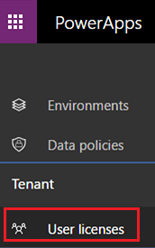

# Ermitteln der PowerApps-Benutzer in Ihrer Organisation
Als globaler Administrator für Office 365 oder Mandantenadministrator für Azure Active Directory können Sie eine Liste der Benutzer in Ihrer Organisation herunterladen, die nicht nur über Lizenzen für PowerApps und/oder Microsoft Flow verfügen, sondern auch auf eines dieser Produkte zugegriffen haben. Die Liste enthält u.a. den Namen, die E-Mail-Adresse und den Lizenztyp der einzelnen Benutzer. Beispiele für Benutzerlizenzen:

* Testlizenz für PowerApps oder Microsoft Flow
* Zugriff auf beide Produkte über eine Office 365-Lizenz
* Zugriff auf beide Produkte über eine Dynamics 365-Lizenz
* Zugriff über PowerApps- und Microsoft Flow-Pläne

### Herunterladen der Benutzerliste
1. Klicken oder tippen Sie im PowerApps Admin Center am linken Rand auf **Benutzerlizenzen**.
   
    > [!IMPORTANT]
> Diese Option ist nur für globale Administratoren von Office 365 und Mandantenadministratoren von Azure Active Directory verfügbar.
   
    
2. Klicken oder tippen Sie auf **Download a list of active user licenses** (Liste der aktiven Benutzerlizenzen herunterladen).
   
    
   
    Der Download der Datei kann einige Minuten dauern. Warten Sie, bis die CSV-Datei heruntergeladen wurde, und öffnen Sie sie dann in Excel.
   
    > [!NOTE]
> Wenn Sie das Fenster schließen, bevor der Dateidownload abgeschlossen ist, müssen Sie den Vorgang möglicherweise von vorne beginnen.

Dieses Beispiel zeigt zwei Benutzer, die über unterschiedliche Lizenzen für PowerApps und Microsoft Flow verfügen. Jane Doe hat über ein Abonnement für Office 365 Zugriff und John Doe verfügt über Testlizenzen für beide Produkte.

Benutzer mit Lizenzen für PowerApps und Microsoft Flow, die noch nie auf diese Produkte zugegriffen haben, werden in der Liste nicht aufgeführt. Im [Office 365 Admin Center][1] können Sie alle Benutzerlizenzen abrufen.

Wenn ein Benutzer die Organisation verlassen hat, steht **Unbekannt** in Spalten wie **Benutzername** und **E-Mail-Adresse**. Wenn in der Liste **Unbekannt** steht, aber keine Benutzer die Organisation verlassen haben, warten Sie einige Minuten und laden die Liste dann erneut herunter.

Um Benutzerlizenzen hinzuzufügen, öffnen Sie das [Office 365 Admin Center][1].

<!--Reference links in article-->
[1]:https://support.office.com/article/Assign-or-remove-licenses-for-Office-365-for-business-997596b5-4173-4627-b915-36abac6786dc
