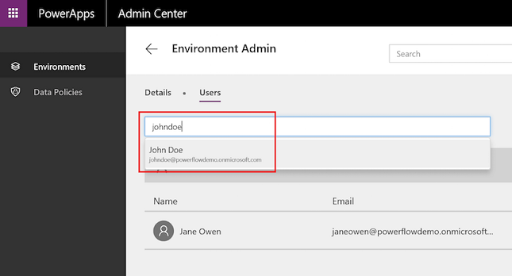
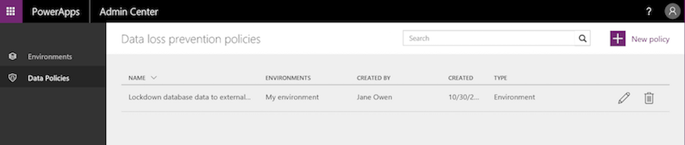

# Verwalten von Umgebungen in PowerApps
Im [PowerApps Admin Center][1] können Sie Umgebungen, die Sie erstellt haben, und Umgebungen, denen Sie in den Rollen „Umgebungsadministrator“ oder „Systemadministrator“ hinzugefügt wurden, verwalten. Über das Admin Center können Sie folgende administrative Aktionen ausführen:

* Erstellen von Umgebungen
* Umbenennen von Umgebungen
* Hinzufügen von Benutzern oder Gruppen zur Umgebungsadministrator- oder Umgebungserstellerrolle oder Entfernen aus diesen Rollen.
* Bereitstellen einer Common Data Service-Datenbank für die Umgebung.
* Festlegen von Richtlinien zur Verhinderung von Datenverlust.
* Festlegen von Datenbanksicherheits-Richtlinien (anhand von Datenbankrollen als offen oder eingeschränkt).
* Mitglieder der globalen Administratorrolle des Azure AD-Mandanten (einschließlich globale Office 365-Administratoren) können ebenfalls alle Umgebungen verwalten, die in ihrem Mandanten erstellt wurden, und für alle Mandanten gültige Richtlinien im PowerApps Admin Center festlegen.

## Zugriff auf das PowerApps Admin Center
So greifen Sie auf das PowerApps Admin Center zu:

* Gehen Sie direkt auf [admin.powerapps.com][1] oder

* wechseln Sie zu [powerapps.com][2], und wählen Sie anschließend das Zahnradsymbol im Header „Navigation“ aus.

    

Sie müssen folgende Rolle aufweisen, um eine Umgebung im PowerApps Admin Center verwalten zu können:

* Die Umgebungsadministratorrolle oder die Systemadministratorrolle der Umgebung oder

* die globale Administratorrolle Ihres Azure AD- oder Office 365-Mandanten.

Außerdem benötigen Sie entweder eine Lizenz von PowerApps-Plan 2 oder Microsoft Flow-Tarif 2, um auf das Admin Center zugreifen zu können. Weitere Informationen finden Sie auf der [Seite mit den PowerApps-Preisen][3].

> [!IMPORTANT]
> Änderungen, die Sie im PowerApps Admin Center vornehmen, wirken sich auf das [Microsoft Flow Admin Center][4] aus und umgekehrt.

## Erstellen einer Umgebung
Anleitungen zum Erstellen einer Umgebung finden Sie unter [Quickstart: Create an environment (Schnellstart: Erstellen einer Umgebung)](create-environment.md).

## Anzeigen Ihrer Umgebungen
Wenn Sie das Admin Center öffnen, wird die Registerkarte "Umgebungen" standardmäßig angezeigt und listet alle Umgebungen auf, für die Sie Umgebungsadministrator sind (sieh unten):

Wenn Sie ein Mitglied der globalen Administratorrolle Ihrer Azure AD oder Ihres Office 365-Mandanten sind, werden alle Umgebungen angezeigt, die von Benutzern in Ihrem Mandanten erstellt wurden, da Sie automatisch für alle ein Umgebungsadministrator sind.

## Benennen Sie Ihre Umgebung um
1. Öffnen Sie das [PowerApps Admin Center][1], suchen Sie die umzubenennende Umgebung in der Liste, und klicken oder tippen Sie darauf.

    

2. Klicken oder tippen Sie auf **Details**.

    
3. Geben Sie im **Name**-Textfeld den neuen Namen ein, und klicken Sie auf **Speichern**.

    

    Wenn Sie die Datenbank in der Umgebung erstellt haben, wird diese Option nicht angezeigt. Sie können die Umgebung über das Dynamics 365 Admin Center umbenennen, indem Sie auf die Registerkarte **Details** klicken.

    

## Löschen Sie Ihre Umgebung
1. Klicken oder tippen Sie im [PowerApps Admin Center][1] auf die Umgebung, die Sie löschen möchten.

    
2. Klicken oder tippen Sie auf **Details**.

    
3. Klicken oder tippen Sie auf **Delete Environment** (Umgebung löschen), um Ihre Umgebung zu löschen.

    

## Erstellen einer Common Data Service-Datenbanken für eine Umgebung
Wenn eine Umgebung noch nicht über eine Datenbank verfügt, kann ein Umgebungsadministrator im [PowerApps Admin Center][1] eine Umgebung mithilfe der folgenden Schritte erstellen. Nur Benutzer mit einer PowerApps Plan 2-Lizenz können Common Data Services-Datenbanken erstellen.

1. Wählen Sie eine Umgebung in der Tabelle der Umgebungen.

    
2. Klicken Sie auf die Registerkarte **Details**.
3. Wählen Sie **Create a database** (Datenbank erstellen) aus.

    

Nachdem Sie eine Datenbank erstellt haben, wählen Sie ein Sicherheitsmodell aus. Weitere Informationen finden Sie unter [Konfigurieren von Datenbanksicherheit](database-security.md).

## Verwalten der Sicherheit für Ihre Umgebungen

### Umgebungsberechtigungen
Alle Benutzer in einer Umgebung im Azure AD-Mandanten sind Benutzer dieser Umgebung. Wenn diesen jedoch eine privilegiertere Rolle zugewiesen werden soll, müssen Sie in eine entsprechende Umgebungsrolle eingefügt werden. Umgebungen weisen zwei integrierte Rollen auf, die Zugriff auf die Berechtigungen in einer Umgebung bieten:

* Mit der **Umgebungsadministratorrolle** (oder der **Systemadministratorrolle**) können Sie alle Administratoraktionen in einer Umgebung ausführen. Dazu gehören die Folgenden:
    * Hinzufügen von Benutzern zur Umgebungsadministrator- oder Umgebungserstellerrolle oder Entfernen aus diesen Rollen

    * Bereitstellen einer Common Data Service-Datenbank für die Umgebung.

    * Anzeigen und Verwalten aller innerhalb einer Umgebung erstellten Ressourcen.

    * Festlegen von Richtlinien zur Verhinderung von Datenverlust. Weitere Informationen finden Sie unter [Richtlinien für die Verhinderung von Datenverlust](prevent-data-loss.md).

  > [!NOTE]
  > Wenn die Umgebung über die Datenbank verfügt, müssen Sie Benutzern die Rolle **Systemadministrator** anstelle der Rolle **Umgebungsadministrator** zuweisen.

* **Die Umgebungserstellerrolle** kann Ressourcen innerhalb einer Umgebung erstellen, einschließlich Apps, Verbindungen, benutzerdefinierter Connectors, Gateways und Workflows mithilfe von Microsoft Flow. Umgebungsersteller können auch die Apps, die sie in einer Umgebung erstellt haben, an andere Benutzer in Ihrer Organisation verteilen. Sie können die App für einzelne Benutzer, Sicherheitsgruppen oder alle Benutzer in der Organisation freigeben. Weitere Informationen finden Sie unter [Freigeben von Apps in PowerApps](../maker/canvas-apps/share-app.md).

Ein Umgebungsadministrator kann folgende Schritte im [PowerApps Admin Center][1] durchführen, um einem Benutzer oder einer Sicherheitsgruppe eine Umgebungsrolle zuzuweisen:

1. Wählen Sie die Umgebung in der Tabelle der Umgebungen aus.

    
2. Klicken Sie auf die Registerkarte **Sicherheit**.
3. Wenn keine Datenbank in der Umgebung erstellt wurde, gehen Sie wie folgt vor:

    a. Wählen Sie entweder die Rolle **Umgebungsadministrator** oder **Umgebungsersteller** aus.

    

    b. Wenn Sie eine App freigeben, geben Sie den Namen eines Benutzers bzw. die Namen mehrerer Benutzer oder Gruppen in Azure Active Directory an, oder geben Sie an, dass Sie die App für die gesamte Organisation freigeben möchten.

    

    c. Wählen Sie **Speicher**, um die Zuweisungen auf die Rolle "Umgebung" zu aktualisieren.

4. Wenn eine Datenbank in der Umgebung erstellt wurde, gehen Sie wie folgt vor:

    a. Fügen Sie den Benutzer der Umgebung hinzu, und klicken Sie auf den Link, um dem Benutzer eine Rolle zuzuweisen.

    

    b. Wählen Sie den Benutzer aus der Benutzerliste in der Umgebung bzw. der Instanz aus.

    

    c. Weisen Sie dem Benutzer die Rolle zu.

    

    d. Klicken Sie auf **OK**, um die Zuweisungen auf die Umgebungsrolle zu aktualisieren.

> [!NOTE]
> Benutzer, die diesen Umgebungsrollen zugewiesen wurden, haben nicht automatisch Zugriff auf die Datenbank der Umgebung (wenn es eine gibt). Der Zugriff muss separat durch den Datenbankbesitzer erteilt werden. Weitere Informationen finden Sie unter [Konfigurieren von Datenbanksicherheit](database-security.md).  
>
>

### Datenbanksicherheit
Die Möglichkeit zum Erstellen und Ändern eines Datenbankschema und zum Verbinden mit in einer Datenbank gespeicherten Daten, die in Ihrer Umgebung bereitgestellt wird, wird von den Benutzerrollen der Datenbank und Berechtigungssätzen gesteuert. Sie können die Benutzerrollen und die Berechtigungssätze für die Datenbank Ihrer Umgebung in den Bereichen **Benutzerrollen** und **Berechtigungssätze** auf der Registerkarte **Sicherheit** verwalten. Weitere Informationen finden Sie unter [Konfigurieren von Datenbanksicherheit](database-security.md).

## Richtlinien für die Daten
Daten des Unternehmens müssen geschützt werden, damit sie nicht für ein Publikum freigegeben werden, das darauf nicht zugreifen sollte. Sie können Richtlinien erstellen und erzwingen, um diese Daten zu schützen; die Richtlinien definieren, welche Verbraucherdienste und Connector-spezifische Unternehmensdaten freigegeben werden können. Richtlinien, die definieren, wie Daten freigegeben werden können, werden als Richtlinien zur Verhinderung von Datenverlust (DLP) bezeichnet. Sie können die DLP-Richtlinien für Ihre Umgebung im Abschnitt **Datenrichtlinien** im [PowerApps Admin Center][1] verwalten.  Weitere Informationen finden Sie unter [Richtlinien für die Verhinderung von Datenverlust](prevent-data-loss.md).

## Häufig gestellte Fragen
### Wie viele Umgebungen und Datenbanken kann ich erstellen?
Je nach Lizenz können Sie bis zu zwei Testumgebungen und zwei Produktionsumgebungen erstellen. Weitere Informationen finden Sie [hier](environments-overview.md#creating-an-environment). Je nach Lizenz kann jeder Benutzer Datenbanken für jeweils bis zu zwei Testumgebungen und Produktionsumgebungen zur Verfügung stellen. 

### Welche Lizenz schließt Common Data Service mit ein?
PowerApps Plan 2.  Auf der [Seite mit den PowerApps-Preisen][3] finden Sie ausführliche Informationen zu allen Plans, die diese Lizenz enthalten.

### Beim Versuch, eine neue Umgebung zu erstellen, wird ein Fehler ausgelöst. Wie kann ich dieses Problem lösen?
Möglicherweise erhalten Sie die folgende Fehlermeldung: „Either your plan doesn’t support the environment type selected or you’ve reached the limit for that type of environment. (Entweder unterstützt Ihr Plan die ausgewählte Art von Umgebung nicht, oder Sie haben die Grenze für diese Art von Umgebung erreicht.)“ Dafür kann einer dieser zwei Gründe verantwortlich sein:

1. Sie haben das Kontingent zum Erstellen einer bestimmten Art von Umgebung bereits erreicht. Angenommen, Sie erstellen eine Testumgebung und erhalten diese Fehlermeldung. Das bedeutet, dass Sie bereits zwei Testumgebungen bereitgestellt haben. Sie können alle Umgebungen im [PowerApps Admin Center][1] sehen.
Wenn Sie möchten, können Sie eine vorhandene Umgebung dieser bestimmten Art löschen und eine neue Umgebung erstellen. Sie sollten sich jedoch vergewissern, dass Sie dabei Ihre Daten, Apps, Flows und andere Ressourcen, die beibehalten werden sollen, nicht verlieren.

2. Sie verfügen über kein Kontingent zum Erstellen dieser bestimmten Art von Umgebung. Überprüfen Sie [hier](environments-overview.md#creating-an-environment), welche Art von Umgebung Sie erstellen können.

Wenn Sie andere Fehlermeldungen erhalten oder weitere Fragen haben, nehmen Sie [hier][5] Kontakt mit uns auf.

### Beim Versuch, eine Datenbank in einer Umgebung zu erstellen, wird ein Fehler ausgelöst. Wie kann ich dieses Problem lösen?
In den folgenden Szenarios können Sie einen Fehler beim Erstellen einer Datenbank erhalten:

1. **Standardumgebung**: Das Erstellen einer Datenbank wird derzeit nicht in einer Standardumgebung des Mandanten unterstützt. 

2. **Umgebung zur individuellen Verwendung**: Wenn Sie sich für den PowerApps-Community-Plan registrieren, erhalten Sie eine Umgebung für Ihre eigene Verwendung. Wenn Sie die Datenbank noch nicht erstellt haben, können Sie zu diesem Zeitpunkt keine Datenbank in der Umgebung zur individuellen Verwendung bereitstellen. 

3. **Umgebung in einer anderen Region, als die Region Ihres AAD-Mandanten**: Derzeit können Sie eine Datenbank nur in den Umgebungen bereitstellen, die in der Region Ihres Azure Active Directory-Mandanten erstellt wurden. Das Bereitstellen einer Datenbank in anderen Regionen soll in naher Zukunft verfügbar sein. Vergewissern Sie sich also, dass Ihre Region mit der Region des Mandanten übereinstimmt, wenn Sie eine Datenbank darin erstellen möchten.

4. **Erstellen von Datenbanken, die in bestimmten Regionen nicht unterstützt werden**: Es gibt bestimmte Regionen, in denen das Erstellen von Datenbanken noch nicht verfügbar ist. Zum Beispiel Länder in Südamerika. Wenn der Hauptstandort Ihres Mandanten Südamerika ist, können Sie derzeit keine Datenbanken in Umgebungen bereitstellen. 
    
Es wird daran gearbeitet, alle der oben genannten Szenarios zu ermöglichen.
Wenn Sie andere Fehlermeldungen erhalten oder weitere Fragen haben, nehmen Sie [hier][5] Kontakt mit uns auf.

### Wann läuft meine Testumgebung ab?   
Testumgebungen laufen 30 Tage nach der Erstellung ab. Wenn Sie nicht möchten, dass Ihre Umgebung abläuft, gibt es Möglichkeiten, diese in eine Produktionsumgebung zu konvertieren. Diese Funktion wird bald verfügbar sein und bis dann laufen Testumgebungen nicht ab.

### Wird meine aktuelle Datenbank (die mit einer vorherigen Version von Common Data Service erstellt wurde) ebenfalls zum Kontingent gezählt?
Wenn Sie bereits über eine Datenbank verfügt haben (die in einer vorherigen Version von Common Data Service erstellt wurde), wird diese zum Kontingent für Produktionsumgebungen gezählt. Wenn Sie nun eine Datenbank in einer Umgebung erstellen (die vor dem 15. März 2018 erstellt wurde), wird diese ebenfalls als Produktionsumgebung gezählt.

### Kann ich eine Umgebung umbenennen?
Ja, diese Funktionalität ist über das PowerApps Admin Center verfügbar. Weitere Informationen finden Sie unter [Verwaltung von Umgebungen](environments-administration.md#rename-your-environment).

### Kann ich eine Umgebung löschen?
Ja, diese Funktionalität ist über das PowerApps Admin Center verfügbar. Weitere Informationen finden Sie unter [Verwaltung von Umgebungen](environments-administration.md#delete-your-environment).
Beachten Sie, dass Produktionsumgebungen mit einer Datenbank derzeit nicht gelöscht werden können (in der neuesten Version von Common Data Service). Diese Funktion wird bald verfügbar sein.

### Kann ich als Umgebungsadministrator für eine Umgebung alle Ressourcen (Apps, Flows, APIs usw.) anzeigen und verwalten?
Ja, die Möglichkeit zum Anzeigen der Apps und Flows für eine Umgebung ist im PowerApps Admin Center verfügbar. Unter [Anzeigen von Apps](admin-view-apps.md) finden Sie weitere Informationen.

<!--Reference links in article-->
[1]: https://admin.powerapps.com
[2]: https://web.powerapps.com
[3]: https://powerapps.microsoft.com/pricing/
[4]: https://admin.flow.microsoft.com
[5]: https://go.microsoft.com/fwlink/?linkid=871628