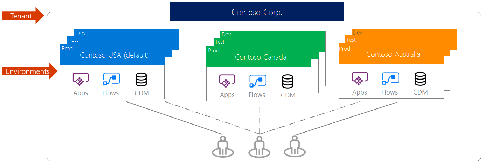
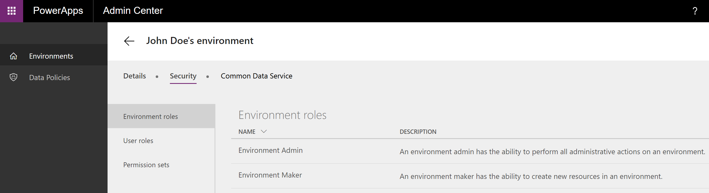
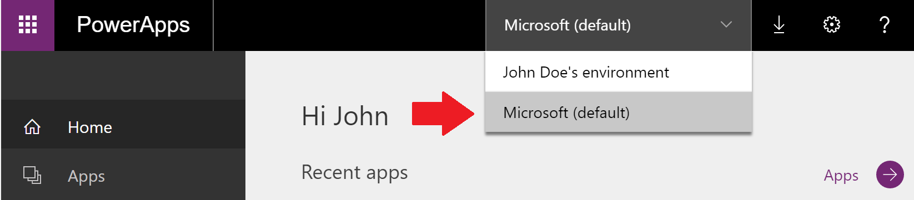
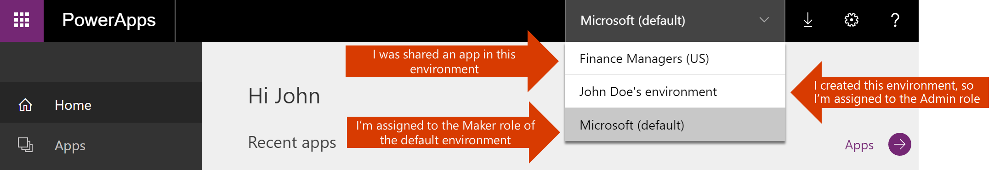
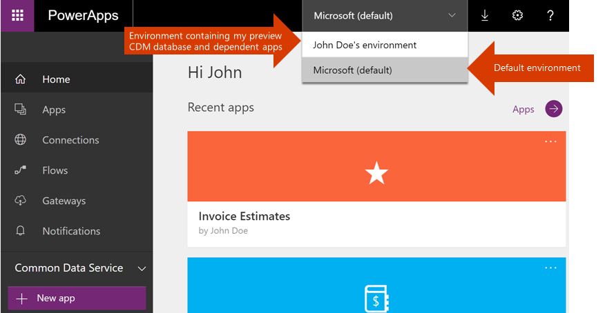

# Umgebungen – Übersicht
Eine Umgebung ist ein Bereich zum Speichern, Verwalten und Freigeben der Geschäftsdaten, Apps und Flows Ihres Unternehmens. Umgebungen dienen außerdem als Container zum Trennen von Apps, die unterschiedliche Rollen oder Sicherheitsanforderungen aufweisen oder sich an verschiedene Zielgruppen richten. In welcher Weise Sie Umgebungen nutzen, hängt von Ihrer Organisation und den Apps ab, die Sie erstellen möchten. Beispiel:

* Sie können sich entscheiden, Ihre Apps in nur einer Umgebung zu erstellen.
* Sie können aber auch getrennte Umgebungen erstellen, um die Test- und Produktionsversionen Ihrer Apps zusammenzufassen.
* Sie können getrennte Umgebungen erstellen, die bestimmten Teams oder Abteilungen im Unternehmen entsprechen und die jeweils relevanten Daten und Apps für die verschiedenen Zielgruppen enthalten.
* Darüber hinaus können Sie separate Umgebungen für verschiedene Niederlassungen Ihres Unternehmens in der Welt erstellen.  

## Umgebungsumfang
Jede Umgebung wird unter einem Azure AD-Mandanten erstellt, und nur Benutzer dieses Mandanten können auf ihre Ressourcen zugreifen. Eine Umgebung ist auch an einen geografischen Ort gebunden, wie etwa die USA. Wenn Sie eine App in einer Umgebung erstellen, wird diese App nur zu Rechenzentren am betreffenden geografischen Ort geroutet. Alle Elemente, die Sie in einer Umgebung erstellen (einschließlich Verbindungen, Gateways, Workflows mithilfe von Microsoft Flow und mehr), sind ebenfalls an den Standort ihrer Umgebung gebunden.

Jede Umgebung kann über eine Common Data Service-Datenbank verfügen, die Speicher für Ihre Apps bereitstellt, dies ist jedoch nicht erforderlich. Die Möglichkeit zum Erstellen einer Datenbank für Ihre Umgebung hängt von der Lizenz, die Sie für PowerApps erwerben, und von Ihren Berechtigungen innerhalb der Umgebung ab. Weitere Informationen finden Sie unter [Preisdetails](pricing-billing-skus.md).

Wenn Sie eine App in einer Umgebung erstellen, sind der App nur Verbindungen mit den Datenquellen erlaubt, die ebenfalls in der gleichen Umgebung bereitgestellt sind; dies schließt Verbindungen, Gateways, Workflows und Common Data Service-Datenbanken ein.  Betrachten wir beispielsweise ein Szenario, in dem Sie zwei Umgebungen mit den Namen ‚Test‘ und ‚Dev‘ und in ihnen jeweils eine Common Data Service-Datenbank erstellt haben. Wenn Sie eine App in der Umgebung ‚Test‘ erstellen, sind ihr nur Verbindungen mit der Test-Datenbank erlaubt; sie ist nicht imstande, Verbindungen mit der Dev-Datenbank herzustellen.

Ferner gibt es ein Verfahren zum Verschieben von Ressourcen zwischen Umgebungen. Weitere Informationen finden Sie unter [Migrieren von Ressourcen](environment-and-tenant-migration.md).

## Umgebungsberechtigungen
Umgebungen weisen zwei integrierte Rollen auf, die Zugriff auf die Berechtigungen in einer Umgebung bieten:

* Die Umgebungsadministratorrolle kann alle Administratoraktionen in einer Umgebung ausführen, darunter:

    * Hinzufügen von Benutzern oder Gruppen zur Umgebungsadministrator- oder Umgebungserstellerrolle oder Entfernen aus diesen Rollen

    * Bereitstellen einer Common Data Service-Datenbank für die Umgebung

    * Anzeigen und Verwalten aller innerhalb einer Umgebung erstellten Ressourcen

    * Festlegen von Richtlinien zur Verhinderung von Datenverlust. Weitere Informationen finden Sie unter [Richtlinien für die Verhinderung von Datenverlust](prevent-data-loss.md).

    Nachdem Sie eine Datenbank in der Umgebung erstellt haben, können Sie anstelle der Systemadministratorrolle eine Umgebungsadministratorrolle verwenden.

* Die Umgebungserstellerrolle kann Ressourcen innerhalb einer Umgebung erstellen, einschließlich Apps, Verbindungen, benutzerdefinierter Connectors, Gateways und Workflows mithilfe von Microsoft Flow.

Umgebungsersteller können außerdem die von ihnen erstellten Apps an andere Benutzer in der Organisation verteilen, indem sie die Apps für einzelne Benutzer, Sicherheitsgruppen oder alle Benutzer in der Organisation freigeben. Weitere Informationen finden Sie unter [Freigeben von Apps in PowerApps](../maker/canvas-apps/share-app.md).

Benutzer, die diesen Umgebungsrollen zugewiesen wurden, haben nicht automatisch Zugriff auf die Datenbank der Umgebung (wenn es eine gibt). Der Zugriff muss separat durch den Datenbankbesitzer erteilt werden. Weitere Informationen finden Sie unter [Konfigurieren von Datenbanksicherheit](database-security.md).

Benutzer oder Sicherheitsgruppen können im [PowerApps Admin Center][1] durch einen Umgebungsadministrator einer dieser beiden Rollen zugewiesen werden. Weitere Informationen finden Sie unter [Administer environments in PowerApps (Verwalten von Umgebungen in PowerApps)](environments-administration.md).

## Die Standardumgebung
Für jeden Mandanten erstellt PowerApps automatisch eine Standardumgebung, die von allen Benutzern dieses Mandanten gemeinsam verwendet wird. Wenn sich ein neuer Benutzer für PowerApps registriert, wird er automatisch der Erstellerrolle der Standardumgebung hinzugefügt. Die Standardumgebung wird in der Region erstellt, die sich am besten mit der Standardregion des AAD-Mandanten deckt.

> [!NOTE]
> Der Umgebungsadministratorrolle der Standardumgebung werden keine Benutzer automatisch hinzugefügt. Weitere Informationen finden Sie unter [Administer environments in PowerApps (Verwalten von Umgebungen in PowerApps)](environments-administration.md).
>
>

Die Standardumgebung ist wie folgt benannt: „{Azure AD-Mandantenname} (Standard)“

## Produktions- und Testumgebungen
Sie können Umgebungen für verschiedene Zwecke erstellen. Eine Testumgebung eignet sich z.B. zum Testen der Umgebung und der Datenbank mithilfe von Common Data Service-Funktionen. Sie kann nur für einen bestimmten Zeitraum verwendet werden. Weitere Informationen finden Sie unter [Administer environments in PowerApps (Verwalten von Umgebungen in PowerApps)](environments-administration.md).

## Auswählen einer Umgebung
Die Einführung von Umgebungen umfasst auf [https://web.powerapps.com](https://web.powerapps.com) auch eine veränderte Benutzeroberfläche.  Die auf der Website sichtbaren Apps, Verbindungen und anderen Elemente sind jetzt nach der ausgewählten aktuellen Umgebung gefiltert.  Ihre aktuelle Umgebung wird im Umgebungswähler nahe der rechten Kante der Kopfleiste angezeigt. Um eine andere Umgebung auszuwählen, klicken oder tippen Sie auf den Umgebungswähler, dann wird eine Liste der verfügbaren Umgebungen angezeigt. Klicken oder tippen Sie auf die Umgebung, in die Sie eintreten möchten.

Eine Umgebung wird in Ihrer Auswahlliste angezeigt, wenn Sie eine der folgenden Bedingungen erfüllen:

* Sie sind Mitglied der Umgebungsadministratorrolle für die Umgebung.
* Sie sind Mitglied der Umgebungserstellerrolle für die Umgebung.
* Sie sind weder Umgebungsadministrator noch Umgebungsersteller der Umgebung, Ihnen wurde aber Zugriff als ‚Mitwirkender‘ zu mindestens einer App in der Umgebung erteilt. Weitere Informationen finden Sie unter [Freigeben von Apps](../maker/canvas-apps/share-app.md). In diesem Fall können Sie in dieser Umgebung keine Apps erstellen. Sie können nur die vorhandenen Apps ändern, die für Sie freigegeben wurden.

## Erstellen einer Umgebung
### Wer kann Umgebungen erstellen?
Ob Sie Umgebungen erstellen können, wird durch Ihre Lizenz bestimmt.

| Lizenz | Die Erstellung von Umgebungen ist zulässig |
| --- | --- |
| PowerApps P2 |√ |
| PowerApps P2-Testversion |√ |
| PowerApps P1 |x |
| PowerApps P1-Testversion |x |
| Dynamics 365-Pläne |x |
| Office 365-Pläne |x |
| Dynamics 365 Apps und Teams-Pläne |x |

Jeder Benutzer kann bis zu zwei Testumgebungen erstellen. PowerApps P2 kann außerdem bis zu zwei Produktionsumgebungen erstellen.

### Wo können Umgebungen erstellt werden?
Neue Umgebungen können auf [PowerApps.com][2] und im [PowerApps Admin Center][1] erstellt werden. Wenn Sie eine Umgebung erstellen, werden Sie der Umgebungsadministratorrolle für diese Umgebung automatisch hinzugefügt. Die Anzahl der Umgebungen, an denen Sie als Mitglied der Umgebungsadministrator- oder Umgebungserstellerrolle teilnehmen können, ist nicht beschränkt. Weitere Informationen zu Umgebungen finden Sie unter [Administer environments in PowerApps (Verwalten von Umgebungen in PowerApps)](environments-administration.md). Anleitungen zum Erstellen einer Umgebung finden Sie unter [Create an environment (Erstellen einer Umgebung)](create-environment.md).

## Was ändert sich für Benutzer der PowerApps-Vorschau?
Benutzer, die an der PowerApps-Vorschau teilgenommen haben, werden mit der Einführung von Umgebungen einige Änderungen an der Benutzeroberfläche feststellen.  In der folgenden Tabelle ist aufgelistet, was sich für Benutzer in den USA und Benutzer außerhalb der USA ändert:

| User | Abläufe |
| --- | --- |
| Benutzer der Vorschau, die eine Common Data Service-Datenbank erstellt haben |Sie sehen eine Umgebung mit der Bezeichnung „{Ihr Name}s Umgebung“, die Ihre Common Data Service-Datenbank aus der Vorschau und alle darauf aufbauenden Apps enthält.  Sie werden der Umgebungserstellerrolle und der Umgebungsadministratorrolle für die Umgebung und als Datenbankbesitzer der Datenbank hinzugefügt. Mit dem Erreichen der allgemeinen Verfügbarkeit von PowerApps nehmen wir ein Upgrade der Metadaten des Common Data Service vor. Diese Änderung wirkt sich für Sie so aus, dass Sie nach wie vor Entitäten und Apps verwenden können, die Sie bereits auf der Common Data Service-Datenbank aus der Vorschau erstellt haben; Sie können in dieser Datenbank jedoch keine Felder oder Entitäten mehr erstellen. Wir veröffentlichen in Kürze Anleitungen zum Erstellen einer Umgebung mit einer Datenbank, die die Metadaten mit Upgrade enthält, und zum Migrieren Ihrer Apps in diese Umgebung.   Wenn eine der Apps, die auf Ihrer Common Data Service-Datenbank aus der Vorschau aufbaut, außerdem einen benutzerdefinierten Connector als Datenquelle verwendet, ist sie vorübergehend in dieser Umgebung nicht funktionsfähig, da alle benutzerdefinierten Connectors zur Standardumgebung migriert werden. Sie müssen den benutzerdefinierten Connector in dieser Umgebung neu erstellen, um betroffene Apps zu reparieren. |
| Benutzer der Vorschau in den USA |Die folgenden Ressourcen, die Sie im Vorschauzeitraum von PowerApps erstellt haben, stehen in der Standardumgebung Ihres Mandanten zur Verfügung: – Alle Apps, die Sie erstellt haben (mit Ausnahme der Apps, die eine Verbindung mit einer Common Data Service-Datenbank aus der Vorschau herstellen) – Alle von Ihnen erstellten Verbindungen und benutzerdefinierten Connectors – Alle von Ihnen installierten lokalen Datengateways |
| Benutzer der Vorschau außerhalb der USA |Über die Standardumgebung hinaus sehen Sie eine Umgebung mit der Bezeichnung „{Azure AD-Mandant} (aus Vorschau)“, die folgende Ressourcen enthält, die Sie im Vorschauzeitraum von PowerApps erstellt haben: – Alle Apps, die Sie erstellt haben (mit Ausnahme der Apps, die eine Verbindung mit einer Common Data Service-Datenbank aus der Vorschau herstellen) – Alle von Ihnen erstellten Verbindungen und benutzerdefinierten Connectors – Alle von Ihnen installierten lokalen Datengateways Sie werden der Umgebungserstellerrolle dieser Umgebung hinzugefügt. |

Ein *Benutzer der Vorschau* ist eine Person, die Microsoft PowerApps vor der allgemeinen Verfügbarkeit verwendet hat.

Zwei Wochen nach dem Erreichen der allgemeinen Verfügbarkeit werden PowerApps-Umgebungen, die Vorschauinhalte enthalten, als schreibgeschützt gekennzeichnet (mit Ausnahme der Standardumgebung). Die vorhandenen Apps und Workflows in diesen Umgebungen funktionieren weiterhin, jedoch können Sie keine Apps oder Workflows mehr erstellen. Wir empfehlen Benutzern dieser Umgebungen dringend, ihre Inhalte in die Standardumgebung oder eine andere benutzerdefinierte Umgebung zu migrieren. Weitere Informationen zum Migrationsvorgang finden Sie in diesem Blog [Common Data Service Features Announcement (Ankündigung von Common Data Services-Funktionen)][3] (der im Lauf dieser Woche veröffentlicht wird).

### Beispielumgebungen für einen Benutzer der Vorschau in den USA

### Beispielumgebungen für einen Benutzer der Vorschau außerhalb der USA

## Verwalten von Umgebungen für Ihre Organisation
Im PowerApps-Admin Center können Sie die Umgebungen, die Sie erstellt haben, und Umgebungen, denen Sie in der Rolle „Umgebungsadministrator“ hinzugefügt wurden, verwalten. Im Admin Center können Sie alle Verwaltungsaktionen für eine Umgebung ausführen, einschließlich der folgenden:

* Hinzufügen von Benutzern oder Gruppen zur Umgebungsadministrator- oder Umgebungserstellerrolle oder Entfernen aus diesen Rollen.  Weitere Informationen finden Sie unter [Administer environments in PowerApps (Verwalten von Umgebungen in PowerApps)](environments-administration.md).
* Bereitstellen einer Common Data Service-Datenbank für die Umgebung. Weitere Informationen finden Sie unter [Erstellen einer Common Data Service-Datenbank](create-database.md).
* Festlegen von Richtlinien zur Verhinderung von Datenverlust. Weitere Informationen finden Sie unter [Richtlinien für die Verhinderung von Datenverlust](prevent-data-loss.md).
* Festlegen von Datenbanksicherheits-Richtlinien (anhand von Datenbankrollen als offen oder eingeschränkt). Weitere Informationen finden Sie unter [Konfigurieren von Datenbanksicherheit](database-security.md).
* Mitglieder der globalen Administratorrolle des Azure AD-Mandanten (einschließlich globale Office 365-Administratoren) können ebenfalls alle Umgebungen verwalten, die in ihrem Mandanten erstellt wurden, und mandantenweit gültige Richtlinien im PowerApps Admin Center festlegen.

<!--Reference links in article-->
[1]: https://admin.powerapps.com
[2]: https://web.powerapps.com
[3]: https://aka.ms/cdspreviewtoga
