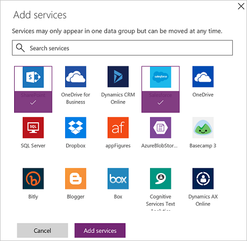

# Erfahren Sie alles über Datengruppen
Datengruppen sind eine einfache Möglichkeit zum Kategorisieren von Diensten im Rahmen einer [Richtlinie zur Verhinderung von Datenverlust (DLP)](prevent-data-loss.md). Die zwei verfügbaren Datengruppen sind die Gruppe **Business data only** (Nur Unternehmensdaten) und die Gruppe **No business data allowed** (Keine Unternehmensdaten zugelassen). Organisationen können frei festlegen, welche Dienste in einer bestimmten Datengruppe platziert werden. Eine gute Möglichkeit zum Kategorisieren von Diensten ist, diese basierend auf der Auswirkung auf Ihre Organisation in Gruppen zu platzieren. Standardmäßig werden alle Dienste in die Datengruppe **No business data allowed** platziert. Sie verwalten die Dienste in einer Datengruppe, wenn Sie die Eigenschaften einer DLP-Richtlinie vom Admin Center aus erstellen oder bearbeiten.

## So werden Daten zwischen Datengruppen geteilt
Daten können nicht zwischen Diensten in verschiedenen Gruppen geteilt werden. Wenn Sie beispielsweise SharePoint und Salesforce in die Gruppe **Business data only** und Facebook und Twitter in die Gruppe **No business data allowed** platzieren, können Sie keine PowerApp erstellen, die Daten zwischen SharePoint und Facebook verschieben. Während Daten nicht zwischen Diensten in verschiedenen Gruppen geteilt werden können, können Sie Daten zwischen den Diensten innerhalb einer bestimmten Gruppe teilen. Kehren wir nun also zum vorherigen Beispiel zurück: Da SharePoint und Salesforce in die gleiche Gruppe platziert wurden, können PowerApps, die Ihre Endbenutzer erstellen, Daten zwischen SharePoint und Salesforce teilen. Wichtig ist, dass Dienste in einer bestimmten Gruppe Daten teilen können, während Dienste in verschiedenen Gruppen keine Daten teilen können.

Darüber hinaus muss eine Datengruppe als *Standardgruppe* festgelegt werden. Zu Beginn ist die Gruppe **No business data allowed** die *Standardgruppe* und alle Dienste befinden sich in der Datengruppe. Ein Administrator kann die Standarddatengruppe in die Datengruppe **Business data only** ändern. 

> [!NOTE]
> Alle neuen Dienste, die zu PowerApps hinzugefügt werden, werden in die festgelegte *Standardgruppe* platziert. Aus diesem Grund empfehlen wir Ihnen, die Gruppe **No business data allowed** als Standardgruppe zu erhalten und Dienste manuell zur Gruppe **Business data only** hinzuzufügen, nachdem Ihre Organisation die Auswirkung ausgewertet hat, die das Zulassen des Teilens von Unternehmensdaten mit dem neuen Dienst hat.

## Hinzufügen von Diensten zu einer Datengruppe
In dieser exemplarischen Vorgehensweise fügen wir SharePoint und Salesforce zur Datengruppe **Business data only** einer DLP-Richtlinie (Richtlinie zur Verhinderung von Datenverlust) hinzu.

1. Wählen Sie den Link **+ Add** (Hinzufügen) im Gruppenfeld **Business data only** der DLP-Richtlinie aus:    
     
2. Wählen Sie SharePoint und Salesforce und dann **Dienste hinzufügen** aus, um beide zur Gruppe „Business data only“ hinzuzufügen:    
     
3. Wählen Sie im Menü oben **Richtlinie speichern** aus:  
   
4. Beachten Sie, dass sowohl SharePoint als auch Salesforce sich jetzt in der Gruppe „Business data only“ befinden:  
      

In dieser exemplarischen Vorgehensweise haben Sie SharePoint und Salesforce zur Datengruppe **Business data only** einer DLP-Richtlinie hinzugefügt. Wenn eine der Personen aus der Umgebung der DLP-Richtlinie eine App erstellt, die Daten zwischen SharePoint oder Salesforce und einem Dienst in der Datengruppe **No business data allowed** teilt, wird das Ausführen der App nicht erlaubt.

## Entfernen von Diensten aus einer Datengruppe
Da sich alle Dienste in einer der verfügbaren Datengruppen befinden müssen, fügen Sie einen Dienst einfach zu einer anderen Gruppe hinzu, wenn Sie diesen aus einer bestimmten Gruppe entfernen möchten, und speichern Sie die Richtlinie anschließend.  

## Ändern der Standarddatengruppe
In dieser exemplarischen Vorgehensweise ändern wir die Standarddatengruppe von der Datengruppe **No business data allowed** in die Datengruppe **Business data only**.  

> [!IMPORTANT]
> Alle neuen Dienste, die zu PowerApps hinzugefügt werden, werden in die festgelegte *Standardgruppe* platziert. Aus diesem Grund empfehlen wir Ihnen, die Gruppe **No business data allowed** als Standardgruppe zu erhalten und Dienste manuell zur Gruppe **Business data only** hinzuzufügen.

1. Wählen Sie **...** in der rechten oberen Ecke der Datengruppe aus, die Sie als Standarddatengruppe festlegen möchten:    
     
2. Wählen Sie **Set as default group** (Als Standardgruppe festlegen):  
      
3. Wählen Sie im Menü oben **Richtlinie speichern** aus:  
   
4. Beachten Sie, dass die Datengruppe nun als Standarddatengruppe festgelegt ist:  
      

## Nächste Schritte
* [Erfahren Sie mehr über Richtlinien zur Verhinderung von Datenverlust (DLP)](prevent-data-loss.md)
* [Erfahren Sie mehr über Umgebungen](environments-overview.md)
* [Erfahren Sie mehr über Microsoft PowerApps](../maker/canvas-apps/getting-started.md)
