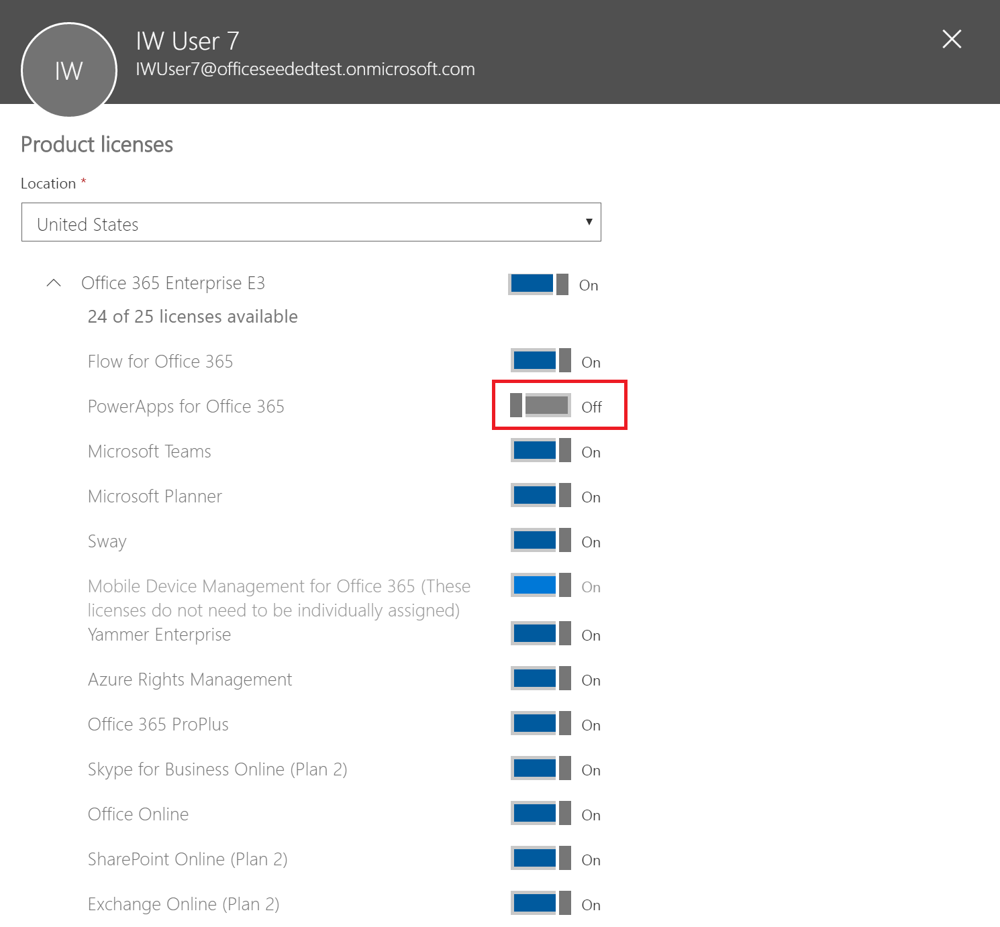

# Verwalten von Lizenzen in Ihrer Organisation
In diesem Artikel wird beschrieben, wie Benutzer in Ihrer Organisation auf PowerApps zugreifen können und wie Sie den Zugriff auf den PowerApps-Dienst steuern können.

## Registrieren bei PowerApps
### Was ist PowerApps?
Microsoft PowerApps ermöglicht Benutzern das Erstellen von Anwendungen für Windows-, iOS- und Android-Mobilgeräte. Mit diesen Apps können Sie Verbindungen zu gängigen SaaS-Diensten herstellen, darunter Twitter, Office 365, Dropbox und Excel.

### Wie können sich Benutzer für PowerApps registrieren?
Die einzige Registrieroption für Einzelbenutzer in Ihrer Organisation ist die PowerApps Plan 2-Testversion, für die sie sich über die PowerApps-Website registrieren können:

##### Option 1
Benutzer können sich registrieren, indem sie auf [powerapps.microsoft.com](https://powerapps.microsoft.com) gehen, **Kostenlos registrieren** auswählen, und dann den Registrierungsvorgang für PowerApps über [portal.office.com](https://portal.office.com/Start?sku=powerapps) abschließen.

##### Option 2
Benutzer können sich registrieren, indem sie auf [powerapps.microsoft.com](https://powerapps.microsoft.com) gehen, **Registrieren** auswählen, sich mit ihren Geschäfts- oder Schulkonten anmelden und sich für die PowerApps Plan 2-Testversion registrieren, indem sie die PowerApps-Nutzungsbedingungen akzeptieren.    

Wenn sich ein Benutzer in Ihrer Organisation für PowerApps registriert, wird diesem Benutzer automatisch eine PowerApps-Lizenz zugewiesen.

> [!NOTE]
> Benutzer, die sich in PowerApps für eine Testlizenz anmelden, werden im Office 365-Administratorportal nicht als PowerApps-Plan 2-Testbenutzer aufgeführt (es sei denn, sie besitzen eine weitere Lizenz für Office 365, Dynamics 365 oder PowerApps).

Weitere Informationen finden Sie unter [Self-Service-Registrierung für PowerApps](../maker/signup-for-powerapps.md).

### Wie können Benutzer in meiner Organisation auf PowerApps zugreifen?
Benutzer in Ihrer Organisation können auf PowerApps auf drei verschiedene Arten zugreifen:

* Sie können sich einzeln für eine PowerApps Plan 2-Testversion registrieren, wie im Abschnitt [Wie können sich Benutzer für PowerApps registrieren?](#how-do-users-sign-up-for-powerapps) beschrieben.
* Sie können ihnen im Office 365-Administratorportal eine PowerApps-Lizenz zuweisen.
* Der Benutzer verfügt über einen Office 365- und Dynamics 365-Plan, die Zugriff auf den PowerApps-Dienst beinhalten. Eine Liste der Office 365- und Dynamics 365-Pläne inklusive PowerApps-Funktionen finden Sie in der [PowerApps-Preisübersicht](https://powerapps.microsoft.com/pricing).

### Kann ich Benutzer in meiner Organisation blockieren, damit sie sich nicht für PowerApps registrieren können?
Jeder Einzelbenutzer kann 30 Tage lang die Features von Microsoft PowerApps-Plan 2 kostenlos testen. Dies wird im Abschnitt [Wie können sich Benutzer für PowerApps registrieren](#how-do-users-sign-up-for-powerapps) beschrieben.  Diese Option ist für jeden Benutzer in einem Mandanten verfügbar und kann nicht durch einen Administrator deaktiviert werden.  Nach Ablauf der Testversion verliert der Benutzer den Zugriff auf die PowerApps Plan 2-Funktionen.  

Wenn sich jemand für eine 30-Tage-Testversion von Microsoft PowerApps-Plan 2 registriert und Sie dies innerhalb Ihrer Organisation nicht unterstützen, entstehen für diese keine Kosten. Wenn sich eine Einzelperson für Microsoft PowerApps registriert, ist dies eine direkte Beziehung zwischen dieser Einzelperson und Microsoft wie bei vielen öffentlichen Clouddiensten von Microsoft wie z.B. Bing, Wunderlist, OneDrive oder Outlook.com, und impliziert in keiner Weise, dass der Dienst von Ihrer Organisation bereitgestellt wird.

Wenn Ihr Unternehmen zudem die Verwendung von nur für die Organisation bestimmten Daten in Microsoft PowerApps einschränken will, ist dies über die Richtlinien zur Verhinderung von Datenverlust (Data Loss Prevention, DLP) möglich. Weitere Informationen finden Sie unter [Data loss prevention (DLP) policies (Richtlinien zur Verhinderung von Datenverlust (DLP))](prevent-data-loss.md).

## Verwaltung von PowerApps
### Warum wird das PowerApps-Symbol im Office 365-App-Startfeld angezeigt?
Wie im August angekündigt, ist Microsoft PowerApps nun ein grundlegender Teil der Office 365-Suite. Drei Monate nach dieser Ankündigung wurde Microsoft PowerApps als Dienst als Teil vorhandener Office 365-SKUs aktiviert. Da Benutzer weltweit nun Microsoft PowerApps verwenden können, wird es ab jetzt im App-Startfeld angezeigt. Weitere Informationen darüber, welche Office 365-SKUs nun PowerApps enthalten, finden Sie unter [Licensing overview (Übersicht über die Lizenzierung)](pricing-billing-skus.md).

Lesen Sie den folgenden Abschnitt, wenn Sie die PowerApps-Kachel standardmäßig aus dem App-Startfeld entfernen möchten.

### Wie entferne ich PowerApps von vorhandenen Benutzern?
Wenn einem Benutzer eine Lizenz für PowerApps Plan 1 oder PowerApps Plan 2 zugewiesen wurde, können Sie die folgenden Schritte ausführen, um die PowerApps-Lizenz für diesen Benutzer zu entfernen:

1. Wechseln Sie zum [Office 365-Verwaltungsportal](https://portal.microsoftonline.com/).

2. Wählen Sie in der linken Navigationsleiste **Benutzer** und dann **Aktive Benutzer** aus.

3. Suchen Sie den Benutzer, dessen Lizenz entfernt werden soll, und wählen Sie dann dessen Namen aus.

4. Klicken Sie im Benutzerdetailbereich im Abschnitt **Produktlizenzen** auf **Bearbeiten**.

5. Suchen Sie die Lizenz **Microsoft PowerApps Plan 1** oder **Microsoft PowerApps Plan 2**, setzen Sie die Umschaltfläche auf **Deaktiviert**, und klicken Sie dann auf **Speichern**.

    

Wenn ein Benutzer über eine Lizenz für die Office 365- und Dynamics 365-Pläne auf PowerApps zugreifen kann, können Sie dessen Zugriff auf den PowerApps-Dienst mit folgenden Schritten deaktivieren:

1. Wechseln Sie zum [Office 365-Verwaltungsportal](https://portal.microsoftonline.com/).

2. Wählen Sie in der linken Navigationsleiste **Benutzer** und dann **Aktive Benutzer** aus.

3. Suchen Sie den Benutzer, dessen Zugriff entfernt werden soll, und wählen Sie dann dessen Namen aus.

4. Klicken Sie im Benutzerdetailbereich im Abschnitt **Produktlizenzen** auf **Bearbeiten**.

5. Erweitern Sie die Benutzerlizenz für Office 365 oder Dynamics 365, deaktivieren Sie den Zugriff auf den Dienst **PowerApps für Office 365** oder **PowerApps für Dynamics 365** und klicken Sie dann auf **Speichern**.

    

Massenhaftes Entfernen von Lizenzen ist auch mithilfe von PowerShell möglich. Ein ausführliches Beispiel finden Sie unter [Office 365-Lizenzierung und Windows PowerShell: Entfernen einer Lizenz](https://technet.microsoft.com/library/dn771774.aspx).   Weitere Informationen zum massenhaften Entfernen von Diensten in einer Lizenz finden Sie unter [Deaktivieren des Zugriffs auf Dienste mit Office 365 PowerShell](https://technet.microsoft.com/library/dn771769.aspx).

Durch das Entfernen der Lizenz oder des Diensts von PowerApps für einen Benutzer in Ihrer Organisation werden für diesen Benutzer auch die PowerApps- und Dynamics 365-Symbole von folgenden Stellen entfernt:

* [Office.com](https://office.com)

    
* Office 365-App-Startfeld

    

### Wie kann ich den Zugriff meiner Benutzer auf Geschäftsdaten meiner Organisation mit PowerApps einschränken?
Mit PowerApps können Sie Datenzonen für geschäftliche und geschäftsfremde Daten wie unten dargestellt erstellen.  Sobald diese Richtlinien zur Verhinderung von Datenverlust implementiert wurden, können Benutzer keine PowerApps mehr entwerfen oder ausführen, die geschäftliche und geschäftsfremde Daten kombinieren. Weitere Informationen finden Sie unter [Data loss prevention (DLP) policies (Richtlinien zur Verhinderung von Datenverlust (DLP))](prevent-data-loss.md).

### Warum werden 10.000 Lizenzen für Microsoft PowerApps in meinem Office 365-Mandanten angezeigt?
Wenn Ihre Organisation berechtigt ist, können Benutzer in Ihrer Organisation 30 Tage lang Microsoft PowerApps-Plan 2 testen, und diese Testlizenzen stellen die verfügbare Kapazität für neue PowerApps-Benutzer in Ihrem Mandanten dar. Es fallen keine Gebühren für diese Lizenzen an. Es gibt zwei mögliche Gründe, warum eine Kapazität von 10.000 Lizenzen (Testlizenzen) für PowerApps im Office 365-Verwaltungsportal angezeigt wird:

* Wenn mindestens ein Benutzer in Ihrem Mandanten an der öffentlichen Vorschauversion von PowerApps im Zeitraum von April 2016 bis Oktober 2016 teilgenommen hat, werden 10.000 Lizenzen mit der Bezeichnung „Microsoft PowerApps und Logic-Abläufe“ angezeigt.

    
* Wenn sich mindestens ein Benutzer in Ihrem Mandanten wie in **Option 1** im Abschnitt [Wie können sich Benutzer für PowerApps registrieren](#how-do-users-sign-up-for-powerapps) beschrieben für eine PowerApps Plan 2-Testversion registriert hat, werden 10.000 Lizenzen mit der Bezeichnung „Microsoft Power Apps & Flow“ angezeigt.

    

Sie können Benutzern selbst zusätzliche Lizenzen über das Office 365-Administratorportal zuweisen. Beachten Sie jedoch, dass es sich hierbei um Testlizenzen für Microsoft PowerApps-Plan 2 handelt, die 30 Tage nach der Zuweisung an einen Benutzer ablaufen.

### Ist dies kostenlos? Werden mir für diese Lizenzen Gebühren berechnet?
Bei diesen Lizenzen handelt es sich um kostenlose Testlizenzen, mit denen Ihre Benutzer 30 Tage lang Microsoft PowerApps-Plan 2 testen können.

### Wie ändert sich dadurch die Art und Weise, wie ich Identitäten für Benutzer in meiner Organisation derzeit verwalte?
Wenn Ihre Organisation bereits über eine Office 365-Umgebung verfügt und alle Benutzer in Ihrer Organisation über Office 365-Konten verfügen, ändert sich die Identitätsverwaltung nicht.

Wenn Ihre Organisation bereits über eine Office 365-Umgebung verfügt, aber noch nicht alle Benutzer in Ihrer Organisation über Office 365-Konten verfügen, erstellen wir einen Benutzer im Mandanten und weisen Lizenzen auf Grundlage der Geschäfts- oder Schul-E-Mail-Adresse des Benutzers zu. Dies bedeutet, dass die Anzahl der Benutzer, die Sie zu einem bestimmten Zeitpunkt verwalten, steigt, wenn sich Benutzer in Ihrer Organisation für den Dienst registrieren.

Wenn Ihre Organisation nicht über eine Office 365-Umgebung verfügt, die mit Ihrer E-Mail-Domäne verbunden ist, ändert sich die Identitätsverwaltung nicht. Benutzer werden zu einem neuen Verzeichnis für Nur-Cloud-Benutzer hinzugefügt, und Sie haben die Möglichkeit, als Mandantenadministrator zu übernehmen und diese zu verwalten.

### Wie verwalte ich einen Mandanten, den Microsoft für meine Benutzer erstellt hat?
Wenn ein Mandant von Microsoft erstellt wurde, können Sie diesen Mandanten mithilfe der folgenden Schritte anfordern und verwalten:

1. Treten Sie dem Mandanten bei, indem Sie sich bei PowerApps mithilfe einer E-Mail-Adressdomäne registrieren, die der Mandantendomäne entspricht, die Sie verwalten möchten. Wenn Microsoft beispielsweise den Mandanten „contoso.com“ erstellt hat, treten Sie dem Mandanten mit einer E-Mail-Adresse bei, die auf @contoso.com endet.
2. Fordern Sie Administratorsteuerung durch Bestätigung des Domänenbesitzes an: Sobald Sie sich im Mandanten befinden, können Sie sich auf die Administratorrolle heraufstufen, indem Sie den Domänenbesitz bestätigen. Gehen Sie hierzu folgendermaßen vor:
3. Wechseln Sie zu [https://portal.office.com](https://portal.office.com/Start?sku=powerapps).
4. Wählen Sie oben links das App-Startprogramm-Symbol und dann den Administrator aus.
5. Lesen Sie die Anweisungen auf der Seite **Become the admin** (Administrator werden), und wählen Sie dann **Yes, I want to be the admin**  (Ja, ich möchte Administrator werden) aus.  

> [!NOTE]
> Wenn diese Option nicht angezeigt wird, ist bereits ein Office 365-Administrator vorhanden.

### Wenn ich über mehrere Domänen verfüge, kann ich dann den Office 365-Mandanten steuern, zu dem Benutzer hinzugefügt werden?
Wenn Sie weiter nichts unternehmen, wird ein Mandant für jede Benutzer-E-Mail-Domäne und -Unterdomäne erstellt.

Wenn sich alle Benutzer unabhängig von ihren E-Mail-Adresserweiterungen im selben Mandanten befinden sollen:  

* Erstellen Sie einen Zielmandanten im Voraus, oder verwenden Sie einen vorhandenen Mandanten. Fügen Sie alle vorhandenen Domänen und Unterdomänen hinzu, die in diesem Mandanten konsolidiert werden sollen. Dann treten alle Benutzer, deren E-Mail-Adressen auf diese Domänen und Subdomänen enden, bei der Registrierung automatisch dem Zielmandanten bei.

> [!IMPORTANT]
> Es gibt keine automatisierten Verfahren zum Verschieben von Benutzern zwischen Mandanten nach der Erstellung. Wie Sie Domänen zu einem einzelnen Office 365-Mandanten hinzufügen können, erfahren Sie unter [Hinzufügen von Benutzern und der Domäne mit dem Setup-Assistenten](https://support.office.com/article/Add-your-users-and-domain-to-Office-365-ffdb2216-330d-4d73-832b-3e31bcb5b2a7).
