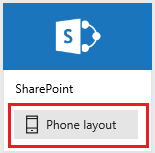
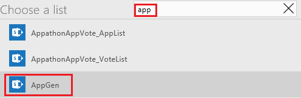

# Generieren einer App, um Daten in einer SharePoint-Liste zu verwalten

Generieren Sie in PowerApps automatisch eine App mit drei Bildschirmen, um Daten in einer SharePoint-Liste zu verwalten, lokal oder in der Cloud.

Standardmäßig hat jede generierte App einen Bildschirm zum Durchsuchen von Datensätzen, einen Bildschirm zum Anzeigen von Details eines Datensatzes und einen Bildschirm zum Erstellen oder Aktualisieren von Datensätzen. Das anfängliche Layout sowie der jeweilige Bildschirminhalt werden automatisch festgelegt, aber Sie müssen wahrscheinlich die App auf Ihre Bedürfnisse anpassen.

Wenn Sie mit PowerApps nicht vertraut sind, finden Sie Grundlagen unter [Einführung in PowerApps](getting-started.md).

Zum Zeitpunkt dieses Artikels unterstützt PowerApps benutzerdefinierte Listen, jedoch keine Bibliotheken. Darüber hinaus können Sie Daten in verschiedenen Arten von Spalten anzeigen, z.B. **Auswahl** und **Bild**, aber Sie können diese Daten nicht aktualisieren. Weitere Informationen finden Sie unter [Known issues (Bekannte Probleme)](connections/connection-sharepoint-online.md#known-issues).

> [!NOTE]
> Wenn ein Spaltenname ein Leerzeichen enthält, wird es von PowerApps als **"\_X0020\_"** angezeigt. **"Name der Spalte"** wird z.B. als **"Name_x0020_der_x0020_Spalte"** angezeigt.

## Eine SharePoint-App angeben
1. Wenn Sie noch keine [Verbindung mit SharePoint](connect-to-sharepoint.md) hergestellt haben, stellen Sie eine her.
2. Öffnen Sie PowerApps auf *eine* der folgenden Weisen:
   
   * [Installieren Sie PowerApps Studio for Windows](http://aka.ms/powerappsinstall), öffnen Sie es, und melden Sie sich an, indem Sie die gleichen Anmeldeinformationen bereitstellen, die Sie bei der Registrierung angegeben haben. Am linken Rand klicken oder tippen Sie auf **New**.
     
       
   * [Öffnen Sie PowerApps Studio für das Web](https://create.powerapps.com/api/start) in einem Browser.
     
       Eine Liste der unterstützten Browser und Einschränkungen in der Vorabversion von PowerApps Studio für das Web finden Sie unter [Create or edit apps in a browser (Erstellen oder Bearbeiten von Apps in einem Browser)](create-app-browser.md).
3. Klicken oder tippen Sie unter **Mit eigenen Daten beginnen** in der SharePoint-Kachel auf **Telefonlayout**.
   
    

## Angeben einer Website und einer Liste
1. Unter **Connect to a SharePoint site** (Verbindung mit einer SharePoint-Website herstellen) fügen Sie die URL der Website ein, die die Liste enthält, die Sie verwenden möchten, und klicken oder tippen Sie auf **Go** (Los).
   
    > [!NOTE]
> Binden Sie keine bestimmte Liste in die URL ein.
   
    
2. Klicken oder tippen Sie unter **Choose a list** (Liste auswählen) auf den Namen der Liste, die Sie verwenden möchten.
   
    Sie können die Listennamen alphabetisch sortieren, indem Sie auf die Sortierschaltfläche klicken oder tippen.
   
    
   
    Sie können auch mindestens einen Buchstaben in das Suchfeld eingeben, um nur die Listennamen anzuzeigen, die Text enthalten, den Sie angeben.
   
    
   
    Nicht alle Typen von Listen werden standardmäßig angezeigt. Wenn der Name der Liste, die Sie verwenden möchten, nicht angezeigt wird, scrollen Sie nach unten, und geben Sie dann den Namen der Liste in das Feld **Benutzerdefinierten Listennamen eingeben** ein.
   
    
3. Klicken oder tippen Sie auf **Connect**, um die App zu generieren.
   
    
4. Wenn Sie aufgefordert werden, die Einführung anzuschauen, klicken oder tippen Sie auf **Next** um sich mit wichtigen Bereichen der PowerApps Schnittstelle vertraut zu machen (oder klicken oder tippen Sie auf **Skip**).
   
    
   
    Sie können sich die Einführung jederzeit später anschauen. Klicken oder tippen Sie hierzu auf das Fragezeichen-Symbol in der Nähe der oberen rechten Ecke, und klicken oder tippen Sie anschließend auf **Take the intro tour**.

## Nächste Schritte
* Zum Speichern der App, die Sie gerade erstellt haben, drücken Sie STRG+S.
* Informationen zum Anpassen des Bildschirms zum Durchsuchen (wird standardmäßig angezeigt) finden Sie unter [Ein Layout anpassen](customize-layout-sharepoint.md).
* Informationen zum Anpassen der Details oder Bearbeiten der Bildschirme finden Sie unter [Customize forms in PowerApps (Anpassen von Formularen in PowerApps)](customize-forms-sharepoint.md).

