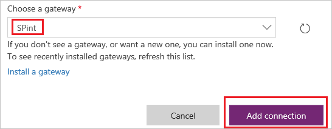

# Herstellen einer Verbindung mit SharePoint aus PowerApps
Erstellen Sie eine Verbindung mit SharePoint Online oder lokalem SharePoint, sodass Sie eine App automatisch generieren oder von Grund auf neu erstellen können.

Wenn Sie mit PowerApps nicht vertraut sind, finden Sie Grundlagen unter [Einführung in PowerApps](getting-started.md).

Zum Zeitpunkt dieses Artikels unterstützt PowerApps benutzerdefinierte Listen, jedoch keine Bibliotheken. Darüber hinaus können Sie Daten in verschiedenen Arten von Spalten anzeigen, z.B. **Auswahl** und **Bild**, aber Sie können diese Daten nicht aktualisieren. Weitere Informationen finden Sie unter [Known issues (Bekannte Probleme)](connections/connection-sharepoint-online.md#known-issues).

## Angeben einer SharePoint-Verbindung
1. Wenn Sie noch nicht angemeldet sind, [melden Sie sich bei PowerApps an](signup-for-powerapps.md).

2. Melden Sie sich unter [powerapps.com](https://web.powerapps.com) mit denselben Anmeldeinformationen an, die Sie bei der Registrierung verwendet haben.

3. Klicken oder tippen Sie in der linken Navigationsleiste auf **Verwalten**, und klicken oder tippen Sie anschließend auf **Verbindungen**.

    

4. Klicken oder tippen Sie in der Nähe der oberen rechten Ecke auf **Neue Verbindung**.

    

5. Klicken oder tippen Sie In der Liste der Verbindungen auf **SharePoint**.

    

6. Führen Sie die Schritte einer der folgenden Vorgehensweisen durch, die weiter unten in diesem Thema angezeigt werden:

   * [Verbinden mit einer SharePoint Online-Website](connect-to-sharepoint.md#connect-to-a-sharepoint-online-site)
   * [Verbinden mit einer lokalen SharePoint-Website](connect-to-sharepoint.md#connect-to-an-on-premises-sharepoint-site)

## Verbinden mit einer SharePoint Online-Website
1. Klicken oder tippen Sie auf **Direkt verbinden (Clouddienste)**, und klicken oder tippen Sie anschließend auf **Verbindung hinzufügen**.

    

2. Wechseln Sie zu [Nächste Schritte](connect-to-sharepoint.md#next-steps) am Ende dieses Themas.

## Verbinden mit einer lokalen SharePoint-Website
1. Klicken oder tippen Sie auf **Verbindung mit einem lokalen Datengateway herstellen**.

    

    > [!NOTE]
> Gateways und lokale Verbindungen können nur in der [Standardumgebung](working-with-environments.md) des Benutzers erstellt und verwendet werden.

2. Geben Sie Ihren Benutzernamen und Ihr Kennwort an.

    Wenn Ihre Anmeldeinformationen einen Domänennamen enthalten, geben Sie sie folgendermaßen an: *Domäne\Alias*.

    

3. Wenn Sie kein lokales Datengateway installiert haben, [installieren Sie eines](gateway-reference.md), und klicken oder tippen Sie anschließend auf das Symbol zum Aktualisieren der Liste der Gateways.

    

4. Klicken oder tippen Sie unter **Gateway auswählen** auf das Gateway, das Sie verwenden möchten, und klicken oder tippen Sie auf **Verbindung hinzufügen**.

    

## Nächste Schritte
* [Generieren Sie eine App automatisch](app-from-sharepoint.md), basierend auf einer Liste, die Sie angeben. Die App verfügt standardmäßig über drei Bildschirme: jeweils einen zum Durchsuchen von Datensätzen, zum Anzeigen von Details zu einem einzelnen Datensatz und zum Erstellen oder Aktualisieren eines Datensatzes.
* [Neuerstellen einer App von Grund auf](get-started-create-from-blank.md). Dieses Thema wurde für Excel geschrieben, die gleichen Prinzipien gelten jedoch auch für SharePoint.
