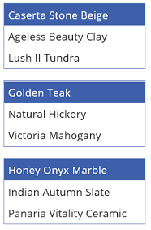

# Listenfeld-Steuerelement in PowerApps
Eine Liste, in der der Benutzer ein oder mehrere Elemente auswählen kann

## Beschreibung
Ein **Listenfeld**-Steuerelement zeigt immer alle verfügbare Optionen an (im Gegensatz zu einem **[Dropdown](control-drop-down.md)**-Steuerelement), wobei der Benutzer mehr als ein Element gleichzeitig auswählen kann (im Gegensatz zu einem **[Optionsfeld](control-radio.md)**-Steuerelement).

## Haupteigenschaften
**[Default](properties-core.md)**: Der Anfangswert eines Steuerelements, bevor er vom Benutzer geändert wird.

**[Items](properties-core.md)**: Die Quelle der Daten, die in einem Steuerelement angezeigt werden, z.B. ein Katalog, eine Liste oder ein Diagramm.

[!INCLUDE [long-items](../../includes/long-items.md)]

## Zusätzliche Eigenschaften
**[BorderColor](properties-color-border.md)** – Die Farbe des Rahmens eines Steuerelements.

**[BorderStyle](properties-color-border.md)** – Legt fest, ob der Rahmen eines Steuerelements **Solid** (Durchgehend), **Dashed** (Gestrichelt), **Dotted** (Gepunktet) oder **None** (Keiner) ist.

**[BorderThickness](properties-color-border.md)** – Die Stärke des Rahmens eines Steuerelements.

**[FocusedBorderThickness](properties-color-border.md)**: Die Rahmenstärke eines Steuerelements, wenn es den Tastaturfokus besitzt.

**[Color](properties-color-border.md)** – Die Farbe des Texts in einem Steuerelement.

**[DisplayMode](properties-core.md)**: Legt fest, ob das Steuerelement Benutzereingaben zulässt (**Edit**, Bearbeiten), ob nur Daten angezeigt werden (**View**, Anzeigen) oder ob das Steuerelement deaktiviert ist (**Disabled**, Deaktiviert).

**[DisabledBorderColor](properties-color-border.md)**: Die Farbe des Steuerelementrahmens, wenn die **[DisplayMode](properties-core.md)**-Eigenschaft des Steuerelements auf **Disabled** (Deaktiviert) festgelegt ist.

**[DisabledColor](properties-color-border.md)**: Die Farbe des Texts in einem Steuerelement, wenn seine **[DisplayMode](properties-core.md)**-Eigenschaft auf **Disabled** (Deaktiviert) festgelegt ist.

**[DisabledFill](properties-color-border.md)**: Die Hintergrundfarbe eines Steuerelements, wenn dessen **[DisplayMode](properties-core.md)**-Eigenschaft auf **Disabled** (Deaktiviert) festgelegt ist.

**[Fill](properties-color-border.md)** – Die Hintergrundfarbe eines Steuerelements.

**[Font](properties-text.md)** – Der Name der Schriftfamilie des angezeigten Texts.

**[FontWeight](properties-text.md)** – Die Schriftbreite des Texts in einem Steuerelement: **Bold** (Fett), **Semibold** (Halbfett), **Normal** oder **Lighter** (Heller).

**[Height](properties-size-location.md)** – Die Entfernung zwischen dem oberen und unteren Rand eines Steuerelements.

**[HoverBorderColor](properties-color-border.md)** – Die Rahmenfarbe eines Steuerelements, wenn der Benutzer den Mauszeiger über das Steuerelement hält.

**[HoverColor](properties-color-border.md)** – Die Farbe des Texts in einem Steuerelement, wenn der Benutzer den Mauszeiger über ihm hält.

**[HoverFill](properties-color-border.md)** – Die Hintergrundfarbe eines Steuerelements, wenn der Benutzer den Mauszeiger über ihm hält.

**[Italic](properties-text.md)** – Legt fest, ob der Text in einem Steuerelement kursiv formatiert ist.

**ItemPaddingLeft**: gibt den Abstand zwischen Text in einem Listenfeld und dem linken Rand an.

**[LineHeight](properties-text.md)**: Der Abstand zwischen Elementen, z.B. Textzeilen oder Elementen in einer Liste.

**[OnChange](properties-core.md)**: Gibt an, wie die App reagiert, wenn der Benutzer den Wert eines Steuerelements ändert (z.B. per Schieberegler).

**[OnSelect](properties-core.md)** – Legt fest, wie die App reagiert, wenn der Benutzer auf ein Steuerelement tippt oder klickt.

**[PaddingBottom](properties-size-location.md)**: Der Abstand zwischen dem Text eines Steuerelements und dem unteren Rand des Steuerelements.

**[PaddingLeft](properties-size-location.md)**: Der Abstand zwischen dem Text eines Steuerelements und dem linken Rand des Steuerelements.

**[PaddingRight](properties-size-location.md)**: Der Abstand zwischen dem Text eines Steuerelements und dem rechten Rand des Steuerelements.

**[PaddingTop](properties-size-location.md)**: Der Abstand zwischen dem Text eines Steuerelements und dem oberen Rand des Steuerelements.

**[PressedBorderColor](properties-color-border.md)** – Die Rahmenfarbe eines Steuerelements, wenn der Benutzer auf das Steuerelement tippt oder klickt.

**[PressedColor](properties-color-border.md)** – Die Farbe des Texts in einem Steuerelement, wenn der Benutzer auf das Steuerelement tippt oder klickt.

**[PressedFill](properties-color-border.md)** – Die Hintergrundfarbe eines Steuerelements, wenn der Benutzer auf das Steuerelement tippt oder klickt.

**[Reset](properties-core.md)**: Gibt an, ob ein Steuerelement auf seinen Standardwert zurückgesetzt wird.

**[SelectionColor](properties-color-border.md)**: Die Textfarbe des ausgewählten Elements oder der Elemente in einer Liste oder die Farbe des Auswahltools in einem Stift-Steuerelement.

**[SelectionFill](properties-color-border.md)** : gibt die Hintergrundfarbe der ausgewählten Elemente in einer Liste oder eines ausgewählten Bereichs des Stift-Steuerelements an.

**SelectMultiple**: gibt an, ob ein Benutzer mehr als ein Element in einem Listenfeld auswählen kann.

**[Size](properties-text.md)** – Der Schriftgrad des Texts, der in einem Steuerelement angezeigt wird.

**[Strikethrough](properties-text.md)** – Legt fest, ob der in einem Steuerelement angezeigte Text durchgestrichen ist.

**[TabIndex](properties-accessibility.md)**: Passt die Aktivierreihenfolge von Steuerelementen zur Laufzeit an, wenn sie auf einen Wert ungleich 0 festgelegt wird.

**[QuickInfo](properties-core.md)**: Erklärender Text, der angezeigt wird, wenn der Benutzer auf ein Steuerelement zeigt.

**[Underline](properties-text.md)** – Legt fest, ob der in einem Steuerelement angezeigte Text unterstrichen ist.

**[Visible](properties-core.md)** – Legt fest, ob ein Steuerelement angezeigt wird oder ausgeblendet ist.

**[Width](properties-size-location.md)** – Der Abstand zwischen dem linken und rechten Rand eines Steuerelements.

**[X](properties-size-location.md)** – Der Abstand zwischen dem linken Rand eines Steuerelements und dem linken Rand des übergeordneten Containers (bzw. des Bildschirms, wenn kein übergeordneter Container vorhanden ist).

**[Y](properties-size-location.md)** – Der Abstand zwischen dem oberen Rand eines Steuerelements und dem oberen Rand des übergeordneten Containers (bzw. des Bildschirms, wenn kein übergeordneter Container vorhanden ist).

## Verwandte Funktionen
[**Distinct**( *DataSource*, *ColumnName* )](../functions/function-distinct.md)

## Beispiel
1. Fügen Sie ein **Listenfeld**-Steuerungselement hinzu, nennen Sie es **CategoryList**, und legen Sie seine **[Items](properties-core.md)**-Eigenschaft auf folgende Formel fest: 
   **["Carpet", "Hardwood", "Tile"]** (Teppichboden, Parkett, Fliesen)
   
    Möchten Sie wissen, wie Sie [ein Steuerelement hinzufügen, benennen und konfigurieren](../add-configure-controls.md)?
   
    
2. Fügen Sie drei **[Dropdown](control-drop-down.md)**-Steuerelemente hinzu, verschieben Sie sie unter **CategoryList**, und nennen Sie diese **CarpetList**, **HardwoodList** und **TileList**.
3. Legen Sie die **[Items](properties-core.md)**-Eigenschaft jedes **[Dropdown](control-drop-down.md)**-Steuerelements auf einen der folgenden Werte fest:
   
   * CarpetList: **["Caserta Stone Beige", "Ageless Beauty Clay", "Lush II Tundra"]**
   * HardwoodList: **["Golden Teak","Natural Hickory", "Victoria Mahogany"]**
   * TileList: **["Honey Onyx Marble","Indian Autumn Slate", "Panaria Vitality Ceramic"]**
     
     
4. Legen Sie die  **[Visible](properties-core.md)** -Eigenschaft jedes **[Dropdown](control-drop-down.md)** -Steuerelements auf einen der folgenden Werte fest:
   
   * CarpetList: **If("Carpet" in CategoryList.SelectedItems.Value, true)**
   * HardwoodList: **If("Hardwood" in CategoryList.SelectedItems.Value, true)**
   * TileList: **If("Tile" in CategoryList.SelectedItems.Value, true)**
     
     Benötigen Sie weitere Informationen zur **[If](../functions/function-if.md)**-Funktion oder [anderen Funktionen](../formula-reference.md)?
5. Drücken Sie F5, und wählen Sie ein oder mehrere Elemente in **CategoryList** aus.
   
    Die entsprechenden  **[Dropdown](control-drop-down.md)**-Steuerelemente werden entsprechend Ihrer Wahl oder Ihren Optionen angezeigt.
   
    
6. (optional) Drücken Sie die ESC-TASTE, um zum Standardarbeitsbereich zurückzukehren.

