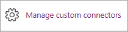
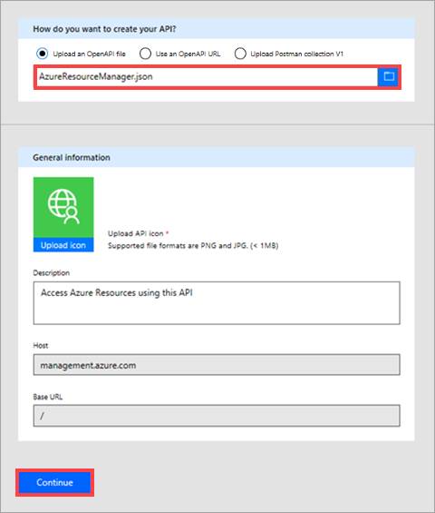

# Verwenden von Azure Active Directory mit einem benutzerdefinierten Connector in PowerApps
Mithilfe von Azure Resource Manager (ARM) können Sie die Komponenten einer Lösung auf Azure verwalten – Komponenten wie Datenbanken, virtuelle Computer und Web-Apps. Dieses Tutorial veranschaulicht das Aktivieren von Authentifizierung in Azure Active Directory, das Registrieren einer der ARM-APIs als benutzerdefinierten Connector und das anschließende Herstellen einer Verbindung mit ihm in PowerApps. Dies ist etwa dann nützlich, wenn Sie Azure-Ressourcen direkt aus einer App verwalten möchten. Weitere Informationen zu ARM finden Sie unter [Azure Resource Manager – Übersicht](https://docs.microsoft.com/azure/azure-resource-manager/resource-group-overview).

## Voraussetzungen
* ein [Azure-Abonnement](https://azure.microsoft.com/free/)
* Ein [PowerApps-Konto](https://powerapps.microsoft.com).
* Die in diesem Tutorial verwendete [OpenAPI-Beispieldatei](http://pwrappssamples.blob.core.windows.net/samples/AzureResourceManager.json).

## Aktivieren der Authentifizierung in Azure Active Directory
Zunächst muss eine Azure Active Directory-Anwendung (AAD) erstellt werden, die beim Aufrufen des ARM-API-Endpunkts die Authentifizierung durchführt.

1. Melden Sie sich beim [Azure-Portal](https://portal.azure.com) an.  Wenn Sie über mehr als einen Azure Active Directory-Mandanten verfügen, stellen Sie sicher, dass Sie beim richtigen Verzeichnis angemeldet sind, indem Sie Ihren Benutzernamen in der oberen rechten Ecke überprüfen.
   
    
2. Klicken Sie im Menü auf der linken Seite auf **More services** (Weitere Dienste).  Geben Sie im Textfeld **Filter** folgenden Text ein: **Azure Active Directory**. Klicken Sie anschließend auf **Azure Active Directory**.
   
    
   
    Das Azure Active Directory-Blatt wird geöffnet.   
3. Klicken Sie im Menü des Azure Active Directory-Blatts auf **App-Registrierungen**.
   
    
4. Klicken Sie in der Liste der registrierten Anwendungen auf **Hinzufügen**.
   
       
5. Geben Sie einen Namen für Ihre Anwendung ein, lassen Sie die Option **Web-App/API** ausgewählt, und geben Sie anschließend unter **Anmelde-URL** Folgendes ein: `https://login.windows.net`.  Klicken Sie auf **Erstellen**.  
   
    
6. Klicken Sie auf die neue Anwendung in der Liste.
   
    
   
    Das Blatt „Registrierte App“ wird geöffnet.  Notieren Sie sich die **Anwendungs-ID**.  Wir benötigen sie später.
7. Das Blatt „Einstellungen“ sollte ebenfalls geöffnet sein.  Klicken Sie andernfalls auf die Schaltfläche **Einstellungen**.
   
    
8. Klicken Sie auf dem Blatt „Einstellungen“ auf **Antwort-URLs**. Fügen Sie in der Liste der URLs `https://msmanaged-na.consent.azure-apim.net/redirect` hinzu, und klicken Sie auf **Speichern**.
   
    
9. Klicken Sie auf dem Blatt „Einstellungen“ auf **Erforderliche Berechtigungen**.  Klicken Sie auf dem Blatt „Erforderliche Berechtigungen“ auf **Hinzufügen**.
   
    
   
    Das Blatt „API-Zugriff hinzufügen“ wird geöffnet.
10. Klicken Sie auf **Hiermit wählen Sie eine API aus**. Klicken Sie auf dem Blatt, das geöffnet wird, auf die Option für die Azure-Dienstverwaltungs-API, und klicken Sie anschließend auf **Auswählen**.
    
    
11. Klicken Sie auf **Berechtigungen auswählen**.  Klicken Sie unter *Delegierte Berechtigungen* auf **Access Azure Service Management as organization users** (Zugriff auf Azure Service Management als Organisationsbenutzer), und klicken Sie anschließend auf **Auswählen**.
    
    
12. Klicken Sie auf dem Blatt „API-Zugriff hinzufügen“ auf **Fertig**.
13. Klicken Sie auf dem Blatt „Einstellungen“ auf **Schlüssel**.  Geben Sie auf dem Blatt „Schlüssel“ eine Beschreibung für den Schlüssel ein, wählen Sie ein Ablaufdatum aus, und klicken Sie anschließend auf **Speichern**.  Ihr neuer Schlüssel wird angezeigt.  Notieren Sie sich den Schlüsselwert, da wir ihn ebenfalls noch später benötigen.  Sie können das Azure-Portal nun schließen.
    
    

## Hinzufügen der Verbindung in PowerApps
Nachdem die AAD-Anwendung konfiguriert ist, können wir jetzt den benutzerdefinierten Connector hinzufügen.

1. Wählen Sie in [powerapps.com](https://web.powerapps.com) im linken Menü **Verbindungen** aus. Wählen Sie die Auslassungspunkte (**...**) und dann in der oberen rechten Ecke **Benutzerdefinierte Connectors verwalten** aus.
   
     **Tipp**: Wenn Sie die Option zum Verwalten benutzerdefinierter Connectors in einem mobilen Browser nicht finden können, befindet sie sich möglicherweise unter einem Menü in der oberen linken Ecke.
   
      
2. Wählen Sie **Benutzerdefinierten Connector erstellen** aus.
   
    
3. Geben Sie einen Namen für Ihre Verbindung ein, und laden Sie anschließend die [ARM-OpenAPI-Beispieldatei](http://pwrappssamples.blob.core.windows.net/samples/AzureResourceManager.json) hoch.  Klicken Sie auf **Weiter**.  
   
    
4. Auf dem nächsten Bildschirm müssen wir PowerApps einige Informationen über unsere Anwendung geben, da die OpenAPI-Datei die AAD-Anwendung zur Authentifizierung verwendet.  Geben Sie unter **Client-ID** die AAD **Anwendungs-ID** ein, die Sie sich zuvor notiert haben.  Verwenden Sie den **Schlüssel** als Clientgeheimnis.  Geben Sie abschließend als **Ressourcen-URL** Folgendes ein: `https://management.core.windows.net/`.
   
    **Wichtig**: Achten Sie darauf, dass Sie die Ressourcen-URL genau wie oben beschrieben eingeben, einschließlich des nachgestellten Schrägstrichs.
   
    
5. Ihr benutzerdefinierter Connector ist nun registriert und kann in PowerApps oder Microsoft Flow genutzt werden.
   
    
   
    **Hinweis**: Die OpenAPI-Beispieldatei legt nicht alle ARM-Vorgänge fest und enthält derzeit nur den Vorgang zum [Auflisten aller Abonnements](https://msdn.microsoft.com/library/azure/dn790531.aspx).  Sie können diese OpenAPI-Datei bearbeiten, oder mithilfe des [OpenAPI-Online-Editors](http://editor.swagger.io/) eine neue OpenAPI-Datei erstellen. Dieser Prozess kann verwendet werden, um auf alle RESTful-APIs zuzugreifen, die über AAD authentifiziert werden.

## Nächste Schritte
Ausführlichere Informationen zum Erstellen einer App finden Sie unter [Generate an app from Excel data (Generieren einer App aus Excel-Daten)](get-started-create-from-data.md).

Ausführlichere Informationen zur Verwendung eines Flows in einer App finden Sie unter [Start a flow in an app (Starten eines Flows in einer App)](using-logic-flows.md).

Wenn Sie Fragen haben oder Kommentare zu benutzerdefinierten Connectors abgeben möchten, [treten Sie unserer Community bei](https://aka.ms/powerapps-community).

