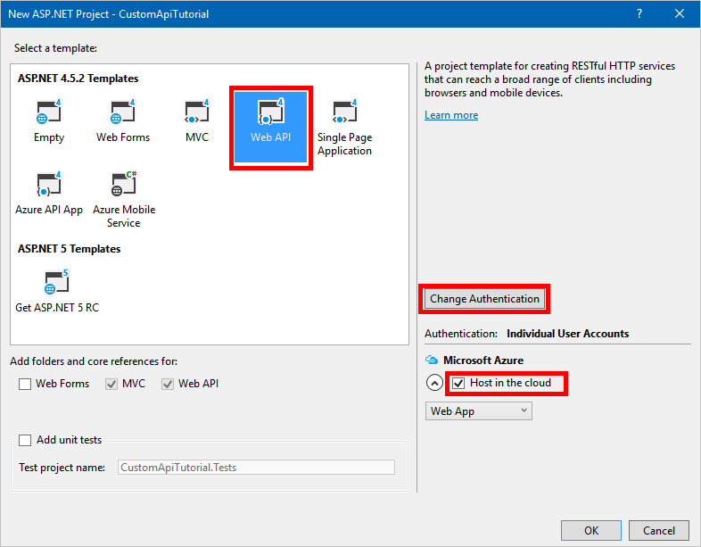

# <a name="build-a-custom-connector-for-a-web-api-in-powerapps"></a>Erstellen eines benutzerdefinierten Connectors für eine Web-API in PowerApps
In diesem Tutorial wird der Einstieg in die Erstellung einer ASP.NET Web-API erläutert, wie Sie sie in Azure Web-Apps hosten, die Azure Active Directory-Authentifizierung aktivieren und anschließend das ASP.NET Web-API in PowerApps bereitstellen. Nach dem Registrieren der API können Sie Verbindungen mit ihr herstellen und sie von der App aus aufrufen.

## <a name="prerequisites"></a>Voraussetzungen
* ein [Azure-Abonnement](https://azure.microsoft.com/en-us/free/)
* ein [PowerApps-Konto](https://powerapps.microsoft.com)
* [Visual Studio](https://www.visualstudio.com/vs/) 2013 oder höher.

## <a name="create-an-aspnet-web-api-and-deploy-it-to-azure"></a>Erstellen und Bereitstellen eines ASP.NET Web-API in Azure
1. Klicken Sie in Visual Studio auf **Datei** > **Neues Projekt**, um eine neue C#-ASP.NET-Web-Anwendung zu erstellen.
   
    
2. Wählen Sie die **Web-API**-Vorlage aus.  Lassen Sie **In der Cloud hosten** aktiviert.  Klicken Sie auf **Authentifizierung ändern**.
   
    
3. Wählen Sie **Keine Authentifizierung** aus, und klicken Sie dann auf **OK**.
   
    
4. Klicken Sie im Dialogfeld **Neues ASP.NET-Projekt** auf **OK**.  Das Dialogfeld „Microsoft Azure-Web-App konfigurieren“ erscheint.
   
    ]
   
    Wählen Sie Ihr Azure-Konto aus, geben Sie einen **Web-App-Namen** ein (oder übernehmen Sie den Standardwert), und wählen Sie Ihr Azure-**Abonnement** aus.  Wählen oder erstellen Sie einen **App Service-Plan** (eine Sammlung von Web-Apps in Ihrem Abonnement).  Wählen oder erstellen Sie eine **Ressourcengruppe** (eine Gruppierung von Azure-Ressourcen in Ihrem Abonnement).  Wählen Sie die Region, in denen die Web-App bereitgestellt werden soll.  Wählen oder erstellen Sie bei Bedarf für Ihre Web-API einen Azure-**Datenbankserver**.  Klicken Sie abschließend auf **OK**.
5. Erstellen Sie Ihre Web-API.
   
    > [!NOTE]
> Wenn Sie noch nicht über fertigen Code für eine Web-API verfügen, nutzen Sie die Informationen aus dem Tutorial [Erste Schritte mit ASP.NET-Web-API 2 (C#)](http://www.asp.net/web-api/overview/getting-started-with-aspnet-web-api/tutorial-your-first-web-api).
6. Um unsere Web-API mit PowerApps zu verbinden, benötigen wir eine [OpenAPI](http://swagger.io/)-Datei, die ihre Operationen beschreibt.  Sie können mithilfe des [Online-Editors](http://editor.swagger.io/) auf eigene Faust eine OpenAPI erstellen, aber im Rahmen dieses Tutorials verwenden wir ein Open-Source-Tool namens [Swashbuckle](https://github.com/domaindrivendev/Swashbuckle/blob/master/README.md).  Installieren Sie das Swashbuckle-NuGet-Paket in Ihrem Visual Studio-Projekt, indem Sie auf **Tools** > **NuGet-Paket-Manager** > **Paket-Manager-Konsole** klicken und anschließend in der Paket-Manager-Konsole den Befehl `Install-Package Swashbuckle` eingeben.
   
    
   
    > [!TIP]
> Wenn Sie Ihre Web-API-Anwendung nach der Installation von Swashbuckle ausführen, wird jetzt eine OpenAPI-Datei unter dieser URL generiert: `http://<your root URL>/swagger/docs/v1`.  Eine generierte Benutzeroberfläche finden Sie auch unter `http://<your root URL>/swagger`.
7. Wenn Ihre Web-API bereit ist, veröffentlichen Sie sie in Azure. Klicken Sie zum Veröffentlichen von Visual Studio mit der rechten Maustaste auf das Webprojekt im Projektmappen-Explorer, klicken Sie auf **Veröffentlichen...** , und befolgen Sie dann die Anweisungen im Dialogfeld „Veröffentlichen“.
8. Rufen Sie OpenAPI-JSON ab, indem Sie zu `https://<azure-webapp-url>/swagger/docs/v1` navigieren.  Speichern Sie den Inhalt als JSON-Datei.  Abhängig von Ihrem Browser müssen Sie möglicherweise den Text in eine leere Textdatei kopieren.   
   
    > [!IMPORTANT]
> Ein OpenAPI-Dokument mit doppelt vorhandenen Operations-IDs ist ungültig. Wenn Sie die C#-Beispielvorlage verwenden, wird die Vorgangs-ID `Values_Get` zweimal wiederholt. Sie können diesen Fehler beheben, indem Sie eine Instanz in `Value_Get` ändern, und erneut veröffentlichen. Sie können auch eine [OpenAPI-Beispieldatei](http://pwrappssamples.blob.core.windows.net/samples/webAPI.json) aus diesem Tutorial laden. Achten Sie darauf, dass Sie vor der Verwendung die Kommentare entfernen (beginnend mit `//`).

## <a name="set-up-azure-active-directory-authentication"></a>Festlegen der Authentifizierung über Azure Active Directory
Erstellen Sie nun zwei Azure Active Directory-Anwendungen (AAD) in Azure.  Ein Beispiel hierzu finden Sie unter [Azure Resource Manager tutorial (Azure Resource Manager-Tutorial)](customapi-azure-resource-manager-tutorial.md#enable-authentication-in-azure-active-directory).

> [!IMPORTANT]
> Beide Apps müssen sich im selben Verzeichnis befinden.

### <a name="first-aad-application-securing-the-web-api"></a>Erste AAD-Anwendung: Sichern der Web-API
Die erste AAD-Anwendung wird verwendet, um die Web-API zu sichern. Nennen Sie sie **webAPI**.  Führen Sie die oben genannten Schritte für das verknüpfte Tutorial (nur im Abschnitt „Aktivieren der Authentifizierung in Azure Active Directory“) mit den folgenden Werten aus:

* Anmelde-URL: `https://login.windows.net`
* Antwort-URL: `https://<your-root-url>/.auth/login/aad/callback`
* Ein Clientschlüssel ist nicht erforderlich.
* Es ist nicht erforderlich, Berechtigungen zu delegieren.

> [!IMPORTANT]
> Beachten Sie die Anwendungs-ID.  Sie benötigen sie später.

### <a name="second-aad-application-securing-the-custom-connector-and-delegated-access"></a>Zweite AAD-Anwendung: Sichern des benutzerdefinierten Connectors und des delegierten Zugriffs
Die zweite AAD-Anwendung dient zum Schutz der Registrierung des benutzerdefinierten Connectors und zum Erwerb von delegiertem Zugriff auf die Web-API, die von der ersten Anwendung geschützt ist. Nennen Sie diese **webAPI-customAPI**.

* Anmelde-URL: `https://login.windows.net`
* Antwort-URL: `https://msmanaged-na.consent.azure-apim.net/redirect`
* Fügen Sie Berechtigungen hinzu, um delegierten Zugriff auf die Web-API zu erhalten.
* Sie benötigen die Anwendungs-ID dieser Anwendung auch später, schreiben Sie sich diese daher auf.
* Generieren Sie einen Clientschlüssel, und speichern Sie ihn an einem sicheren Ort. Wir benötigen diesen Schlüssel später.

## <a name="add-authentication-to-your-azure-web-app"></a>Authentifizierung zu Ihrer Azure-Web-App hinzufügen

1. Melden Sie sich im [Azure-Portal](https://portal.azure.com) an, und suchen Sie Ihre Web-App, die Sie im ersten Abschnitt bereitgestellt haben.

2. Klicken Sie auf **Einstellungen**, und wählen Sie dann **Authentifizierung/Autorisierung** aus.

3. Aktivieren Sie **App Service-Authentifizierung**, und wählen Sie dann **Azure Active Directory** aus.  Wählen Sie auf dem nächsten Blatt **Express** aus.  

4. Klicken Sie auf **Vorhandene AD-App auswählen**, und wählen Sie die **webAPI**-AAD-Anwendung, die Sie zuvor erstellt haben.

Sie sollten jetzt AAD zum Authentifizieren der Webanwendung verwenden können.

## <a name="add-the-custom-connector-to-powerapps"></a>Hinzufügen des benutzerdefinierten Connectors zu PowerApps
1. Ändern Sie Ihre OpenAPI-Datei, um das `securityDefintions`-Objekt und die AAD-Authentifizierung, die für die Web-App verwendet wird, hinzuzufügen. Der Teil Ihrer OpenAPI-Datei mit der **Host**-Eigenschaft sollte wie folgt aussehen:

    ```javascript
    // File header should be above here...

    "host": "<your-root-url>",
    "schemes": [
        "https"         //Make sure this is https!
    ],
    "securityDefinitions": {
        "AAD": {
            "type": "oauth2",
            "flow": "implicit",
            "authorizationUrl": "https://login.windows.net/common/oauth2/authorize",
            "scopes": {}
        }
    },

    // The rest of the OpenAPI document follows...
    ```

2. Navigieren Sie zu [PowerApps](https://web.powerapps.com), und fügen Sie einen benutzerdefinierten Connector hinzu, wie unter [Registrieren und Verwenden von benutzerdefinierten Connectors in PowerApps](register-custom-api.md) beschrieben.

3. Nachdem Sie Ihre OpenAPI-Datei hochgeladen haben, erkennt der Assistent automatisch, dass Sie AAD-Authentifizierung für Ihre Web-API verwenden.

4. Konfigurieren Sie die AAD-Authentifizierung für den benutzerdefinierten Connector.  
   
   * **Client-ID**: *Client-ID der webAPI-customAPI*
   * **Geheimnis**: *Client-Schlüssel der webAPI-customAPI*
   * **Anmelde-URL**: `https://login.windows.net`
   * **ResourceUri**: *Client-ID der webAPI*
5. Klicken Sie auf **Erstellen**, und erstellen Sie eine Verbindung zum benutzerdefinierten Connector.

## <a name="next-steps"></a>Nächste Schritte
Lernen Sie das Tutorial [Azure Resource Manager custom connector (Benutzerdefinierte Connectors in Azure Resource Manager)](customapi-azure-resource-manager-tutorial.md) kennen.

