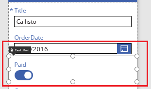
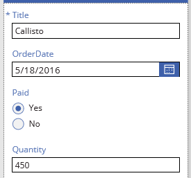

# Anpassen einer Karte in Microsoft PowerApps
Führen Sie eine grundlegende Anpassung (ohne Entsperren einer Karte) durch, indem Sie beispielsweise das Steuerelement ändern. Erweiterte Anpassung (mit Aufheben der Sperre einer Karte), indem Sie z.B. ein Steuerelement hinzufügen, das für diese Karte standardmäßig nicht verfügbar ist.

Eine Übersicht finden Sie unter [Grundlegendes zu Datenkarten](working-with-cards.md).

## Voraussetzungen

* Grundlegende Informationen zum [Hinzufügen und Konfigurieren von Steuerelementen](add-configure-controls.md).
* In diesem Thema werden nur allgemeine Konzepte erläutert. Um die Anleitungen einzeln und genau befolgen zu können, führen Sie die Schritte in den folgenden Themen durch:

  1. [Erstellen Sie eine App aus SharePoint](app-from-sharepoint.md).
  2. [Passen Sie das Layouts an](customize-layout-sharepoint.md).
  3. [Passen Sie das Formular an](customize-forms-sharepoint.md).

## Anpassen einer gesperrten Karte
Ersetzen Sie in diesem Verfahren ein Steuerelement des Typs **[Umschalten](controls/control-toggle.md)** durch einem Steuerelement des Typs  **[Optionsfeld](controls/control-radio.md)**, ohne die Karte zu entsperren.

1. Klicken oder tippen Sie in **EditScreen1**auf die **bezahlte** Karte, um sie auszuwählen.

    

2. Klicken oder tippen Sie im rechten Bereich auf die Kartenauswahl für die **bezahlte** Karte, und klicken oder tippen Sie anschließend auf **Bearbeitungsoptionen**.

    

    Der Bildschirm spiegelt die vorgenommene Änderung wider.

    
   
    Informationen darüber, welche Typen von SharePoint-Spalten welche Typen von Karten unterstützen, finden Sie unter [Known issues (Bekannte Probleme)](connections/connection-sharepoint-online.md#known-issues).

## Entsperren und Anpassen einer Karte
In diesem Verfahren entsperren Sie eine Karte und ersetzen anschließend ein Steuerelement des Typs  **[Texteingabe](controls/control-text-input.md)** durch ein Steuerelement des Typs **[Schieberegler](controls/control-slider.md)**.

1. Klicken oder tippen Sie in **EditScreen1** auf die Karte **Quantity** (Menge).

2. Klicken oder tippen Sie im rechten Bereich auf das Symbol der Ellipse für diese Karte, und klicken oder tippen Sie anschließend auf **Advanced options** (Erweiterte Optionen).

    
3. Klicken oder tippen Sie oben im rechten Bereich auf das Schlosssymbol, um die Karte zu entsperren.

    
4. Löschen Sie in der Karte das Steuerelement des Typs **Eingabetext**, fügen Sie ein Steuerelement des Typs **Schieberegler** hinzu, und nennen Sie das neue Steuerelement **QtySlider**.

5. Legen Sie im rechten Bereich die **Update**-Eigenschaft der Karte **Quantity** (Menge) auf diese Formel fest: 
   **QtySlider.Value**

   > [!NOTE]
> Wenn die **Update**-Eigenschaft nicht angezeigt wird, klicken oder tippen Sie auf **More options** (Weitere Optionen) am Ende des Abschnitts **Data**.

6. Klicken oder tippen Sie auf den Schieberegler, um ihn auszuwählen, und öffnen Sie anschließend die Liste der Steuerelemente am oberen Rand des rechten Bereichs.

7. Klicken oder tippen Sie auf **ErrorMessage4**, und legen Sie dann die **Height**-Eigenschaft auf diese Formel fest: 
   **QtySlider.Y + QtySlider.Height**
