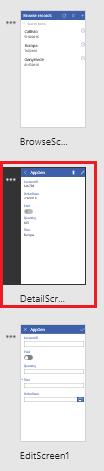
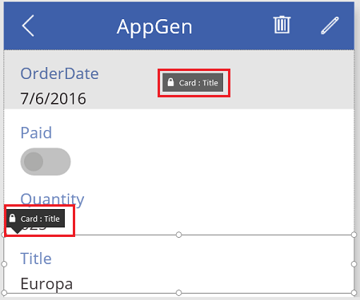
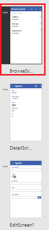

# Anpassen von Formularen in PowerApps
Anpassen eines **Display form**-Steuerelements und eines **Edit form**-Steuerelements, sodass die wichtigsten Daten angezeigt werden, in der intuitivsten Reihenfolge und in den Steuerelementen, mit denen Benutzer die Daten leicht verstehen und aktualisieren können.

Jedes Formular umfasst eine oder mehrere Karten, die jeweils Daten aus einer bestimmten Spalte in der Datenquelle anzeigen. Die Schritte in diesem Thema zeigen Ihnen, wie Sie angeben, welche Karten in einem Formular angezeigt werden, wie Sie Karten innerhalb eines Formulars nach oben oder unten verschieben, und wie Sie konfigurieren, wie Daten aus jeder Spalte in einer Karte angezeigt werden.

Wenn Sie mit PowerApps nicht vertraut sind, finden Sie Grundlagen unter [Einführung in PowerApps](getting-started.md).

## Voraussetzungen
Sie können dieses Tutorial zur allgemeinen Information verwenden oder den hier aufgeführten Schritten exakt folgen.

1. [Herstellen einer Verbindung](connect-to-sharepoint.md) von PowerApps zu SharePoint.
2. Erstellen Sie die SharePoint-Liste, die [Ein Layout anpassen](customize-layout-sharepoint.md) beschreibt.
3. [Generieren Sie eine App automatisch](app-from-sharepoint.md) basierend auf dieser Liste.
4. Klicken oder tippen Sie auf der linken Navigationsleiste rechts unten auf ein Symbol, um zur Miniaturansicht zu wechseln.
   
    

## Karten ein- und ausblenden
1. In der linken Navigationsleiste klicken oder tippen Sie auf die mittlere Miniaturansicht und wählen **DetailsScreen1**.
   
    
2. Klicken oder tippen Sie auf eine Karte, um Sie auszuwählen und die Optionen für die Anpassung von Formularen im rechten Bereich anzuzeigen.
   
    
3. Im rechten Bereich klicken oder tippen Sie auf das Kontrollkästchen der Karte **AccountID**, um sie auszublenden, und klicken oder tippen Sie auf das Kontrollkästchen der Spalte **ID**, um sie anzuzeigen.
   
    

## Karten anordnen
* Klicken oder tippen Sie auf die **Title**-Karte, um sie auszuwählen, und ziehen Sie ihre Titelleiste nach oben, bis die **OrderDate**-Karte hervorgehoben ist.
  
    
  
    Die Karte, die Sie verschieben, wird direkt oberhalb der Karte angezeigt, die hervorgehoben ist, wenn Sie die Maustaste loslassen.
  
    

## Ausführen der App
1. In der linken Navigationsleiste klicken oder tippen Sie auf die obere Miniaturansicht und wählen **BrowseScreen1**.
   
    
2. Öffnen Sie den Vorschaumodus durch Drücken von F5 (oder durch Auswählen des Symbols **Preview** in der Nähe der oberen rechten Ecke).  
   
    
3. In der oberen rechten Ecke klicken oder tippen Sie auf das Pluszeichen zum Hinzufügen eines Datensatzes in **EditScreen1**.
   
    
4. Fügen Sie beliebige Daten hinzu und klicken oder tippen Sie auf das Häkchen in der oberen rechten Ecke. Der neue Datensatz wird in der SharePoint-Liste gespeichert und Sie kehren zu **BrowseScreen1** zurück.
   
    
5. Klicken oder tippen Sie auf den Pfeil für das Element, das Sie gerade erstellt haben, um Details zu diesem Element in **DetailScreen1** anzuzeigen.  
   
    
6. In der oberen rechten Ecke klicken oder tippen Sie auf das Bearbeiten-Symbol zum Aktualisieren des Datensatzes in **EditScreen1**.
   
    
7. Ändern Sie die Informationen in mindestens einem Feld, und klicken oder tippen Sie auf das Häkchen in der oberen rechten Ecke, um Ihre Änderungen in der SharePoint-Liste zu speichern und zu **DetailScreen1** zurückzukehren.  
   
    
8. Klicken oder tippen Sie in der Nähe der oberen rechten Ecke auf das Papierkorb-Symbol, um den Datensatz zu löschen, den Sie gerade aktualisiert haben, und um wieder zu **BrowseScreen1** zurückzukehren.
   
    
9. Schließen Sie den Vorschaumodus durch Drücken der ESC-Taste (oder durch Klicken oder Tippen auf das Schließen-Symbol in der Nähe der oberen linken Ecke *unter* der Titelleiste für PowerApps).
   
    

## Nächste Schritte
* Drücken Sie STRG+S, um Ihre App zu speichern, sodass sie auf anderen Geräten ausgeführt werden kann.
* Sie können die [App freigeben](share-app.md), damit sie von anderen Personen ausgeführt werden kann.

