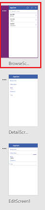
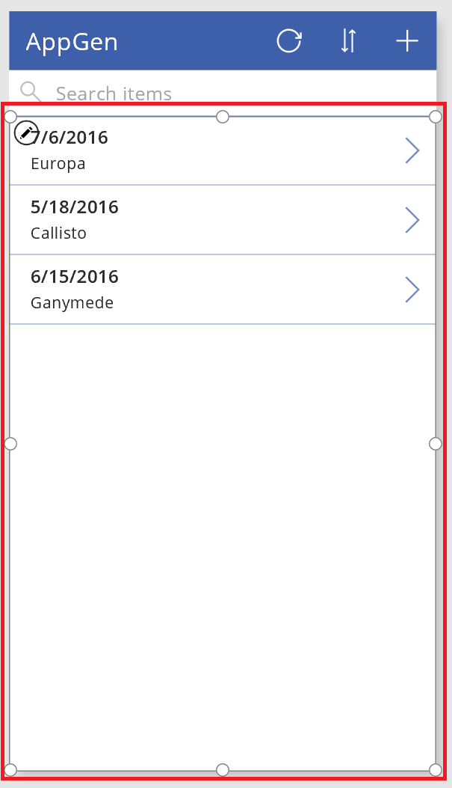
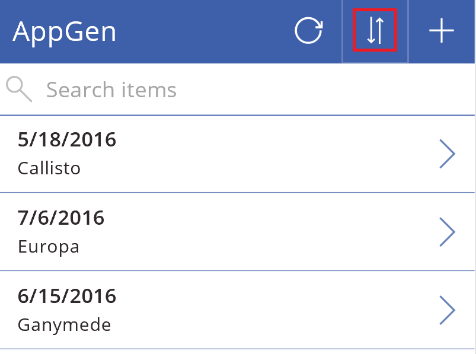
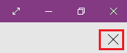
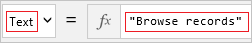

# Anpassen eines Kataloglayouts in PowerApps
Nachdem Sie eine App automatisch in PowerApps generiert haben, passen Sie den Bildschirm zum Durchsuchen an, der standardmäßig angezeigt wird. Geben Sie an, welches Layout verwendet wird, welche Spalten angezeigt werden und welche Spalten beim Sortieren und Filtern von Datensätzen verwendet werden.

* Informationen dazu, wie Sie eine Anwendung automatisch generieren, finden Sie unter [Generieren einer App, um Daten in einer SharePoint-Liste zu verwalten](app-from-sharepoint.md).
* Wenn Sie mit PowerApps nicht vertraut sind, finden Sie Grundlagen unter [Einführung in PowerApps](getting-started.md).

## Voraussetzungen
Sie können dieses Tutorial zur allgemeinen Information verwenden oder den hier aufgeführten Schritten exakt folgen.

1. [Herstellen einer Verbindung](connect-to-sharepoint.md) von PowerApps zu SharePoint.
2. Erstellen Sie eine SharePoint-Liste mit dem Namen **AppGen**, die die folgenden Spalten enthält.
   
    
3. Fügen Sie diese Elemente der Liste hinzu, die Sie gerade erstellt haben.
   
    
4. [Generieren Sie eine App automatisch](app-from-sharepoint.md) basierend auf der Liste, die Sie gerade erstellt haben.
5. Klicken oder tippen Sie auf der linken Navigationsleiste rechts unten auf ein Symbol, um zur Miniaturansicht zu wechseln.
   
    

## Anpassen des Katalogs
1. Klicken oder tippen Sie in der linken Navigationsleiste auf die obere Miniaturansicht, um sicherzustellen, dass **BrowseScreen1** ausgewählt ist.
   
    
   
    **BrowseScreen1** zeigt die **AccountID** und den **Titel** für jedes Element in der SharePoint-Liste an.
   
    
   
    Als Nächstes müssen Sie angeben, dass **OrderDate** für jedes Element angezeigt wird anstatt **AccountID**.
2. Klicken oder tippen Sie auf **AccountID** des ersten Elements auf dem Bildschirm.
   
    Beim Klicken oder tippen auf ein UI-Element (auch „Steuerelement“ genannt) wählen Sie das Element aus und ein Auswahlrahmen mit Handles zum Ändern der Größe erscheint um das Steuerelement.
   
    
3. Öffnen Sie im rechten Bereich die Liste **Title1**, und klicken oder tippen Sie dann auf **OrderDate**.
   
    
   
    **BrowseScreen1** zeigt Ihre Änderung.
   
    

Weitere Informationen zu Katalogen finden Sie unter [Anzeigen einer Liste mit Elementen in PowerApps](add-gallery.md).

## Sortier- und Suchspalten festlegen
1. Wählen Sie das **Gallery**-Steuerelement durch Klicken oder Tippen auf eine beliebigen Datensatz außer dem ersten aus.
   
    
2. Stellen Sie sicher, dass die Eigenschaftenliste in der Nähe der oberen linken Ecke **Items** anzeigt.
   
    
   
    Der Wert dieser Eigenschaft, die in der Bearbeitungsleiste angezeigt wird, bestimmt nicht nur die Quelle der Daten, die auf dem Bildschirm erscheinen, sondern auch die Filter- und Sortierspalten.
   
    Beispielsweise kann die Bearbeitungsleiste diese Formel standardmäßig enthalten.
   
    
   
    Auf Grundlage dieser Formel können Benutzer selektiv nur die Datensätze anzeigen, die in der Spalte **AccountID** mit einem oder mehreren Buchstaben beginnen.
   
    
   
    Wenn ein Benutzer z.B. den Buchstaben „A“ in der Suchleiste eingegeben hat, zeigt der Bildschirm den Datensatz für Europa an. Der Titel dieses Datensatzes stimmt nicht mit dem Suchkriterium überein, aber die Konto-ID. Später in diesem Verfahren ändern Sie die Formel ab, sodass die Datensätze auf Grundlage der Spalte **Title** gefiltert werden.
   
    In jeder generierten App können Benutzer Datensätze alphabetisch in aufsteigender oder absteigender Reihenfolge sortieren, indem Sie auf die Sortierschaltfläche in der Nähe der oberen rechten Ecke klicken oder tippen. Diese Formel gibt an, dass die Datensätze auf Grundlage der Spalte **AccountID** sortiert werden.
   
    
   
    Später in diesem Verfahren ändern Sie die Formel ab, sodass die Datensätze auf Grundlage der Spalte **Title** sortiert werden.
3. Ersetzen Sie in der Bearbeitungsleiste beide Instanzen von **AccountID** durch **Title** (einschließlich der doppelten Anführungszeichen, die die zweite Instanz einschließen).
   
    Die Bearbeitungsleiste sollte jetzt eine Formel enthalten, die diesem Beispiel ähnelt: 
    **SortByColumns(Filter(AppGen, StartsWith(Title, TextSearchBox1.Text)), "Title", If(SortDescending1, Descending, Ascending))**
   
    **Hinweis:**: Die Zahl nach **TextSearchBox** ist möglicherweise höher, je nachdem welche Aktionen Sie zuvor ausgeführt haben. Jedoch sollte die Formel weiterhin wie erwartet funktionieren.

## Testen von Sortieren und Suchen
1. Öffnen Sie den Vorschaumodus durch Drücken von F5 (oder durch Klicken oder Tippen der Schaltfläche „Wiedergabe“ in der Nähe der oberen rechten Ecke).
   
    
2. In der Nähe der oberen rechten Ecke des **BrowseScreen1**, klicken oder tippen Sie mindestens einmal auf die Schaltfläche „Sort“. So ändern Sie die alphabetische Sortierreihenfolge zwischen aufsteigender und absteigender.
   
    
3. Geben Sie im Suchfeld einen oder mehrere Buchstaben ein, um nur die Datensätze anzuzeigen, deren Titel mit dem bzw. den Buchstaben beginnt, den/die Sie eingeben.
   
    
4. Löschen Sie den Text aus der Suchleiste. Schließen Sie anschließend den Vorschaumodus durch Drücken der ESC-TASTE (oder durch Klicken oder Tippen auf das Schließen-Symbol *unter* der Titelleiste für PowerApps).
   
    

## Ändern des Bildschirmtitels
1. Klicken oder tippen Sie auf den Titel des Bildschirms, um ihn auszuwählen.
   
    
2. Stellen Sie sicher, dass die Eigenschaftenliste **Text** angezeigt, und geben Sie anschließend den gewünschten Namen umgeben von doppelten Anführungszeichen in der Bearbeitungsleiste ein.
   
    
   
    **BrowseScreen1** zeigt Ihre Änderung.
   
    

## Nächste Schritte
* Drücken Sie STRG+S, um die Änderungen zu speichern.
* [Passen Sie die Formulare](customize-forms-sharepoint.md) in der App durch Einblenden, Ausblenden und Neuanordnen von Feldern im Formular an.

