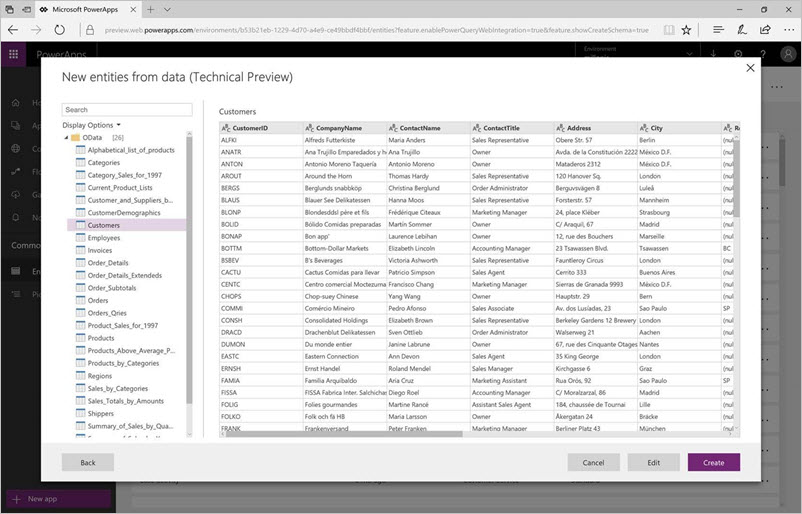

# Erstellen neuer Entitäten im Common Data Service (CDS) mithilfe von Power Query
Mit der Integration der Geschäftsanwendung **Power Query**, können Entwickler anhand einer breiten Palette von Datenquellen neue Entitäten im Common Data Service (CDS) erstellen.

Mit dem **Common Data Service** können Benutzer Daten sicher innerhalb eines Satzes von Standardentitäten und benutzerdefinierten Entitäten speichern und verwalten. Eine *Entität* ist eine Gruppe von Feldern, die ähnlich wie eine Tabelle in einer Datenbank zum Speichern von Daten verwendet wird. Sobald die Daten im Common Data Service gespeichert sind, können Sie mithilfe von **Microsoft PowerApps** anspruchsvolle Anwendungen erstellen, die die gespeicherten Daten verwenden.

Mit der Integration von **Power Query** in PowerApps können Entwickler von Geschäftsanwendungen auf der Grundlage von Daten aus externen Datenquellen neue Entitäten im **Common Data Service** erstellen. Zu solchen Datenquellen zählen u.a. lokale Datenquellen wie relationale Datenbanken (SQL Server, IBM DB2 usw.), Excel-, Access- und Textdateien, aber auch Onlinedienste wie Salesforce, Azure SQL-Datenbank und Data Warehouse, Web-APIs, OData-Feeds und viele weitere Quellen. Zusätzlich zu der breiten Palette von Datenquellen, mit denen Sie Verbindungen herstellen können, können Sie mithilfe von **Power Query** auch Daten filtern, transformieren und kombinieren, bevor Sie sie in den Common Data Service laden.

## Aktivieren der CDS-Funktion für neue Entitäten aus Power Query
Diese Funktion ist in Ihrem PowerApps-Mandanten verfügbar, sie ist jedoch nicht standardmäßig aktiviert. Sie können die Funktion unter [web.powerapps.com](https://aka.ms/pqocds) aktivieren.

**Hinweis:** Sie können neue benutzerdefinierte Entitäten nur in Datenbanken erstellen, die Sie erstellt haben.

Führen Sie im PowerApps-Portal die folgenden Schritte aus, um diese Funktion zu aktivieren:

1. Rufen Sie im linken Navigationsbereich die Registerkarte **Common Data Service > Entitäten** auf.
2. Wählen Sie in der Liste **Entitäten** das Dropdownmenü **Neue Entität** aus.
3. Wählen Sie aus der im Dropdownmenü angezeigten Liste den Eintrag **Neue Entität aus Daten (Technische Vorschau)** aus (siehe folgende Abbildung).
   
    
4. Nachdem Sie den Eintrag **Neue Entität aus Daten (Technische Vorschau)** im Menü ausgewählt haben, wird ein Dialogfeld mit der Liste der in dieser technischen Vorschau verfügbaren Connectors geöffnet, wie in der folgenden Abbildung veranschaulicht.
   
   
5. Wenn Sie den gewünschten Connector ausgewählt haben, können Sie mit den nächsten Schritten fortfahren und Details und Anmeldeinformationen für die Verbindung mit der Datenquelle angeben, die zu importierenden Tabellen auswählen usw. Möglicherweise können Sie auch auf den **Abfrage-Editor** zugreifen (über die Schaltfläche **Bearbeiten** in der **Navigationsansicht**) und damit Filter- oder Datentransformationsschritte ausführen, bevor Sie Daten in CDS importieren.
   
    

## Anpassen der Einstellungen für das Laden sowie anderer Verhaltenseinstellungen
Wenn Sie die Schritte im vorherigen Abschnitt ausgeführt haben und über eine Datenquelle verfügen, anhand derer Sie mithilfe von **Power Query** neue Entitäten in CDS erstellen können, können Sie weitere Einstellungen für das Laden konfigurieren, beispielsweise das Aktualisierungsverhalten oder entitätsspezifische Einstellungen (wie Anzeigename, Primärschlüssel und andere).

Wenn Sie diese Schritte ausgeführt haben und **Laden** auswählen, haben Sie neue benutzerdefinierte Entitäten in CDS erstellt. Sie können Abfragen auch nach dem erstmaligen Laden bearbeiten, indem Sie das Menü **Entität** für eine bestimmte Entität aufrufen.

Wir halten diese neue Funktionalität für sehr hilfreich und würden uns über Ihr Feedback freuen. Bitte [senden Sie uns Ihre Vorschläge und Ihr Feedback](https://powerusers.microsoft.com/t5/PowerApps-Community/ct-p/PowerApps1) zu dieser Funktion.

