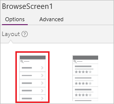
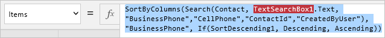

# Generieren einer App mithilfe einer Common Data Service-Datenbank
Sie können eine App automatisch generieren, um Daten zu verwalten, die in Common Data Service gespeichert sind. Sie können Daten in einer der vielen Standardentitäten verwalten, die in das Modell integriert sind, oder in einer benutzerdefinierten Entität, die Sie oder andere Personen in Ihrer Organisation erstellt haben.

Wenn Sie mit Common Data Service nicht vertraut sind, finden Sie Informationen dazu unter [Grundlegendes zu Entitäten](data-platform-intro.md).

In diesem Thema wird beschrieben, wie Sie automatisch eine App generieren, die auf einer einzelnen Entität basiert, die Sie angeben. Informationen zum Erstellen einer App, die auf mehr als einer Entität basiert, finden Sie unter [Eine App von Grund auf neu erstellen](data-platform-create-app-scratch.md).

Standardmäßig verfügt jede App, die PowerApps generiert, über drei Bildschirme:

* Der Bildschirm zum Durchsuchen zeigt eine Teilmenge eines oder mehrerer Felder, eine Suchleiste und eine Schaltfläche zum Sortieren an, mit deren Hilfe Benutzer einen bestimmten Datensatz leicht finden können.
* Der Detailbildschirm zeigt mehrere oder alle Felder für einen bestimmten Datensatz.
* Der Bildschirm zum Bearbeiten enthält Elemente der Benutzeroberfläche, mit deren Hilfe Benutzer einen Datensatz erstellen oder aktualisieren und die Änderungen speichern können.

> [!NOTE]
> Wenn Sie eine App über Common Data Service generieren, müssen Sie keine Verbindung von PowerApps erstellen, wie dies für Datenquellen wie SharePoint, Dynamics 365 und Salesforce erforderlich ist. Sie müssen nur die Entität angeben, die Sie in der App anzeigen, verwalten oder anzeigen und verwalten möchten.

## Eine App generieren
1. Erstellen Sie eine Common Data Service-Datenbank. Weitere Informationen finden Sie unter [Erstellen einer Common Data Service-Datenbank](create-database.md).

2. Klicken oder tippen Sie in PowerApps Studio für Windows im Menü **Datei** (am linken Rand des Bildschirms) auf **Neu**.

3. Klicken oder tippen Sie unter **Von Ihren Daten ausgehen** auf der Kachel **Common Data Service** auf **Smartphonelayout**.

4. Klicken oder tippen Sie unter **Choose an entity** (Eine Entität auswählen) auf die **Contact**-Entität.

5. Klicken oder tippen Sie auf **Connect** zum automatischen Generieren einer App.

    An diesem Punkt werden Sie möglicherweise dazu aufgefordert, eine Einführungstour zu machen. Sie können sich die Einführung auch später anschauen. Klicken oder tippen Sie hierzu auf das Fragezeichen in der Nähe der oberen rechten Ecke, und klicken oder tippen Sie anschließend auf **Take the intro tour** (Einführungstour machen).

6. Klicken oder tippen Sie auf der linken Navigationsleiste rechts unten auf ein Symbol, um zur Miniaturansicht zu wechseln.

    

## Anpassen des Bildschirms zum Durchsuchen
1. Klicken oder tippen Sie im rechten Bereich auf das Layout, das nur eine Überschrift enthält.

    

2. Unter dem Suchfeld klicken oder tippen Sie auf das **Label**-Steuerelement (Bezeichnung), um es auszuwählen.

    

3. Wählen Sie im rechten Bereich in der Dropdownliste **Surname of Given name** (Nachname des angegebenen Namens) aus.

    Das **Label**-Steuerelement (Bezeichnung), das Sie ausgewählt haben, zeigt Daten aus diesem Feld an.

4. Wählen Sie im Bildschirm zum Durchsuchen den Katalog durch Klicken oder Tippen auf einen beliebigen Namen mit Ausnahme des oberen aus.

    Ein Auswahlrahmen umgibt den Katalog.

    

5. Kopieren Sie die folgende Formel, indem Sie sie auswählen und STRG+C drücken.

    **SortByColumns(Search(Contact, TextSearchBox1.Text, "Name_Surname"), "Name_Surname", If(SortDescending1, Descending, Ascending))**

6. Stellen Sie sicher, dass die Eigenschaftenliste in der Nähe der oberen linken Ecke **Items** (Elemente) anzeigt.

7. Wählen Sie in der Bearbeitungsleiste die Standardformel aus.

    

8. Drücken Sie die ENTF-TASTE, um die Standardformel zu löschen, und fügen Sie anschließend die Formel ein, die Sie kopiert haben. Die Namen im Katalog sind alphabetisch sortiert.

## Testen des Bildschirms zum Durchsuchen
1. Öffnen Sie den Vorschaumodus durch Drücken von F5 oder durch Klicken oder Tippen der Schaltfläche **Play** (Wiedergabe) in der Nähe der oberen rechten Ecke.

2. Scrollen Sie mithilfe des Touchscreens, eines Mausrads oder durch Zeigen mit der Maus auf den Katalog, sodass die Scrollleiste angezeigt wird, durch alle Datensätze.

3. Klicken oder tippen Sie in der Nähe der oberen rechten Ecke mindestens einmal auf die Schaltfläche „Sort“ (Sortieren), um die Reihenfolge zu ändern, in der die Namen aufgeführt sind.

    

4. Geben Sie in das Suchfeld einen Buchstaben ein, um nur die Namen anzuzeigen, die diesen Buchstaben enthalten.

5. Entfernen Sie sämtlichen Text aus dem Suchfeld, und klicken oder tippen Sie anschließend auf den Pfeil rechts neben dem Vornamen in der Liste.

    Der Detailbildschirm öffnet sich und zeigt weitere Informationen zu dem Kontakt an, den Sie ausgewählt haben.

6. Kehren Sie durch Drücken der ESC-TASTE oder durch Klicken oder Tippen auf die Schaltfläche **Schließen** in der Nähe der oberen rechten Ecke unter der Titelleiste zum Designarbeitsbereich zurück.

## Anpassen der anderen Bildschirme
1. Wenn **DetailScreen** nicht angezeigt wird, klicken oder tippen Sie in der linken Navigationsleiste auf die mittlere Miniaturansicht.

2. Klicken oder tippen Sie in der Nähe des oberen Rands von **DetailScreen** auf **Full name**, um Optionen zum Anpassen des Formulars auf diesem Bildschirm anzuzeigen.

3. Klicken oder tippen Sie im rechten Bereich auf die Schaltfläche mit dem Auge für **Name_MiddleName**, um dieses Feld auszublenden.

4. Klicken oder tippen Sie im rechten Bereich auf die Schaltfläche mit dem Auge für **Name_Surname**, um dieses Feld anzuzeigen.

5. Ziehen Sie im rechten Bereich **Name_Surname** nach oben, und legen Sie ihn unter **Name_GivenName** ab.

    Der **DetailScreen** spiegelt Ihre Änderungen wider.

6. Klicken oder tippen Sie in der linken Navigationsleiste auf die untere Miniaturansicht, um **EditScreen** anzuzeigen, und wiederholen Sie anschließend die vorherigen Schritte dieser Vorgehensweise, damit **EditScreen** mit **DetailScreen** übereinstimmt.

## Testen der App
1. Klicken oder tippen Sie in der linken Navigationsleiste auf die obere Miniaturansicht, um den Bildschirm zum Durchsuchen zu öffnen.

2. Öffnen Sie den Vorschaumodus durch Drücken von F5 oder durch Klicken oder Tippen der Schaltfläche **Play** (Wiedergabe) in der Nähe der oberen rechten Ecke.

3. Klicken oder tippen Sie in der oberen rechten Ecke des Bildschirms zum Durchsuchen auf die Schaltfläche mit dem Pluszeichen (**+**), um einen Datensatz zu erstellen.

4. Fügen Sie Text in die Felder **Given Name** (Vorname) und **Surname** (Nachname) ein, und klicken oder tippen Sie anschließend auf die Schaltfläche mit dem Häkchen, um Ihren neuen Datensatz zu speichern und zum Bildschirm zum Durchsuchen zurückzukehren.

5. Suchen Sie den Datensatz, den Sie gerade erstellt haben, und klicken oder tippen Sie anschließend auf den Pfeil rechts davon, um den Datensatz auf dem Detailbildschirm anzuzeigen.

6. Klicken oder tippen Sie in der oberen rechten Ecke auf die Schaltfläche mit dem Stift, um den Datensatz auf dem Bildschirm zum Bearbeiten anzuzeigen.

7. Ändern Sie die Daten im Feld **Given name**, und klicken oder tippen Sie anschließend auf die Schaltfläche mit dem Häkchen, um Ihre Änderungen zu speichern.

8. Klicken oder tippen Sie in der Nähe der oberen rechten Ecke auf die Schaltfläche mit dem Papierkorb, um den Datensatz zu löschen, den Sie erstellt und aktualisiert haben.

## Nächste Schritte
[Neuerstellen einer App mithilfe einer Common Data Service-Datenbank](data-platform-create-app-scratch.md)
