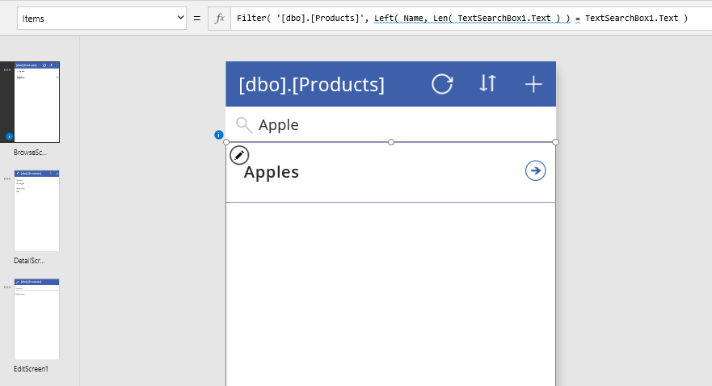

# Grundlagen der Delegierung
PowerApps enthalten einen leistungsstarken Funktionssatz für die Filterung, Sortierung und Strukturierung von Tabellen mit Daten: Beispiele hierfür sind die Funktionen **[Filter](functions/function-filter-lookup.md)**, **[Sort](functions/function-sort.md)** und **[AddColumns](functions/function-table-shaping.md)**, um nur einige zu nennen.  Mit diesen Funktionen können Sie für Ihre Benutzer den genauen Zugriff auf die benötigten Informationen bereitstellen.  Für Leser mit Datenbankkenntnissen: Die Verwendung dieser Funktionen entspricht dem Schreiben einer Datenbankabfrage.  

Der Schlüssel zur Erstellung von effizienten Apps besteht darin, die Datenmenge gering zu halten, die auf Ihr Gerät übertragen werden muss.  Unter Umständen wird aus einem Satz mit Millionen von Datensätzen nur eine Handvoll von Datensätzen benötigt, oder ein einzelner Aggregatwert kann für Tausende von Datensätzen stehen.  Vielleicht ist es auch möglich, nur den ersten Satz mit Datensätzen abzurufen, und den Rest erst dann bereitzustellen, wenn er vom Benutzer angefordert wird.  Wenn zielgerichtet vorgegangen wird, können die Verarbeitungsleistung, der Arbeitsspeicher und die Netzwerkbandbreite, die für die App erforderlich sind, deutlich gesenkt werden. Dies führt zu kürzeren Reaktionszeiten für Ihre Benutzer – sogar auf Smartphones, die per Mobilfunknetz verbunden sind.  

Mit der *Delegierung* wird erreicht, dass die Ausdrucksstärke von PowerApps-Formeln genutzt werden kann und gleichzeitig möglichst wenig Daten über das Netzwerk übertragen werden müssen.  Dies bedeutet, dass PowerApps die Verarbeitung von Daten an die Datenquelle delegieren, anstatt die Daten zur lokalen Verarbeitung in die App zu verschieben.  

Die Schwierigkeit hierbei ist, dass nicht alle Vorgänge, die in einer PowerApps-Formel ausgedrückt werden können, an jede Datenquelle delegiert werden können. Dies ist der Grund für diesen Artikel.  Die PowerApps-Sprache ist an die Formelsprache von Excel angelehnt und verfügt über umfassenden und sofortigen Zugriff auf eine vollständige Arbeitsmappe im Arbeitsspeicher, die viele verschiedene numerische Funktionen und Funktionen für die Textbearbeitung enthält.  Daher ist die PowerApps-Sprache relativ komplex und kann von den meisten Datenquellen nicht unterstützt werden, darunter auch leistungsstarke Datenbankmodule wie SQL Server.

**Zum Verwenden von großen Datasets ist die Nutzung von Datenquellen und Formeln erforderlich, für die eine Delegierung möglich ist.**  Nur auf diese Weise erzielen Sie für Ihre App eine gute Leistung und können sicherstellen, dass die Benutzer auf alle benötigten Informationen zugreifen können. Achten Sie auf [Vorschläge mit einem blauen Punkt](delegation-overview.md#blue-dot-suggestions), mit dem Orte gekennzeichnet werden, an denen die Delegierung nicht möglich ist.  Wenn Sie mit kleinen Datasets arbeiten (weniger als 500 Datensätze), können Sie eine beliebige Datenquelle und Formel verwenden, weil die Verarbeitung lokal durchgeführt werden kann, falls das Delegieren der Formel nicht möglich ist.  

## Delegierbare Datenquellen
In der vollständigen Liste unter [Delegierbare Datenquellen](delegation-list.md) ist angegeben, für welche Datenquellen die Delegierung unterstützt wird (und in welchem Umfang).

Wir fügen vorhandenen Datenquellen ständig die Unterstützung der Delegierung hinzu und erweitern außerdem die Liste der Datenquellen.

Für importierte Excel-Arbeitsmappen (mit der Datenquelle „Der App statische Daten hinzufügen“), Sammlungen und Tabellen, die in Kontextvariablen gespeichert sind, ist keine Delegierung erforderlich. All diese Daten befinden sich bereits im Arbeitsspeicher, und die gesamte PowerApps-Sprache kann angewendet werden.

## Delegierbare Funktionen
Der nächste Schritt besteht darin, nur diejenigen Formeln zu verwenden, die delegiert werden können. Hier sind die Formelelemente angegeben, die delegiert werden können.  Allerdings ist jede Datenquelle anders, und nicht alle unterstützen alle Elemente. Achten Sie in Ihrer Formel jeweils auf Vorschläge mit einem blauen Punkt.

Diese Listen werden sich im Laufe der Zeit ändern. Wir arbeiten daran, die Delegierung für weitere Funktionen und Operatoren zu unterstützen.

### Filterfunktionen
Die Funktionen **[Filter](functions/function-filter-lookup.md)**, **[Search](functions/function-filter-lookup.md)** und **[LookUp](functions/function-filter-lookup.md)** können delegiert werden.  

In den Funktionen **Filter** und **LookUp** können Sie für Spalten der Tabelle Folgendes verwenden, um die entsprechenden Datensätze auszuwählen:

* **[And](functions/function-logicals.md)** (einschließlich **[&&](functions/operators.md)**), **[Or](functions/function-logicals.md)** (einschließlich **[||](functions/operators.md)**), **[Not](functions/function-logicals.md)** (einschließlich **[!](functions/operators.md)**)
* **[In](functions/operators.md)**
* **[=](functions/operators.md)**, **[<>](functions/operators.md)**, **[>=](functions/operators.md)**, **[<=](functions/operators.md)**, **[>](functions/operators.md)**, **[<](functions/operators.md)**
* **[+](functions/operators.md)**, **[-](functions/operators.md)**
* **[TrimEnds](functions/function-trim.md)**
* **[IsBlank](functions/function-isblank-isempty.md)**
* **[StartsWith](functions/function-startswith.md)**
* Konstante Werte, die in allen Datensätzen gleich sind, z.B. Steuerelementeigenschaften sowie [globale und Kontextvariablen](working-with-variables.md).

Sie können auch Teile Ihrer Formel verwenden, die zu einem konstanten Wert für alle Datensätze ausgewertet werden.  Beispielsweise ist **Left( Language(), 2 )** nicht von Spalten des Datensatzes abhängig und gibt daher für alle Datensätze den gleichen Wert zurück.  Es ist also praktisch eine Konstante.  Die Verwendung von Kontextvariablen, Sammlungen und Signalen ist ggf. nicht konstant und verhindert daher, dass **Filter** und **LookUp** delegiert werden können.  

Einige wichtige Elemente, die in der obigen Liste fehlen:

* **[If](functions/function-if.md)**
* **[*](functions/operators.md)**, **[/](functions/operators.md)**, **[Mod](functions/function-mod.md)**
* **[Concatenate](functions/function-concatenate.md)** (einschließlich **[&](functions/operators.md)**)
* **[ExactIn](functions/operators.md)**
* Funktionen für die Zeichenfolgenbearbeitung: **[Lower](functions/function-lower-upper-proper.md)**, **[Upper](functions/function-lower-upper-proper.md)**, **[Left](functions/function-left-mid-right.md)**, **[Mid](functions/function-left-mid-right.md)**, **[Len](functions/function-left-mid-right.md)**, ...
* Signale: **[Location](functions/signals.md)**, **[Acceleration](functions/signals.md)**, **[Compass](functions/signals.md)**, ...
* „Volatiles“: **[Now](functions/function-now-today-istoday.md)**, **[Today](functions/function-now-today-istoday.md)**, **[Rand](functions/function-rand.md)**, ...
* [Sammlungen](working-with-variables.md)

### Sortierfunktionen
**[Sort](functions/function-sort.md)** und **[SortByColumns](functions/function-sort.md)** können delegiert werden.  

Bei **Sort** kann die Formel nur der Name einer einzelnen Spalte sein und keine anderen Operatoren und Funktionen enthalten.

### Aggregatfunktionen
**[Sum](functions/function-aggregates.md)**, **[Average](functions/function-aggregates.md)**, **[Min](functions/function-aggregates.md)** und **[Max](functions/function-aggregates.md)** können delegiert werden.  Diese Delegierung wird derzeit nur von einer begrenzten Anzahl von Datenquellen unterstützt. Weitere Informationen finden Sie in der [Delegierungsliste](delegation-list.md).

Zählfunktionen, z.B. **[CountRows](functions/function-table-counts.md)**, **[CountA](functions/function-table-counts.md)** und **[Count](functions/function-table-counts.md)**, können nicht delegiert werden.

Andere Aggregatfunktionen, z.B. **[StdevP](functions/function-aggregates.md)** und **[VarP](functions/function-aggregates.md)**, können nicht delegiert werden.

### Andere Funktionen
Für alle anderen Funktionen wird die Delegierung nicht unterstützt, einschließlich dieser wichtigen Funktionen:

* Tabellenstrukturierung: **[AddColumns](functions/function-table-shaping.md)**, **[DropColumns](functions/function-table-shaping.md)**, **[ShowColumns](functions/function-table-shaping.md)**, ...
* **[First](functions/function-first-last.md)**, **[FirstN](functions/function-first-last.md)**, **[Last](functions/function-first-last.md)**, **[LastN](functions/function-first-last.md)**
* **[Concat](functions/function-concatenate.md)**
* **[Collect](functions/function-clear-collect-clearcollect.md)**, **[ClearCollect](functions/function-clear-collect-clearcollect.md)**
* **[CountIf](functions/function-table-counts.md)**, **[RemoveIf](functions/function-remove-removeif.md)**, **[UpdateIf](functions/function-update-updateif.md)**
* **[GroupBy](functions/function-groupby.md)**, **[Ungroup](functions/function-groupby.md)**

Ein häufiges Muster ist die Verwendung von **AddColumns** und **LookUp** zum Zusammenführen von Informationen aus einer Tabelle in eine andere. In der Datenbanksprache wird dies meist als „Join“ (Verknüpfung“) bezeichnet.  Beispiel:

**AddColumns( Products, "Supplier Name", LookUp( Suppliers, Suppliers.ID = Product.SupplierID ).Name )**

Bei **Products** und **Suppliers** kann es sich zwar ggf. um delegierbare Datenquellen handeln, und **LookUp** ist eine delegierbare Funktion, aber die Funktion **AddColumns** ist nicht delegierbar.  Das Ergebnis der gesamten Formel ist auf den ersten Teil der Datenquelle **Products** beschränkt.  

Da **LookUp** und die dazugehörige Datenquelle delegierbar sind, kann eine Übereinstimmung für **Suppliers** auch dann überall in der Datenquelle gefunden werden, wenn sie groß ist.  Ein potenzieller Nachteil ist, dass **LookUp** für jeden dieser ersten Datensätze in **Products** separate Aufrufe der Datenquelle durchführt, wodurch im Netzwerk viel Datenverkehr anfällt.  Wenn **Suppliers** klein genug ist und sich nicht häufig ändert, können Sie die Datenquelle stattdessen in Ihrer App mit einem **Collect**-Aufruf zwischenspeichern, sobald die App gestartet wird (per [**OnVisible**](controls/control-screen.md) auf dem Startbildschirm), und einen **LookUp**-Vorgang dafür durchführen.  

## Grenzwerte für Fälle, in denen keine Delegierung möglich ist
Formeln, die nicht delegiert werden können, werden lokal verarbeitet.  Auf diese Weise kann die gesamte Bandbreite der PowerApps-Formelsprache genutzt werden.  Dies hat aber einen Preis: Alle Daten müssen zuerst auf das Gerät übertragen werden, sodass unter Umständen eine größere Datenmenge über das Netzwerk abgerufen werden muss.  Dies kann eine Weile dauern, sodass der Eindruck entsteht, dass Ihre App langsam ist oder hängt.

Um dies zu vermeiden, gilt für PowerApps ein Grenzwert für die Datenmenge, die lokal verarbeitet werden kann: 500 Datensätze.  Wir haben diesen Wert gewählt, damit Sie über vollständigen Zugriff auf kleine Datasets verfügen und die Nutzung Ihrer großen Datasets optimieren können, indem Teilergebnisse angezeigt werden.

Bei der Nutzung sollten Sie aber mit Bedacht vorgehen, da es für Benutzer verwirrend sein kann.  Angenommen, Sie verwenden die Funktion **Filter** mit einer Auswahlformel, die nicht delegiert werden kann, für eine Datenquelle mit einer Million Datensätzen.  Da die Filterung lokal durchgeführt wird, werden nur die ersten 500 von einer Million Datensätze durchsucht.  Wenn der gewünschte Datensatz der 501. oder 500.001. Datensatz ist, wird er nicht berücksichtigt und mit **Filter** nicht zurückgegeben.

Auch bei Aggregatfunktionen kann dies verwirrend sein.  Angenommen, Sie verwenden **Average** für eine Spalte der Datenquelle mit einer Million Datensätzen.  Da **Average** noch nicht delegiert werden kann, kann nur für die ersten 500 Datensätze der Mittelwert gebildet werden.  Hier sollten Sie Vorsicht walten lassen, weil eine Teilantwort von einem Benutzer Ihrer App als vollständige Antwort verstanden werden könnte.

## Vorschläge mit einem blauen Punkt
Um einfacher erkennen zu können, was delegiert wird und was nicht, sind in der Erstellungsumgebung Vorschläge mit einem blauen Punkt angegeben, wenn eine Formel nicht delegierbare Teile enthält.

Blaue Punkte werden nur für Formeln angezeigt, die für delegierbare Datenquellen verwendet werden.  Wenn kein blauer Punkt angezeigt wird und Sie der Meinung sind, dass Ihre Formal nicht richtig delegiert wird, können Sie den Typ der Datenquelle anhand der obigen Liste mit den <a href="#delegable-data-sources">delegierbaren Datenquellen</a> überprüfen.

## Beispiele
In diesem Beispiel verwenden wir eine SQL Server-Tabelle mit Produkten (Obstsorten). Sie hat den Namen **[dbo].[Products]**.  Auf dem Bildschirm „Neu“ kann mit PowerApps eine einfache App mit drei Bildschirmansichten und einer Verbindung mit dieser Datenquelle erstellt werden:

Beachten Sie die Formel für die **Items**-Eigenschaft des Katalogs.  Darin werden die Funktionen **SortByColumns** und **Search** verwendet, die beide delegiert werden können.

Wir geben den Begriff **„Apple“** in das Suchtext-Eingabesteuerelement ein.  Wenn wir genau hinsehen, fallen uns vorübergehend Punkte auf, die sich oben im Fenster bewegen, während der neue Eintrag der neuen Suche verarbeitet wird.  Mit diesen Punkten wird angegeben, dass wir mit der SQL Server-Instanz kommunizieren:

Da eine Delegierung hierbei auch möglich ist, wenn die Tabelle **[dbo].[Products]** Millionen von Datensätze enthält, können alle Datensätze gefunden werden. Sie können im Katalog auf mehreren Seiten angezeigt werden, und der Benutzer kann einen Bildlauf durch die Ergebnisse durchführen.

Sie sehen, dass Treffer für „Apple“ und „Pineapple“ angezeigt werden.  Mit der Funktion **Search** wird ein Suchbegriff überall in einer Textspalte gefunden.  Es kann auch sein, dass wir den Suchbegriff stattdessen nur am Anfang des Obstsortennamens suchen möchten.  Hierfür können wir eine andere delegierbare Funktion (**Filter**) mit einem komplizierteren Suchbegriff verwenden (der Einfachheit halber entfernen wir den Aufruf **SortByColumns**):

Dies scheint zu funktionieren. Jetzt wird richtigerweise nur **„Apples“** angezeigt, und **„Pineapple“** ist nicht im Ergebnis enthalten.  Neben dem Katalog wird aber ein blauer Punkt angezeigt, und ein Teil der Formel ist blau unterkringelt.  Auch in der Miniaturansicht des Bildschirms wird ein blauer Punkt angezeigt.  Wenn Sie auf den blauen Punkt neben dem Katalog zeigen, wird Folgendes angezeigt:

Wir nutzen zwar **Filter**, also eine delegierbare Funktion, zusammen mit SQL Server, einer delegierbaren Datenquelle, aber die in **Filter** verwendete Formel ist nicht delegierbar.  Die Delegierung von **Mid** und **Len** an eine Datenquelle ist nicht möglich.

Aber es hat funktioniert, oder?  Na ja, fast.  Aus diesem Grund ist dies ein blauer Punkt und kein gelbes Warnsymbol mit roter Unterkringelung.  Wenn die Tabelle **[dbo].[Products]** weniger als 500 Datensätze enthält, hat dies perfekt funktioniert.   Alle Datensätze wurden auf das Gerät übertragen, und die Funktion **Filter** wurde lokal angewendet.  

Falls diese Tabelle dagegen mehr als 500 Datensätze enthält, werden nur Obstsorten *in den ersten 500 Datensätzen der Tabelle*, die mit **„Apple“** beginnen, im Katalog angezeigt.  Wenn **„Apple, Fuji“** als Name im 501. oder 500.001. Datensatz enthalten ist, wird er nicht gefunden.
