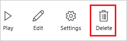

# Löschen einer App aus PowerApps
In diesem Artikel wird gezeigt, wie Sie eine App aus Ihrem PowerApps-Konto und Konten von anderen löschen, mit denen die App geteilt wurde.

## Löschen einer App aus Ihrem Konto
1. Öffnen Sie [powerapps.com](https://web.powerapps.com), und klicken oder tippen Sie in der linken Navigationsleiste auf **Apps**.
   
    
2. (optional) Filtern Sie in der oberen linken Ecke die Liste der Apps, um nur die Apps anzuzeigen, die Sie besitzen oder zu denen Sie beitragen.
   
    
   
    **Hinweis**: Wenn die App, die Sie löschen möchten, nicht angezeigt wird, sollten Sie sicherstellen, dass Sie sich in der richtigen Umgebung befinden.
3. Klicken oder tippen Sie am rechten Rand auf das Info-Symbol der App, die Sie löschen möchten.
   
    
4. Klicken oder tippen Sie in der oberen rechten Ecke auf das Papierkorb-Symbol, um die App zu löschen.
   
    
   
    **Hinweis**: Sie benötigen die Berechtigung **Mitwirkender**, um eine App löschen zu können.
5. Klicken oder tippen Sie im erscheinenden Dialogfeld auf **Aus der Cloud löschen**.  
   
    **Wichtig**: Durch diese Aktion wird diese App nicht nur dauerhaft aus Ihrem Konto gelöscht, sondern auch aus den Konten aller Benutzer, mit denen diese App geteilt wurde.
   
    

## Weitere Ressourcen
[Eine App freigeben](share-app.md)  
[App-Name und -Kachel ändern](set-name-tile.md)  
[Wiederherstellen der vorherigen Version einer App](restore-an-app.md)  

