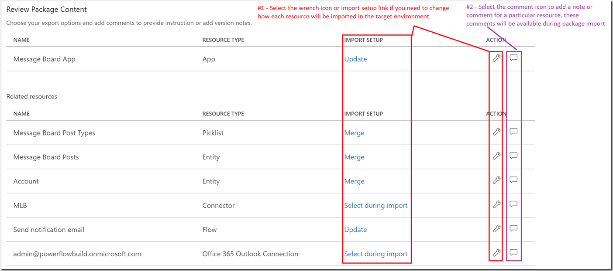
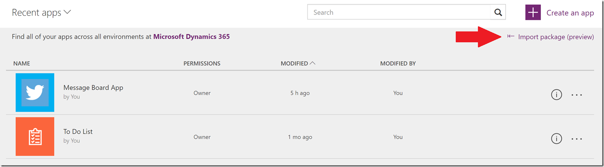
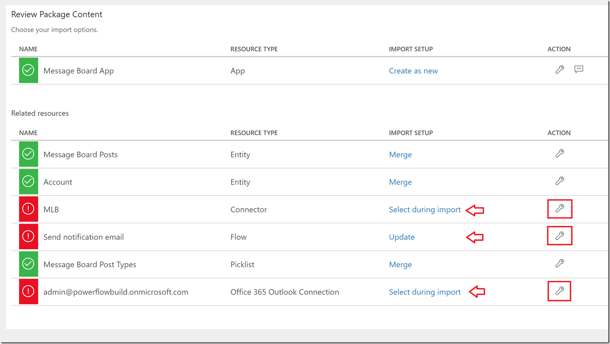
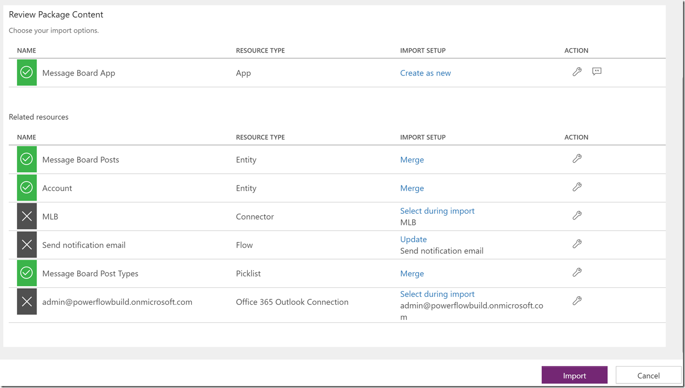

# Migration der Umgebungs- und Mandanten-App durch Paketerstellung
Erfahren Sie, wie Sie Ressourcen mithilfe von Paketerstellung von einer Umgebung zu einer anderen migrieren. Diese Umgebungen können innerhalb des gleichen Mandanten oder mandantenübergreifend sein.

## Das Szenario
Ein gängiges Szenario: Bei Test- oder Entwicklungsumgebungen und bei einer Produktionsumgebung möchten Sie möglicherweise Ressourcen migrieren. Entwickler und Tester haben weitreichenden Zugriff auf die Apps in ihrer Umgebung. Aber bei der Migration einer neuen App bis hin zur Produktion hat diese Umgebung eine strenge Kontrolle über Berechtigungen zum Aktualisieren und Ändern der App.

In einem weiteren Szenario verfügt jeder Kunde über seine eigene Umgebung und seine eigenen Daten. Wenn ein neuer Kunde hinzugefügt wird, wird eine neue Umgebung für ihn erstellt, und Sie würden Apps in seine Umgebung migrieren.

## Welche Ressourcen können mithilfe von Paketerstellung migriert werden?
Beim Exportieren einer App werden ihre abhängigen Ressourcen ebenfalls im Paket exportiert.  Zunächst wird, wie in der Tabelle unten erläutert, nur eine Teilmenge aller möglichen Ressourcentypen unterstützt.

| Ressourcentyp | Unterstützt | Importoptionen |
| --- | --- | --- |
| App |Ja |Es gibt zwei Möglichkeiten, eine App in eine Umgebung zu importieren: <ol><li><b>Neu erstellen</b>: Die App wird als neue App in der Umgebung erstellt, in die das Paket importiert wird.</li> <li><b>Aktualisieren</b>: Die App ist in der Umgebung bereits vorhanden und wird beim Importieren des Pakets aktualisiert.</li></ol> |
| Flow |Ja |Es gibt zwei Möglichkeiten, einen Flow in eine Umgebung zu importieren: <ol><li><b>Neu erstellen</b>: Der Flow wird als neuer Flow in der Umgebung erstellt, in die das Paket importiert wird.</li> <li><b>Aktualisieren</b>: Der Flow ist in der Umgebung bereits vorhanden und wird beim Importieren des Pakets aktualisiert.</li></ol> 
 <i> HINWEIS: Alle Ressourcen, von denen der Flow abhängt, werden ebenfalls in das exportierte App-Paket eingeschlossen und müssen mit dem importierten Paket konfiguriert werden. </i> |
| Anpassungen und Auswahllisten von CDS-Entitäten |Ja |Es gibt zwei Möglichkeiten, CDS-Entitäten oder Auswahllisten in eine Umgebung zu importieren: <ol><li><b>Überschreiben</b>: Ist eine Ressource mit demselben Namen vorhanden, wird sie durch diesen Import ersetzt. Wenn keine entsprechende Ressource vorhanden ist, wird eine neue Ressource erstellt. <li><b>Zusammenführen</b>: Wenn eine Entität oder Auswahlliste mit demselben Namen vorhanden ist, werden neue Felder oder Einträge hinzugefügt, fehlende Felder oder Einträge werden jedoch nicht entfernt.</li></ol> |
| Benutzerdefinierte Connectors |Nein |Wenn eine App von einem benutzerdefinierten Connector abhängt, wird das Exportieren des Connectors als Teil des Pakets derzeit <b>nicht unterstützt</b>. 

 Wenn Sie über eine App verfügen, die sich auf einen benutzerdefinierten Connector stützt, haben Sie derzeit lediglich die Möglichkeit, den Connector beim Importieren des Pakets in der Zielumgebung manuell neu zu erstellen oder zu aktualisieren. |
| Verbindungen |Nein |Wenn eine App von einer Verbindung abhängt (z.B. einer SQL-Verbindung mit Anmeldeinformationen), wird das Exportieren der Verbindung oder der Anmeldeinformationen als Teil des Pakets derzeit nicht unterstützt. 

 Wenn Sie über eine App verfügen, die sich auf eine freigegebene Verbindung (wie SQL) stützt, haben Sie derzeit lediglich die Möglichkeit, diese Verbindung mit den entsprechenden Anmeldeinformationen in der Zielumgebung neu zu erstellen und die Verbindung auszuwählen, wenn Sie das Paket importieren. |
| Benutzerdefinierte CDS-Rollen und Berechtigungssätze |Nein |Das Exportieren von benutzerdefinierten CDS-Rollen und/oder -Berechtigungssätzen wird derzeit nicht unterstützt, Sie haben also nur die Möglichkeit, diese Entitäten in der Zielumgebung manuell neu zu erstellen. |
| Gateways |Nein |Gateways werden nur in Standardumgebungen (und {Mandantenname}-Umgebungen (von der Vorschau)) unterstützt, sodass Export/Migration nicht unterstützt werden. |
| CDS-Datenzeilen |Nein |Das Exportieren von Zeilen aus CDS-Entitäten wird derzeit nicht unterstützt; Sie haben also lediglich die Möglichkeit, Daten nach dem Anwenden von Änderungen des CDS-Schemas in einer neuen Umgebung manuell zu [exportieren und importieren](data-platform-export-data.md). |

## Wie erhalte ich Zugriff auf Pakete für meine App?
Die Möglichkeit zum Exportieren von Apps ist für alle Benutzer mit der Berechtigung „Kann bearbeiten“ für die App verfügbar.

Die Möglichkeit zum Importieren ist für alle Benutzer mit der Berechtigung „Umgebungsersteller“ in der Zielumgebung verfügbar.

Benutzer benötigen einen PowerApps-Plan 2 oder eine PowerApps-Plan 2-Testlizenz, um eine App exportieren oder importieren zu können.

*HINWEIS: Während der Vorschauphase für die Paketerstellung kann jeder Benutzer mit einer gültigen PowerApps-Lizenz Pakete für seine Apps und Umgebungen testen.*

## Exportieren einer App
1. Klicken oder tippen Sie auf http://web.powerapps.com auf **Apps**, wählen Sie die Auslassungspunkte für die zu migrierende App aus, und wählen Sie anschließend **Export (preview)** (Exportieren (Vorschau) aus.
   
    
2. Wenn die Seite zum Exportieren von Paketen geöffnet wird, geben Sie einen Namen und eine Beschreibung für das Paket ein.
   
    
3. Im Abschnitt „Paketinhalt überprüfen“ können Sie optional Anmerkungen oder Notizen hinzufügen oder die Einstellung dafür ändern, wie die einzelnen Ressourcen während des Paketimports in die Zielumgebung importiert werden.
   
    
4. Wählen Sie nach Abschluss des Vorgangs **Exportieren** aus, und der Download der Paketdatei beginnt innerhalb weniger Sekunden.

## Importieren einer App
1. Klicken oder tippen Sie auf http://web.powerapps.com **Apps**, und wählen Sie anschließend **Import package (preview)** (Paket importieren (Vorschau)) aus.
   
    
2. Wählen Sie **Hochladen** aus, und wählen Sie die App-Paketdatei aus, die importiert werden soll.
   
    
3. Wenn das Paket hochgeladen wurde, müssen Sie den Paketinhalt überprüfen und weitere Eingaben für alle mit einem roten Symbol gekennzeichneten Elemente vornehmen; hierzu wählen Sie das Schraubenschlüsselsymbol für das betreffende Element aus und geben die erforderlichen Informationen ein.
   
    
4. Sobald Sie alle erforderlichen Informationen eingegeben haben, wählen Sie **Importieren** aus.
   
    
5. Bei Abschluss des Importvorgangs werden Sie automatisch zu einer Seite umgeleitet (die der unten stehenden ähnelt), auf der mitgeteilt wird, ob der Importvorgang erfolgreich war oder fehlgeschlagen ist.
   
    

> **HINWEIS** Wenn Sie eine App importieren und sich entscheiden, eine vorhandene App zu **aktualisieren**, werden die neuen Änderungen als Entwurf der Anwendungen gespeichert.  Sie müssen diese Änderungen [veröffentlichen](http://powerapps.microsoft.com/tutorials/save-publish-app/#publish-an-app), damit sie für alle anderen Benutzer der Anwendungen verfügbar sind.
> 
> 

## Bekannte Einschränkungen
| Einschränkung | Status |
| --- | --- |
| Es wurde festgestellt, dass das Importieren von App-Paketen mit mehr als ~3 Ressourcen mehrere Minuten dauert. |Dies ist ein bekanntes Problem, und in Kürze wird ein Fix verfügbar gemacht. |

