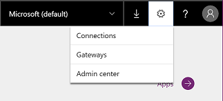
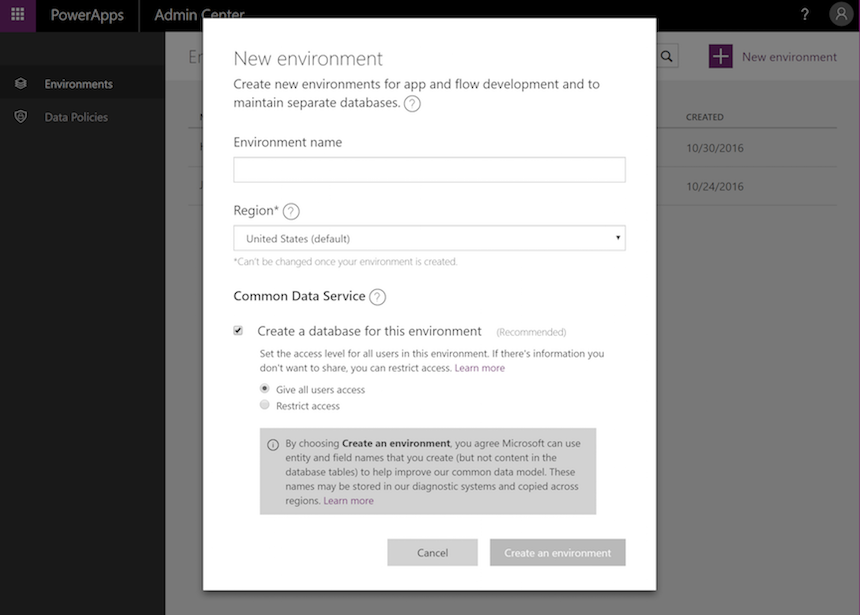
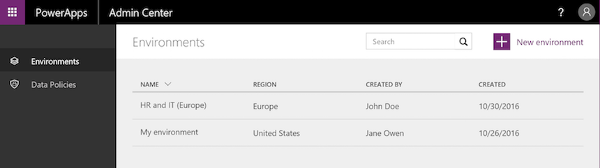
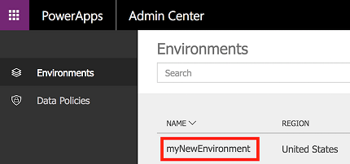
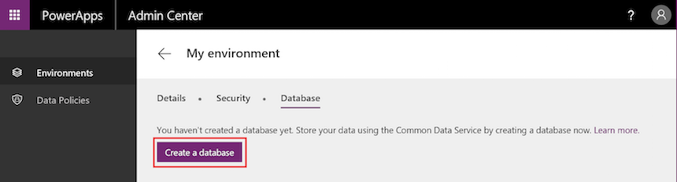
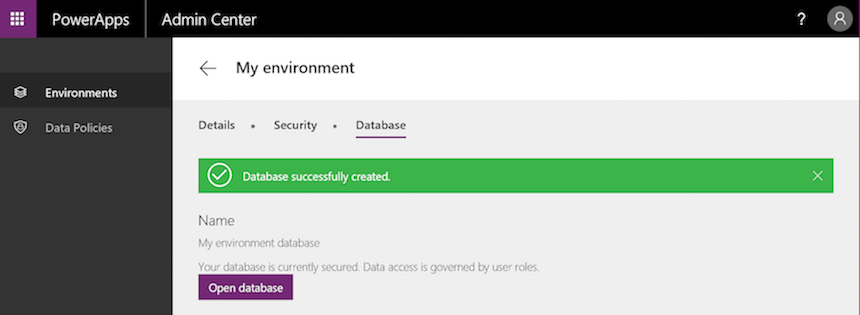
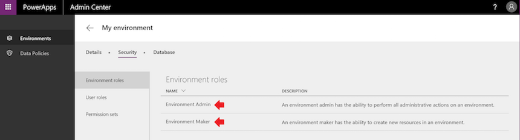
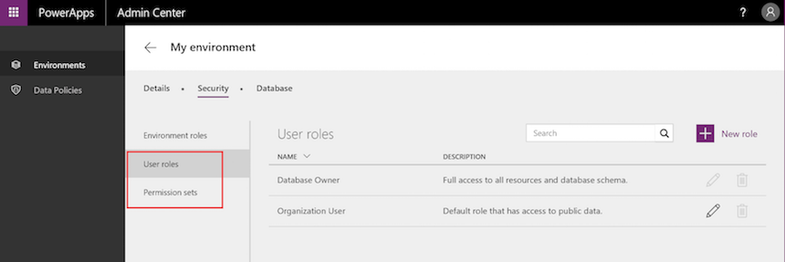

# Verwaltung von Umgebungen in PowerApps
Im [PowerApps Admin Center][1] können Sie Umgebungen, die Sie erstellt haben, und Umgebungen, denen Sie in der Rolle „Umgebungsadministrator“ hinzugefügt wurden, verwalten. Über das Admin Center können Sie folgende administrative Aktionen ausführen:

* Erstellen von Umgebungen
* Umbenennen von Umgebungen
* Hinzufügen von Benutzern oder Gruppen zur Umgebungsadministrator- oder Umgebungserstellerrolle oder Entfernen aus diesen Rollen.
* Bereitstellen einer Common Data Service-Datenbank für die Umgebung.
* Festlegen von Richtlinien zur Verhinderung von Datenverlust.
* Festlegen von Datenbanksicherheits-Richtlinien (anhand von Datenbankrollen als offen oder eingeschränkt).
* Mitglieder der globalen Administratorrolle des Azure AD-Mandanten (einschließlich globale Office 365-Administratoren) können ebenfalls alle Umgebungen verwalten, die in ihrem Mandanten erstellt wurden, und für alle Mandanten gültige Richtlinien im PowerApps Admin Center festlegen.

## Zugriff auf das PowerApps Admin Center
So greifen Sie auf das PowerApps Admin Center zu:

* Gehen Sie direkt auf [admin.powerApps.com][1] oder
* wechseln Sie zu [powerApps.com][2], und wählen Sie anschließend das Zahnradsymbol im Header „Navigation“
  
    

Sie müssen folgende Rolle aufweisen, um eine Umgebung im PowerApps Admin Center verwalten zu können:

* die Umgebungsadministratorrolle der Umgebung oder
* die globale Administratorrolle Ihres Azure AD- oder Office 365-Mandanten

Sie benötigen auch PowerApps Plan 2 oder Flow Plan 2, um auf das Admin Center zugreifen zu können. Weitere Informationen finden Sie auf der [Seite mit den PowerApps-Preisen][3].

**Wichtig**: Änderungen, die Sie im PowerApps Admin Center vornehmen, wirken sich auf das [Flow Admin Center][4] aus und umgekehrt.

## Erstellen einer Umgebung
Klicken Sie zunächst **+ New Environment** (Neue Umgebung), und es öffnet sich ein Dialogfeld zum Erstellen einer Umgebung.

Geben Sie dann die folgenden Informationen an:

| Eigenschaft | Beschreibung |
| --- | --- |
| Name der Umgebung |Geben Sie den Namen Ihrer Umgebung ein. |
| Region |Wählen Sie den Speicherort, der Ihre Umgebung hosten soll. Es wird empfohlen, einen Speicherort zu verwenden, der sich nah an Ihren Benutzern befindet. Wenn sich Ihre App-Benutzer beispielsweise in London befinden, wählen Sie einen Speicherort in Europa. Wenn sich Ihre App-Benutzer in New York befinden, wählen Sie die USA. Eine Liste der unterstützten Regionen für Umgebungen finden Sie unter [Unterstützten Regionen](regions-overview.md). |
| Erstellen einer Datenbank für diese Umgebung |Aktivieren Sie dieses Kontrollkästchen, um eine Common Data Service-Datenbank für diese Umgebung zu erstellen. Eine Datenbank kann so konfiguriert werden, dass sie entweder für alle Benutzer in der Umgebung offen oder auf Datenbankrollen beschränkt ist. Weitere Informationen finden Sie unter [Konfigurieren von Datenbanksicherheit](database-security.md). |

Wählen Sie abschließend **Create an environment** (Umgebung erstellen).

Die neue Umgebung wird in der Tabelle der Umgebungen angezeigt.

> [!NOTE]
> Wenn Sie eine Umgebung erstellen, werden Sie der Umgebungsadministratorrolle für diese Umgebung automatisch hinzugefügt.
> 
> 

## Anzeigen Ihrer Umgebungen
Wenn Sie das Admin Center öffnen, wird die Registerkarte "Umgebungen" standardmäßig angezeigt und listet alle Umgebungen auf, für die Sie Umgebungsadministrator sind (sieh unten):

Wenn Sie ein Mitglied der globalen Administratorrolle Ihrer Azure AD oder Ihres Office 365-Mandanten sind, werden alle Umgebungen angezeigt, die von Benutzern in Ihrem Mandanten erstellt wurden, da Sie automatisch für alle ein Umgebungsadministrator sind.

## Benennen Sie Ihre Umgebung um
1. Öffnen Sie das [PowerApps Admin Center][1], suchen Sie die umzubenennende Umgebung in der Liste, und klicken oder tippen Sie darauf.
   
    
2. Klicken oder tippen Sie auf **Details**.
   
    
3. Geben Sie im **Name**-Textfeld den neuen Namen ein, und klicken Sie auf **Speichern**.
   
    

## Löschen Sie Ihre Umgebung
1. Klicken oder tippen Sie im [PowerApps Admin Center][1] auf die Umgebung, die Sie löschen möchten.
   
    
2. Klicken oder tippen Sie auf **Details**.
   
    
3. Klicken oder tippen Sie auf **Delete Environment** (Umgebung löschen), um Ihre Umgebung zu löschen.
   
    

## Erstellen einer Common Data Service-Datenbanken für eine Umgebung
Wenn eine Umgebung noch nicht über eine Datenbank verfügt, kann ein Umgebungsadministrator im [PowerApps Admin Center][1] eine Umgebung mithilfe der folgenden Schritte erstellen. Nur Benutzer mit einer PowerApps Plan 2-Lizenz können Common Data Services-Datenbanken erstellen.

1. Wählen Sie eine Umgebung in der Tabelle der Umgebungen.
   
    
2. Wählen Sie die Registerkarte **Database** (Datenbank).
3. Wählen Sie **Create a database** (Datenbank erstellen) aus.
   
    
   
    Wenn die Datenbank bereitgestellt wurde, wird diese Bestätigungsmeldung angezeigt:
   
    

Nachdem Sie eine Datenbank erstellt haben, wählen Sie ein Sicherheitsmodell aus. Weitere Informationen finden Sie unter [Konfigurieren von Datenbanksicherheit](database-security.md).

## Verwalten der Sicherheit für Ihre Umgebungen
### Umgebungsberechtigungen
Alle Benutzer in einer Umgebung im Azure AD-Mandanten sind Benutzer dieser Umgebung. Wenn diesen jedoch eine privilegiertere Rolle zugewiesen werden soll, müssen Sie in eine entsprechende Umgebungsrolle eingefügt werden. Umgebungen weisen zwei integrierte Rollen auf, die Zugriff auf die Berechtigungen in einer Umgebung bieten:

* Die **Umgebungsadministratorrolle** kann alle Administratoraktionen in einer Umgebung ausführen, darunter z.B.:
  
  o   Hinzufügen von Benutzern oder Gruppen zur Umgebungsadministrator- oder Umgebungserstellerrolle oder Entfernen aus diesen Rollen
  
  o   Bereitstellen einer Common Data Service-Datenbank für die Umgebung
  
  o   Anzeigen und Verwalten aller innerhalb einer Umgebung erstellten Ressourcen
  
  o Festlegen von Richtlinien zur Verhinderung von Datenverlust. Weitere Informationen finden Sie unter [Richtlinien für die Verhinderung von Datenverlust](prevent-data-loss.md).
* **Die Umgebungserstellerrolle** kann Ressourcen innerhalb einer Umgebung erstellen, einschließlich Apps, Verbindungen, benutzerdefinierter Connectors, Gateways und Workflows mithilfe von Microsoft Flow. Umgebungsersteller können auch die Apps, die sie in einer Umgebung erstellt haben, an andere Benutzer in Ihrer Organisation verteilen. Sie können die App für einzelne Benutzer, Sicherheitsgruppen oder alle Benutzer in der Organisation freigeben. Weitere Informationen finden Sie unter [Freigeben von Apps in PowerApps](share-app.md).

Ein Umgebungsadministrator kann folgende Schritte im [PowerApps Admin Center][1] durchführen, um einem Benutzer oder einer Sicherheitsgruppe eine Umgebungsrolle zuzuweisen:

1. Wählen Sie die Umgebung in der Tabelle der Umgebungen aus.
   
    
2. Wählen Sie auf der Registerkarte **Sicherheit** **Umgebungsrollen** aus.
3. Wählen Sie entweder die Rolle **Umgebungsadministrator** oder **Umgebungsersteller** aus.
   
    
4. Wenn Sie eine App freigeben, geben Sie den Namen eines Benutzers bzw. die Namen mehrerer Benutzer oder Gruppen in Azure Active Directory an, oder geben Sie an, dass Sie die App für die gesamte Organisation freigeben möchten.
   
    
5. Wählen Sie **Speicher**, um die Zuweisungen auf die Rolle "Umgebung" zu aktualisieren.

Klicken oder tippen Sie auf das Symbol **x** für einen Benutzer oder für eine Gruppe, um einem Benutzer oder einer Gruppe alle Berechtigungen zu entziehen.

> [!NOTE]
> Benutzer, die diesen Umgebungsrollen zugewiesen wurden, haben nicht automatisch Zugriff auf die Datenbank der Umgebung (wenn es eine gibt). Der Zugriff muss separat durch den Datenbankbesitzer erteilt werden. Weitere Informationen finden Sie unter [Konfigurieren von Datenbanksicherheit](database-security.md).  
> 
> 

### Datenbanksicherheit
Die Möglichkeit zum Erstellen und Ändern eines Datenbankschema und zum Verbinden mit in einer Datenbank gespeicherten Daten, die in Ihrer Umgebung bereitgestellt wird, wird von den Benutzerrollen der Datenbank und Berechtigungssätzen gesteuert. Sie können die Benutzerrollen und die Berechtigungssätze für die Datenbank Ihrer Umgebung in den Bereichen **Benutzerrollen** und **Berechtigungssätze** auf der Registerkarte **Sicherheit** verwalten. Weitere Informationen finden Sie unter [Konfigurieren von Datenbanksicherheit](database-security.md).

> [!NOTE]
> Umgebungsadministratoren haben keinen Zugriff auf das Erstellen und Verwalten von Benutzerrollen und Berechtigungssätzen für eine Datenbank der Umgebung. Diese Berechtigung haben nur Mitglieder der Benutzerrolle **Datenbankbesitzer**.  
> 
> 

## Richtlinien für die Daten
Daten des Unternehmens müssen geschützt werden, damit sie nicht für ein Publikum freigegeben werden, das darauf nicht zugreifen sollte. Sie können Richtlinien erstellen und erzwingen, um diese Daten zu schützen; die Richtlinien definieren, welche Verbraucherdienste und Connector-spezifische Unternehmensdaten freigegeben werden können. Richtlinien, die definieren, wie Daten freigegeben werden können, werden als Richtlinien zur Verhinderung von Datenverlust (DLP) bezeichnet. Sie können die DLP-Richtlinien für Ihre Umgebung im Abschnitt **Datenrichtlinien** im [PowerApps Admin Center][1] verwalten.  Weitere Informationen finden Sie unter [Richtlinien für die Verhinderung von Datenverlust](prevent-data-loss.md).

## Häufig gestellte Fragen
### Wie viele Umgebungen kann ich erstellen?
Jeder Benutzer kann bis zu zwei Umgebungen erstellen.

### Wie viele Datenbanken kann ich bereitstellen?
Jeder Benutzer kann bis zu zwei Datenbanken bereitstellen.

### Kann ich eine Umgebung umbenennen?
Ja, diese Funktionalität ist über das PowerApps Admin Center verfügbar. Weitere Informationen finden Sie unter [Verwaltung von Umgebungen](environments-administration.md#rename-your-environment).

### Kann ich eine Umgebung löschen?
Ja, diese Funktionalität ist über das PowerApps Admin Center verfügbar. Weitere Informationen finden Sie unter [Verwaltung von Umgebungen](environments-administration.md#delete-your-environment).

### Kann ich als Umgebungsadministrator für eine Umgebung alle Ressourcen (Apps, Flows, APIs usw.) anzeigen und verwalten?
Ja, die Möglichkeit zum Anzeigen der Apps und Flows für eine Umgebung ist im PowerApps Admin Center verfügbar. Unter [Anzeigen von Apps](admin-view-apps.md) finden Sie weitere Informationen.

### Welche Lizenz schließt Common Data Service mit ein?
PowerApps Plan 2.  Auf der [Seite mit den PowerApps-Preisen][3] finden Sie ausführliche Informationen zu allen Plans, die diese Lizenz enthalten.

### Kann Common Data Service außerhalb einer Umgebung verwendet werden?
Nein. Für Common Data Service ist eine Umgebung erforderlich.

<!--Reference links in article-->
[1]: https://admin.powerapps.com
[2]: https://web.powerapps.com
[3]: https://powerapps.microsoft.com/pricing/
[4]: https://admin.flow.microsoft.com
