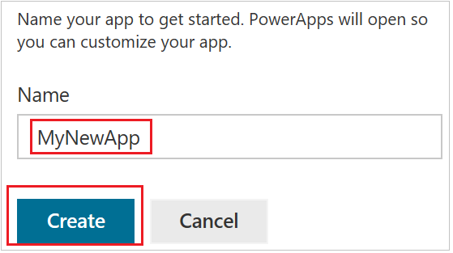
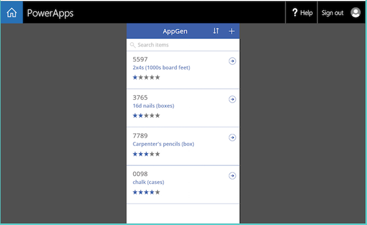

# Generieren einer App aus SharePoint mit PowerApps

In PowerApps wird eine App automatisch generiert, in der Benutzer Elemente aus einer benutzerdefinierten SharePoint Online-Liste verwalten können. Die App wird drei Bildschirme haben, auf denen Benutzer Folgendes können:

* alle Datensätze in der Liste durchsuchen (**BrowseScreen1**)
* alle Felder eines bestimmten Datensatzes anzeigen (**DetailsScreen1**)
* einen Datensatz erstellen oder bearbeiten (**EditScreen1**)

Wenn Sie eine App über die SharePoint Online-Befehlszeile aus einer benutzerdefinierten Liste erstellen, ist die App eine Ansicht dieser Liste. Sie können die App außer im Webbrowser auch auf einem Windows Phone-, iOS- oder Android-Gerät ausführen.

> [!IMPORTANT]
> PowerApps unterstützt nicht alle Typen von SharePoint-Daten. Weitere Informationen finden Sie unter [Known issues (Bekannte Probleme)](connections/connection-sharepoint-online.md#known-issues).

## Eine App generieren
1. Öffnen Sie eine benutzerdefinierte Liste in SharePoint Online, klicken oder tippen Sie auf **PowerApps** in der Befehlszeile, und klicken oder tippen Sie anschließend auf **App erstellen**.
   
    
2. Geben Sie im angezeigten Bereich einen Namen für Ihre App ein, und klicken oder tippen Sie auf **Erstellen**.
   
    
   
    Eine neue Registerkarte wird im Webbrowser angezeigt und zeigt die App, die Sie basierend auf Ihrer SharePoint-Liste automatisch generiert haben.
   
      
3. Klicken oder tippen Sie für Ihre SharePoint-Liste auf die Registerkarte des Browsers, und klicken oder tippen Sie anschließend auf **Öffnen**.
   
    > [!NOTE]
> Möglicherweise müssen Sie das Browserfenster aktualisieren (z.B. durch Drücken von F5), bevor die App sich öffnet.
   
    
   
    Die App wird in einer separaten Registerkarte des Browsers geöffnet.
   
    

## Verwalten der App

* Wenn Sie auf **Edit in PowerApps** (In PowerApps bearbeiten) klicken oder tippen, öffnet sich die App auf einer separaten Registerkarte des Browsers, wo Sie die App in PowerApps Studio für das Web aktualisieren können.
* Wenn Sie auf **Make this view public** (Veröffentlicht diese Ansicht) klicken oder tippen, können andere Personen in Ihrer Organisation sie anzeigen. Standardmäßig können nur Sie Ansichten anzeigen, die Sie erstellen. Wenn Sie anderen Personen gestatten möchten, diese App zu bearbeiten, müssen Sie sie [mit ihnen teilen](share-app.md) und **Mitwirkender**-Berechtigungen gewähren.
* Wenn Sie auf **Aus Ansicht entfernen** klicken oder tippen, entfernen Sie die Ansicht aus SharePoint, aber die App wird in PowerApps verbleiben, sofern Sie sie nicht [löschen](delete-app.md).

## Nächste Schritte
* Wenn Sie der Liste Elemente hinzufügen oder sie aktualisieren möchten, lesen Sie den Abschnitt „Manage the list using the app (Verwalten der Liste mithilfe der App)“ im Artikel [Open app from a SharePoint Online list (Öffnen von Apps über eine SharePoint Online-Liste)](open-app-embedded-in-sharepoint.md).
* Informationen zum Anpassen des Bildschirms zum Durchsuchen (wird standardmäßig angezeigt) finden Sie unter [Ein Layout anpassen](customize-layout-sharepoint.md).
* Informationen zum Anpassen der Details oder Bearbeiten der Bildschirme finden Sie unter [Customize forms in PowerApps (Anpassen von Formularen in PowerApps)](customize-forms-sharepoint.md).
* Wenn Sie die App löschen möchten, entfernen Sie die Ansicht aus SharePoint, und [löschen Sie die App](delete-app.md) dann aus PowerApps.

