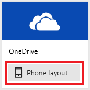
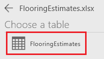
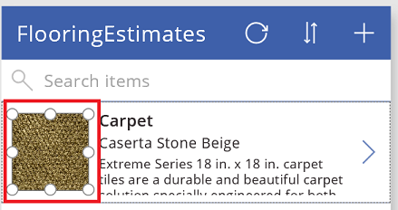
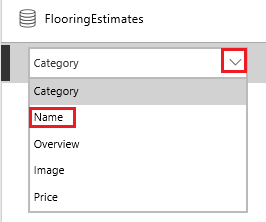
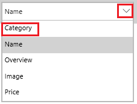
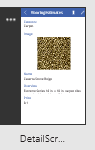
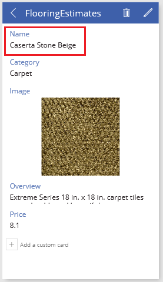

# Generieren einer App aus Excel-Daten
Erstellen Sie automatisch eine App basierend auf Daten in einer Excel-Datei, die Sie in ein Cloudspeicherkonto wie OneDrive hochladen. Nachdem Sie die App generiert haben, können Sie sie beliebig anpassen und anschließend ausführen, um sicherzustellen, dass sie Ihren Vorstellungen entspricht.

Generierte Apps verfügen standardmäßig über drei Bildschirme:

* **BrowseScreen1** zeigt eine Teilmenge eines oder mehrerer Felder, eine Suchleiste und eine Schaltfläche zum Sortieren an, mit deren Hilfe Benutzer einen bestimmten Datensatz leicht finden können.
* **DetailsScreen1** zeigt mehrere oder alle Felder für einen bestimmten Datensatz.
* **EditScreen1** enthält Elemente der Benutzeroberfläche, mit deren Hilfe Benutzer einen Datensatz erstellen oder aktualisieren und die Änderungen speichern können.

> [!NOTE]
> Sie können eine App auch aus einer [benutzerdefinierten SharePoint-Liste](app-from-sharepoint.md) generieren.

## Voraussetzungen
* [Registrieren](signup-for-powerapps.md) Sie sich für PowerApps, und führen Sie anschließend einen dieser Schritte aus:
  * Installieren Sie [PowerApps Studio für Windows](http://aka.ms/powerappsinstall) auf einem Computer mit Windows 8, Windows 8.1 oder Windows 10.
  * Öffnen Sie [PowerApps Studio für das Web](create-app-browser.md) (Vorschau) in einem Browser.
* Melden Sie sich bei PowerApps mit denselben Anmeldeinformationen an, die Sie bei der Registrierung verwendet haben.
* Um dieses Tutorial nachzuvollziehen, laden Sie diese [Excel-Datei](https://az787822.vo.msecnd.net/documentation/get-started-from-data/FlooringEstimates.xlsx) herunter.
  
    > [!IMPORTANT]
> Sie können eine eigene Excel-Datei verwenden, wenn die Daten als Tabelle formatiert sind. Weitere Informationen finden Sie unter [Erstellen oder Löschen einer Excel-Tabelle](https://support.office.com/article/Create-an-Excel-table-in-a-worksheet-E81AA349-B006-4F8A-9806-5AF9DF0AC664).
* Laden Sie die Excel-Datei in OneDrive oder ein anderes [Cloudspeicherkonto](connections/cloud-storage-blob-connections.md) hoch.

## Erstellen einer App
1. Klicken oder tippen Sie in PowerApps Studio im Menü **Datei** auf **Neu** (nahe dem linken Rand).
   
    
2. Befolgen Sie einen der folgenden Schritte:
   
   * Wenn Ihr Cloudspeicherkonto unter **Von Ihren Daten ausgehen** angezeigt wird, klicken oder tippen Sie auf **Smartphonelayout**.
     
     
   * Wenn Ihr Cloudspeicherkonto unter **Von Ihren Daten ausgehen** nicht angezeigt wird, klicken Sie auf den Pfeil am Ende der Zeile mit den Kacheln. Wenn Ihr Konto in der Liste der Verbindungen angezeigt wird, klicken oder tippen Sie darauf.
   * Wenn Ihr Cloudspeicherkonto weder unter **Von Ihren Daten ausgehen** noch in der Liste der Verbindungen angezeigt wird, klicken oder tippen Sie auf **Neue Verbindung** und dann auf den Eintrag für Ihr Konto. Klicken oder tippen Sie auf **Verbinden**, und befolgen Sie die Anweisungen zum Konfigurieren der Verbindung.
     
     
3. Navigieren Sie unter **Choose an Excel file** zu **FlooringEstimates.xlsx**, und klicken oder tippen Sie darauf.
   
      
4. Klicken oder tippen Sie unter **Choose a table (Tabelle auswählen)** auf **FlooringEstimates**.  
   
    
5. Klicken oder tippen Sie auf **Connect**, um die App zu generieren.
6. Wenn Sie aufgefordert werden, die Einführung anzuschauen, klicken oder tippen Sie auf **Next** (Weiter), um sich mit wichtigen Bereichen der PowerApps-Benutzeroberfläche vertraut zu machen (oder klicken bzw. tippen Sie auf **Skip** (Überspringen)).
   
    
   
    > [!NOTE]
> Sie können sich die Einführung jederzeit später anschauen. Klicken oder tippen Sie hierzu auf das Fragezeichen-Symbol in der Nähe der oberen rechten Ecke, und klicken oder tippen Sie anschließend auf **Take the intro tour**.

## Ändern des Kataloglayouts
Wenn eine App erstellt wird, verfügt sie über ein Standardlayout auf Basis Ihrer Daten, aber Sie können dieses Kataloglayout nach Belieben anpassen.

1. Klicken oder tippen Sie auf der linken Navigationsleiste rechts unten auf ein Symbol, um zur Miniaturansicht zu wechseln.
   
    
2. Klicken oder tippen Sie auf der linken Navigationsleiste auf die obere Miniaturansicht, um sicherzustellen, dass der Bildschirm zum Durchsuchen (**BrowseScreen1**) ausgewählt ist.
3. Klicken oder tippen Sie an eine beliebige Stelle im Katalog, beispielsweise auf das erste Bild.
   
    
4. Öffnen Sie im Bereich auf der rechten Seite die Liste **Layout**, und klicken oder tippen Sie dann auf das Layout, das ein Bild, einen Titel und einen Untertitel enthält.
   
    
   
    Das Layout der App ändert sich gemäß Ihren Änderungen.
   
    

## Ändern der angezeigten Daten
1. Klicken oder tippen Sie unter **Elemente suchen (Search items)** auf **Teppich (Carpet)**, um das Steuerelement **Bezeichnung (Label)** auszuwählen.
   
   Die zugeordnete Liste wird im rechten Bereich hervorgehoben.
   
   
2. Öffnen Sie im rechten Bereich die markierte Liste, und klicken oder tippen Sie dann auf **Name**.
   
    
3. Öffnen Sie die Liste unten, und klicken oder tippen Sie auf **Category** (Kategorie).
   
    
   
    **BrowseScreen1** zeigt jetzt für jeden Datensatz einen Namen und eine Kategorie an.
   
    
   
    > [!NOTE]
> Standardmäßig können Sie per Mausrad bzw. auf einem Touchscreen durch Wischen nach oben oder unten durch die Liste (auch „Katalog“ genannt) scrollen. Um entweder ein Trackpad oder eine Maus ohne Rad zu verwenden, wählen Sie den Katalog aus, klicken oder tippen Sie in der Eigenschaftenliste auf **Scrollleiste anzeigen**, und ersetzen Sie dann in der Bearbeitungsleiste **FALSE** durch **TRUE**.

## Ändern der Reihenfolge von Formularfeldern
1. Klicken oder tippen Sie in der linken Navigationsleiste auf die mittlere Miniaturansicht, um den Detailbildschirm (**DetailsScreen1**) zu öffnen.
   
    
2. Klicken oder tippen Sie auf das Bild, um die für das Anpassen des Formulars verfügbaren Optionen anzuzeigen.
   
    
3. Ziehen Sie im rechten Bereich das Feld **Name** in der Liste an die oberste Stelle.
   
    
   
    Der Bildschirm wird den Änderungen entsprechend aktualisiert.
   
    

## Ein Steuerelement ändern
1. Klicken oder tippen Sie in der linken Navigationsleiste auf die untere Miniaturansicht, um den Bearbeitungsbildschirm (**EditScreen1**) zu öffnen.
   
    
2. Klicken oder tippen Sie auf **Overview** (Übersicht).
   
    Mit diesem Schritt wird die Übersichtskarte ausgewählt. Jede Karte enthält Text zur Beschreibung des Zwecks der Karte. Sie können auch die Steuerelemente auf einer Karte anpassen. Weitere Informationen finden Sie unter [Karten-Steuerelement in PowerApps](controls/control-card.md).
   
    
3. Klicken oder tippen Sie im rechten Bereich auf den Pfeil nach unten für die Karte, scrollen Sie nach unten, und klicken oder tippen Sie dann auf **Mehrzeiligen Text bearbeiten**.
   
    Mit diesem Schritt wird eine Übersicht jedes Produkts in einem Steuerelement angezeigt, das groß genug ist, um den Text darzustellen.
   
    

## Ausführen der App
Während Sie die App anpassen, können Sie Ihre Änderungen testen, indem Sie die App im Vorschaumodus ausführen.

1. Klicken oder tippen Sie in der linken Navigationsleiste auf die obere Miniaturansicht, um den Bildschirm zum Durchsuchen (**BrowseScreen1**) zu öffnen.
2. Öffnen Sie den Vorschaumodus durch Drücken von F5 oder durch Klicken bzw. Tippen auf die Schaltfläche **Play** (Wiedergabe) in der Nähe der oberen rechten Ecke.
   
    
3. Klicken oder tippen Sie im **BrowseScreen1** auf den Pfeil rechts neben einem Datensatz, um ihn im Detailbildschirm (**DetailsScreen1**) anzuzeigen.
   
    
4. Klicken oder tippen Sie im **DetailsScreen1** auf das Stiftsymbol rechts oben in der Ecke, um den Datensatz im Bearbeitungsbildschirm (**EditScreen1**) anzuzeigen.
   
    
5. Ändern Sie im **EditScreen1** die Informationen in mindestens einem Feld, und klicken oder tippen Sie auf das Häkchen in der oberen rechten Ecke, um Ihre Änderungen zu speichern.
   
    
6. Schließen Sie den Vorschaumodus, indem Sie die ESC-Taste drücken (oder indem Sie auf das Symbol zum Schließen unter der Titelleiste klicken oder tippen).
   
    

### Bekannte Einschränkungen
Weitere Informationen zum Freigeben von Excel-Daten in Ihrer Organisation erhalten Sie in diesen [Ausführungen zu Einschränkungen](connections/cloud-storage-blob-connections.md#sharing-excel-tables).

## Nächste Schritte
* Drücken Sie STRG+S, um Ihre App zu speichern, sodass sie auf anderen Geräten ausgeführt werden kann.
* Da Sie jetzt wissen, wie eine App aus Daten generiert wird, können Sie als Nächstes [eine App von Grund auf neu erstellen](get-started-create-from-blank.md).
* Sie können die [App freigeben](share-app.md), damit sie von anderen Personen ausgeführt werden kann.

