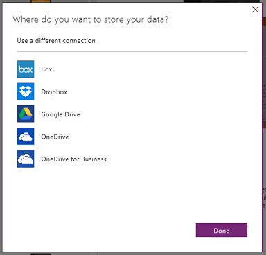
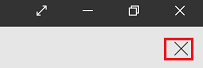

# App aus einer Vorlage erstellen und ausführen
Erstellen Sie eine Anwendung automatisch basierend auf einer Vorlage für das spezifische Szenario, und führen Sie sie dann aus, um ihr Standardverhalten zu verstehen. Experimentieren Sie mit dem Anpassen einer App, und speichern und teilen Sie sie mit anderen.

**Voraussetzungen**

* [Registrieren Sie sich](signup-for-powerapps.md) bei PowerApps, [installieren](http://aka.ms/powerappsinstall) und öffnen Sie PowerApps, und melden Sie sich mit den Anmeldeinformationen an, die Sie beim Registrieren angegeben haben.
  
    **Hinweis**: Um dieses Feature verwenden zu können, stellen Sie sicher, dass Sie Version 2.0.510 oder höher ausführen. Öffnen Sie zum Ermitteln der Version das Menü **File** auf der linken Seite, klicken oder tippen Sie auf **Account** (Konto), und suchen Sie unter **Product information** (Produktinformationen).
* Ein Cloudspeicherkonto, z.B. DropBox, OneDrive oder Google Drive.

## Erstellen einer App
1. Klicken oder tippen Sie in PowerApps Studio für Windows oder PowerApps Studio für Web auf **Neu** (neben dem linken Rand des Bildschirms).
   
    
2. Klicken oder tippen Sie auf der Kachel **App-Vorlagen** auf **Smartphonelayout**.
   
   **Hinweis:** Sie können auch eine App anhand einer Vorlage für ein Tabletlayout erstellen, aber dieses Tutorial konzentriert sich auf die Mobiltelefonoption.
   
   
   
   Eine Liste mit Vorlagen wird angezeigt.
3. Wenn Sie keine Verbindung mit einem Cloudspeicherkonto haben:
   
   1. Klicken oder tippen Sie am unteren Rand des Bildschirms auf **Choose** (Auswählen).
      
       
   2. Klicken oder tippen Sie auf das Konto, das Sie verwenden möchten.
      
       
   3. Stellen Sie Ihre Anmeldeinformationen bereit, und klicken oder tippen Sie auf **Verwendung**, um Zugriff zu erteilen.
      
       Die Verbindung wird am unteren Bildschirmrand angezeigt.
4. In der Liste der Vorlagen, klicken oder tippen Sie auf eine Vorlage, und klicken oder tippen Sie anschließend auf **Use** (Verwenden) in der Nähe der rechten unteren Ecke.
   
    
   
    Die Beispieldaten werden in Ihr Cloudspeicherkonto kopiert, die App wird erstellt und die Startseite wird angezeigt.

## Ausführen der App
Eine App aus einer Vorlage wird im Standardarbeitsbereich geöffnet, wo Sie den größten Teil Ihrer Zeit mit Anpassen verbringen. Bevor Sie Änderungen an der App vornehmen, führen Sie die Schritte in diesem Abschnitt durch, um zu sehen, wie die App im **Vorschaumodus** funktioniert.

**Tipp:** Entwerfen und Entwickeln Sie Apps im Standardarbeitsbereich, aber testen Sie diese im **Vorschaumodus**, bevor Sie sie für andere Benutzer freigeben.

1. Wenn Sie PowerApps noch nie verwendet haben, schauen Sie sich die Einführung an (oder klicken oder tippen Sie auf **Skip**).
   
    
   
    Sie können sich die Einführung jederzeit später anschauen. Klicken oder tippen Sie hierzu auf das Fragezeichen-Symbol in der Nähe der oberen rechten Ecke, und klicken oder tippen Sie anschließend auf **Take the intro tour**.
2. Klicken oder tippen Sie auf der linken Navigationsleiste auf den Bildschirm, der dem oberen Rand am nächsten ist.
3. Drücken Sie F5 (oder klicken oder tippen Sie auf den Pfeil nach rechts in der oberen rechten Ecke), um die App im **Vorschaumodus** zu öffnen.
   
    
   
    Die App wird mit Beispieldaten zur Veranschaulichung der Funktionalität der App aufgefüllt. Die App für die Kostenschätzung enthält z.B. Daten für das Erstellen von Beauftragungen und die Schätzung der Kosten für die Installation eines bestimmten Fußbodenprodukts in einem Raum einer bestimmten Größe.
4. Untersuchen Sie das Standardverhalten der App, und stellen Sie sicher, dass die Daten in Ihrem Cloudkonto Ihre Änderungen wiedergeben.
   
    Machen Sie beispielsweise eine Beauftragung, und erstellen Sie eine Kostenschätzung in der App für die Kostenschätzung.
5. Kehren Sie zu dem Standardarbeitsbereich zurück durch Auswahl des Symbols **X** in der oberen rechten Ecke (unter der PowerApps Titelleiste).
   
    

## Anpassen der App
Sie können diese oder jede App u.a. folgendermaßen anpassen:

* [Bildschirmgröße oder -ausrichtung oder beides ändern](set-aspect-ratio-portrait-landscape.md)
* [Eine andere Datenquelle hinzufügen](add-data-connection.md)
* [Einen oder mehrere Bildschirme hinzufügen](add-screen-context-variables.md)
* [Ein Steuerelement hinzufügen und konfigurieren](add-configure-controls.md)
* [Das Verhalten der App ändern](working-with-formulas.md)

## Nächste Schritte
1. Drücken Sie STRG+S, geben Sie Ihre App einen Namen, und klicken oder tippen Sie anschließend auf **Save** (Speichern), um Ihre App in der Cloud zu speichern.
2. Mit [Share your app](share-app.md) (App freigeben) stellen Sie Ihre App anderen Personen zur Verfügung.
   
    **Hinweis**: Bevor Sie eine App freigeben stellen Sie sicher, dass die Personen, mit denen Sie die App freigeben, auf die Daten zugreifen können. Beispielsweise müssen Sie [eine Excel- oder andere Datei freigeben](share-app-data.md) über ein Cloudspeicherkonto durchführen.

