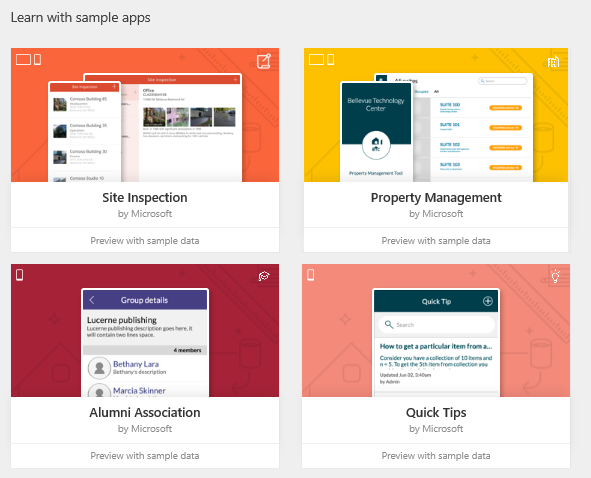

# Einführung in PowerApps
Willkommen! In PowerApps können Sie Organisationsdaten verwalten, indem Sie eine App ausführen, die Sie selbst erstellt haben oder die ein anderer mit Ihnen geteilt hat. Apps können auf **[Mobilgeräten wie Smartphones](run-app-client.md)** oder durch Öffnen von Dynamics 365 **[in einem Browser](run-app-browser.md)** ausgeführt werden. Sie können unendlich viele verschiedene Apps erstellen &ndash; ganz ohne Programmierkenntnisse in C# oder einer anderen Sprache.

Wenn Sie mit der App-Entwicklung noch nicht vertraut sind, sehen Sie sich einmal an, wie Sie eine einfache App automatisch auf Grundlage einer einzelnen Datenquelle generieren lassen, die Sie dann an Ihre Bedürfnisse anpassen. Dies wird in diesem in diesem fünfminütigen Video gezeigt:

[!VIDEO nb:cid:UUID:34ccfd46-7826-49ce-90d8-cf6a144b6968]

Nachdem Sie eine **[App z.B. auf Grundlage einer benutzerdefinierten SharePoint-Liste automatisch generiert haben](app-from-sharepoint.md)**, können Sie ändern, wie **[alle Elemente](customize-layout-sharepoint.md)**, **[Details zu einzelnen Elementen](customize-forms-sharepoint.md)** und **[Optionen zum Erstellen oder Bearbeiten eines Elements](customize-forms-sharepoint.md)** in der App angezeigt werden. Sie können auch eine **[Beispiel-App](open-and-run-a-sample-app.md)** oder **[Vorlage](get-started-test-drive.md)** öffnen, um sich einen Eindruck von den Möglichkeiten zu verschaffen, die PowerApps bieten, und sich über den Aufbau komplexerer Apps zu informieren.

Wenn Sie über die nötige Erfahrung und Kreativität verfügen, können Sie **[eigene Apps von Grund auf entwickeln](get-started-create-from-blank.md)**. Sie können Verbindungen mit **[Datenquellen](connections-list.md)** herstellen, **[Benutzeroberflächenelemente (so genannte Steuerelemente) hinzufügen](reference-properties.md)** und das Verhalten der App über **[Formeln](working-with-formulas.md)** definieren. Beginnen Sie mit einem überschaubaren Projekt und bauen Sie Ihre Kenntnisse schrittweise aus. So können Sie Apps erstellen und mit anderen teilen und damit die Verwaltung von Daten in Ihrer Organisation neu definieren. Sind Sie bereit für den ersten Schritt?

## Eine App automatisch generieren
Um eine App automatisch zu generieren, geben Sie eine Datenquelle wie die folgenden an:

* **[Common Data Service](data-platform-intro.md)**
* SQL Server-Datenbank
* Salesforce
* Dynamics 365
* Excel-Arbeitsmappe (in einem Cloudspeicherkonto)

Eine Schritt-für-Schritt-Anleitung finden Sie unter **[Erstellen einer App für die Verwaltung von Daten in SharePoint](app-from-sharepoint.md)**. Das Thema ist zwar für SharePoint bestimmt, doch gelten dieselben Prinzipien für andere Typen von Datenquellen.

## Eine App anpassen
Wenn die generierte App standardmäßig nicht Ihre Anforderungen erfüllt, können Sie sie **[anpassen](customize-layout-sharepoint.md)**. Sie könnten beispielsweise andere Daten oder die gleichen Daten in einem anderen Benutzeroberflächenelement anzeigen.

Ideen dazu, wie Sie Ihre App noch weiter verbessern können, erhalten Sie durch **[Öffnen einer Beispiel-App](open-and-run-a-sample-app.md)**. Sie bekommen eine Vorstellung davon, was Sie mit Kreativität und ein wenig Erfahrung erfinden können.

Sie können auch eine **[App anhand einer Vorlage erstellen](get-started-test-drive.md)**. Jede Vorlage basiert auf fiktiven Daten in einem Cloudkonto, wie etwa Dropbox. Erkunden Sie bestimmte Bildschirme und Steuerelemente um zu verstehen, wie sie konfiguriert sind, und experimentieren Sie mit Anpassung, um Techniken zu entdecken, die Sie für Ihre eigenen Apps anwenden können.

## App von Grund auf neu erstellen
Nachdem Sie eine App oder zwei automatisch generiert haben und eine gewisse Erfahrung mit Anpassen haben, können Sie eine **[App von Grund auf neu erstellen](get-started-create-from-blank.md)**. Durch das Arbeiten von Grund auf gewinnen Sie Flexibilität beim App-Design, Flow und Steuerelementen und können eine größere Vielzahl von **[Datenquellen](connections-list.md)** integrieren.

Eine ausführliche Beschreibung einiger Konzepte, die Sie benötigen, finden Sie unter folgenden Themen:

* Formeln (**[Tutorial](working-with-formulas.md)** oder **[Referenz](formula-reference.md)**)
* Kataloge (**[Tutorial](add-gallery.md)** oder **[Referenz](reference-properties.md)**)
* Formulare (**[Tutorial](add-form.md)** oder **[Referenz](working-with-forms.md)**)
* **[Tabellen und Datensätze](working-with-tables.md)**
* **[Steuerelemente und deren Eigenschaften](reference-properties.md)**

## Freigeben und Ausführen einer App
Wenn Sie Ihre App fertiggestellt haben, können Sie sie für andere Benutzer in Ihrer Organisation**[ freigeben](share-app.md)** und entweder Ihre eigenen Apps oder freigegebene Apps **[in einem Browser](run-app-browser.md)** oder **[auf einem Smartphone](run-app-client.md)** ausführen.

## Weitere Informationen
In diesem Thema finden Sie eine grundlegende Übersicht über die zahllosen Möglichkeiten von PowerApps. In den Themen, die am linken Rand dieser Seite aufgeführt sind, finden Sie Anleitungen und Referenzinformationen. Wenn Sie eine spezielle Frage haben, die in den Themen nicht behandelt wird:

* **[Beteiligen Sie sich an unserer Community](https://aka.ms/powerapps-community)**, um Fragen zu stellen und Ideen mit anderen PowerApps-Benutzern auszutauschen.
* **[Wenden Sie sich an den Support](https://aka.ms/pasupport)**.

