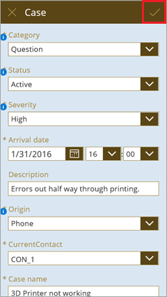

Bis hierhin haben wir in diesem Abschnitt eine App auf Grundlage der Entität „Case“ des Common Data Service generiert, die App und ihre Komponenten genauer betrachtet und auf unterschiedliche Weise angepasst. Im letzten Thema in diesem Abschnitt fügen wir in eine weitere Standardentität hinzu und senden eine E-Mail mit Microsoft Flow. Die App löst einen Flow aus, damit die Person, die den Fall geöffnet hat, bei einer Aktualisierung des Falls benachrichtigt wird. In diesem Thema wird ein bestimmtes Szenario betrachtet, die dabei erworbenen Kenntnisse können Sie aber auf viele Arten von Apps anwenden. Betrachten wir zunächst die Entitäten.

## <a name="review-entity-relationships"></a>Überprüfen von Entitätsbeziehungen
Wir werden gleich die Entität „Contact“ hinzufügen, vorher betrachten wir aber, wie die Entitäten „Case“ und „Contact“ zusammenhängen. Bei der Entität „Case“ sehen Sie das Feld **CurrentContact** mit dem Datentyp **Lookup**. Dies bedeutet, dass dieses Feld in einer Beziehung mit einer anderen Tabelle verwendet wird.


Auf der Registerkarte **Beziehungen** sehen Sie, dass die entsprechende Entität **Contact** lautet. Behalten Sie dies im Hinterkopf, da die Beziehung später in diesem Thema verwendet wird.


## <a name="add-an-entity-to-the-app"></a>Hinzufügen einer Entität zur App
Das Hinzufügen einer Datenquelle in PowerApps geht ganz einfach. Klicken oder tippen Sie im rechten Bereich auf **Datenquellen** und dann auf **Datenquelle hinzufügen**. In diesem Fall wählen Sie dann die Verbindung **Common Data Service** und die Entität **Contact** aus. Wenn Sie auf **Verbinden** klicken oder tippen, wird die Entität zur App hinzugefügt. 


Beachten Sie, dass in diesem Beispiel Daten aus einer anderen Entität hinzugefügt werden. Sie können in Ihren Apps aber auch Daten aus verschiedenen Quellen kombinieren. 

## <a name="look-up-contact-information"></a>Suchen von Kontaktinformationen
Nachdem wir nun auf die Daten der Entität „Contact“ in der App zugreifen können, sollten wir sie auch einsetzen. Wie in der Einführung erwähnt, möchten wir eine E-Mail senden, wenn ein Fall aktualisiert wird. Hierfür werden zwei Formeln und ein Flow verwendet. Die erste Formel bezieht sich auf den Bearbeitungsbildschirm, genauer gesagt die OnSelect-Eigenschaft der Schaltfläche zum Speichern.



Für diese Schaltfläche wird standardmäßig die Formel `SubmitForm(EditForm1)` verwendet, um die Aktualisierung zu übermitteln, wenn ein Benutzer Daten im Formular bearbeitet. Wir müssen die Formel erweitern, sodass zuerst die Kontaktinformationen für die Person gesucht werden, die den aktuellen Fall geöffnet hat, und diese Informationen dann lokal in der App gespeichert werden: 

```UpdateContext({contact:LookUp(Contact, ContactId=BrowseGallery1.Selected.CurrentContact.ContactId)}); SubmitForm(EditForm1)```

Das ist ein bisschen komplizierter, aber James erläutert diese Formel ab Minute 2:04 im Video ausführlich.

## <a name="trigger-a-flow-from-the-app"></a>Auslösen eines Flows in der App
Nachdem wir nun den Kontakt für jeden Fall kennen, können wir eine E-Mail senden. Wir könnten die E-Mail direkt aus der App senden, in diesem Beispiel zeigen wir aber, wie in der App ein Flow ausgelöst wird. Dies ist der Flow, und er ist denkbar einfach: Auf Grundlage einer Aktion in einer App wird eine E-Mail gesendet. Wir werden Flows hier nicht ausführlicher betrachten, es gibt aber eine Reihe für „Geführtes Lernen“ für Microsoft Flow. 


In der App müssen wir den Flow nun basierend auf einem Ereignis aufrufen. Wir verwenden die OnSuccess-Eigenschaft des Bearbeitungsformulars, damit der Flow bei einer erfolgreichen Bearbeitung ausgelöst wird. Klicken oder tippen Sie auf das Bearbeitungsformular, und klicken oder tippen Sie dann im Menüband auf **Aktion** > **Flows**. Wählen Sie den Flow aus, den Sie verwenden möchten. 


Der Flow ist nun dem OnSuccess-Ereignis des Bearbeitungsformulars zugeordnet, und wir können auf den Kontakt für die E-Mail verweisen. Mit der folgenden Formel wird der Flow mit der E-Mail-Adresse der Person, die den Fall geöffnet hat, einer Betreffzeile und dem Text der E-Mail aufgerufen. 

```CaseResolvedEmailConfirmation.Run(contact.EmailPrimary, "Your case has been updated", "Check it out")```

Mehr ist nicht nötig, um der App eine Datenquelle hinzuzufügen und einen Flow auszulösen, mit dem eine E-Mail gesendet wird. Wenn Sie die Videos in diesem Abschnitt noch nicht angesehen haben, sollten Sie dies jetzt tun. In ihnen werden viele Details behandelt, die in den Themen nur kurz angesprochen wurden.

## <a name="wrapping-it-all-up"></a>Zusammenfassung
Damit sind wir am Ende dieses Abschnitts angelangt. Wir hoffen, dass es Ihnen gefallen hat und Sie jede Menge gelernt haben. Wir haben zunächst eine einfache App aus einer Entität generiert und näher betrachtet, um ihre Komponenten kennenzulernen. Wir haben viel Zeit darauf verwendet, die App anzupassen, und dann eine Datenquelle hinzugefügt und gesehen, wie ein Flow ausgelöst wird. In diesem Abschnitt haben wir eine App für das Fallmanagement erstellt, die Kenntnisse, die Sie dabei erworben haben, lassen sich aber auf viele Arten von Apps anwenden. Wie bereits am Anfang dieses Abschnitts erwähnt: Wenn Sie mit einer etwas komplexeren Fallmanagement-App arbeiten möchten, finden Sie in PowerApps Studio für Windows eine entsprechende Vorlage. 

Als Nächstes befassen wir uns mit der Verwaltung von Apps. Im Abschnitt zur Verwaltung erfahren Sie, wie Sie Apps freigeben und verschiedene Versionen erstellen, und es werden Umgebungen erläutert, die Sie sich als Container für Apps, Daten und andere Ressourcen vorstellen können. 

