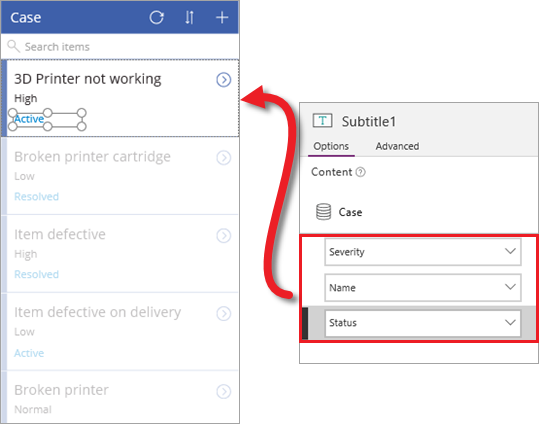
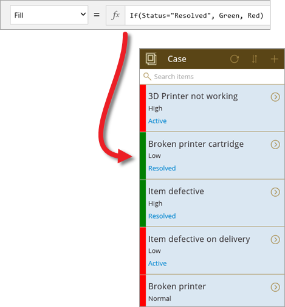

In den ersten beiden Themen in diesem Abschnitt haben Sie eine App aus einer Common Data Service-Entität generiert und dann die drei verschiedenen Bildschirme der App genauer betrachtet. Die mit PowerApps generierte App kann bereits verwendet werden, aber meistens passen Sie eine App nach dem Generieren noch an. In diesem Thema erläutern wir einige Änderungen am Bildschirm zum Durchsuchen der App. Sie können alle Bildschirme anpassen, wir konzentrieren uns aber auf einen, um die Anpassungen ausführlicher vorstellen zu können. Sie können eine beliebige App generieren – aus einer Entität, einer Excel-Datei oder einer anderen Quelle – und ausprobieren, wie Sie sie anpassen können. Dies ist wirklich die beste Möglichkeit, um den Aufbau einer App kennenzulernen.

## Ändern der Galerie und der Datenbindungen
Beim Generieren der App mit PowerApps wurden ein Layout und die Felder festgelegt, die auf den einzelnen Bildschirmen angezeigt werden. Für diese App wählen wir ein Galeriesteuerelement mit einer Statusleiste aus (die Statusleiste wird gleich angepasst). Wählen Sie im rechten Bereich auf der Registerkarte **Layout** das gewünschte Layout aus. Sie können die Ergebnisse sofort sehen, da die App in PowerApps aktualisiert wird, sobald Sie Änderungen vornehmen.

Nachdem Sie das richtige Basislayout festgelegt haben, können Sie nun die angezeigten Felder ändern. Klicken oder tippen Sie auf ein Feld im ersten Element, und ändern Sie dann im rechten Bereich die Daten, die für jedes Element angezeigt werden. Dies bietet einen besseren Überblick über die einzelnen Elemente in der Entität.

## Ändern des App-Designs
PowerApps bietet eine Reihe von Designs, die Sie in Ihrer App verwenden können, ähnlich wie PowerPoint. Auf dem folgenden Bildschirm sehen Sie das Design **Dune** und ein einfaches Logo, das in die App eingefügt wurde. Dies sind einfache Änderungen, die aber das Erscheinungsbild Ihrer App erheblich verbessern können. 

## Anzeigen des Fallstatus mit einer Formel
Einer der Hauptvorteile von PowerApps besteht darin, dass Sie keinen herkömmlichen Anwendungscode schreiben müssen – Sie müssen kein Entwickler sein, um Apps erstellen zu können. Sie benötigen aber eine Möglichkeit, Logik in einer App auszudrücken und Navigation, Filtern, Sortieren und andere Funktionen in der App zu steuern. Hier kommen Formeln ins Spiel.

Wenn Sie schon einmal Excel-Formeln verwendet haben, sollte Ihnen der Ansatz von PowerApps vertraut vorkommen. Angenommen, Sie möchten eine grüne Statusleiste anzeigen, wenn ein Fall erfolgreich bearbeitet wurde, andernfalls soll die Statusleiste rot sein. Hierzu wählen Sie das Statussteuerelement auf dem Bildschirm aus und legen dann die Eigenschaft **Füllung** dieses Steuerelements in der Formelleiste auf die folgende Formel fest: `If(Status="Resolved", Color.Green, Color.Red)`. Dies ist mit einer Excel-Formel vergleichbar, PowerApps Formeln verweisen jedoch auf Steuerelemente und andere Elemente der App und nicht auf Zellen in einer Tabelle. Die folgende Abbildung zeigt, wo die Formel festgelegt wird, sowie das Ergebnis in der App.

## Sortieren und Filtern nach Datum
Auf dem Bildschirm zum Durchsuchen der generierten App können Sie Fälle suchen und die Liste der Elemente in der Galerie sortieren. Wir werden die Funktion zum Suchen und Sortieren entfernen, um Fälle auf Grundlage eines Datums anzuzeigen. Sie können diese Verfahren kombinieren, wir konzentrieren uns für diese App aber auf den datumsbasierten Ansatz. In der folgenden Abbildung sehen Sie die Elemente, die hinzugefügt wurden:

* Eine Beschriftung („Show cases after:“, Fälle zeigen nach), damit die Benutzer wissen, was sie tun sollen: **Einfügen** > **Text** > **Bezeichnung**, Formel **Füllung** ändern in **Weiß**.
* Eine Datumsauswahl: **Einfügen** > **Steuerelemente** > **Datumsauswahl**.
* Eine Formel, die die Eigenschaft **Elemente** der Galerie zum Durchsuchen mit der Datumsauswahl verbindet: `Filter(Case, DatePicker1.SelectedDate < LastModifiedDateTime)`.

Das Datum wird auf den 20. Oktober festgelegt. Sie können sehen, dass die App die Fälle anzeigt, die nach diesem Datum erstellt wurden. Beachten Sie, dass standardmäßig alle Fälle in der Entität das gleiche Datum der letzten Änderung haben. Sie können einen oder mehrere Fälle aktualisieren, um die Funktionsweise der Filter kennenzulernen. Das Arbeiten mit Entitätsdaten wird später in diesem Kurs behandelt.

## Anzeigen der Gesamtzahl der Fälle
Das waren viele neue Informationen, aber wir sind mit den Anpassungen auch fast fertig. Der letzte Schritt in diesem Thema ist das Hinzufügen von Bezeichnungen mit zwei Zahlen: die Gesamtzahl der Fälle und die Anzahl der Fälle, die dem datumsbasierten Filter entsprechen.

Im Video wird das Hinzufügen der beiden Bezeichnungen ausführlich erläutert, daher hier nur die Grundlagen zu den Eigenschaften, die jeweils festgelegt werden:

* **Ausrichten** = `Center`
* **Breite** = `Parent.Width/2`
* Linkes Feld: **Text** = `"Total cases: " & CountRows(Case)`. Dies schließt alle Fälle in der Entität ein. 
* Rechtes Feld: **Text** = `Filtered cases: " & CountRows(BrowseGallery1.AllItems)`. Dies schließt nur die Fälle ein, die dem datumsbasierten Filter entsprechen.

Das waren also die Anpassungen für die App. Im nächsten Thema werden eine Datenquelle und ein Flow hinzugefügt, und Sie sehen die fertige App.

