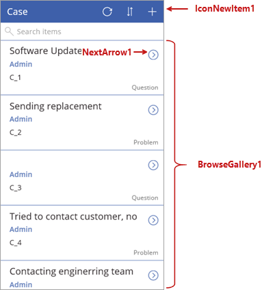
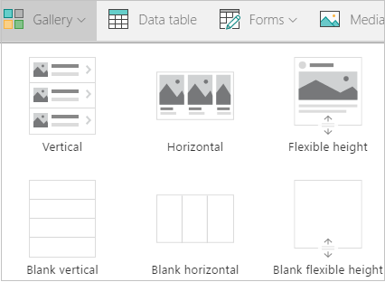
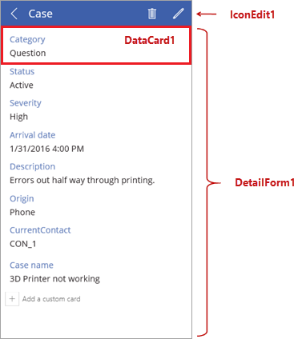
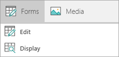
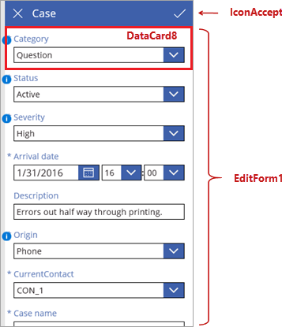

In diesem Thema wird die generierte App genauer betrachtet, indem wir die Bildschirme und Steuerelemente durchgehen, die das Verhalten der App steuern. Dabei wird nicht auf alle Details eingegangen, die Einblicke in die Funktionsweise dieser App werden Ihnen aber beim Erstellen Ihrer eigenen Apps nützlich sein. In einem der folgenden Themen betrachten wir die Formeln, die mit Bildschirmen und Steuerelementen verwendet werden.

## Ausführen der App im Vorschaumodus
Klicken oder tippen Sie auf  oben rechts, um die App auszuführen. Wenn Sie durch die App navigieren, sehen Sie, dass sie Daten aus der Entität enthält und in der Standardversion bereits gut zu bedienen ist.

## Grundlegendes zu Steuerelementen in PowerApps
Ein Steuerelement ist einfach ein Benutzeroberflächenelement, dem ein bestimmtes Verhalten zugeordnet wird. Viele Steuerelemente in PowerApps sind identisch mit Steuerelementen, die Sie bereits in anderen Apps verwendet haben: Bezeichnungen, Texteingabefelder, Dropdownlisten, Navigationselemente usw. In PowerApps gibt es aber auch spezialisiertere Steuerelemente wie **Galerien** (zum Anzeigen von Zusammenfassungsdaten) und **Formulare** (für Detaildaten und zum Erstellen und Bearbeiten von Elementen). Außerdem gibt es einige andere praktische Steuerelemente wie **Bild**, **Kamera** und **Barcode**. Klicken oder tippen Sie zum Anzeigen der verfügbaren Optionen im Menüband auf **Einfügen** und dann auf die verschiedenen Optionen wie **Text** oder **Symbole**.

## Elemente des Bildschirms zum Durchsuchen
Jeder der drei App-Bildschirme verfügt über ein Hauptsteuerelement sowie einige zusätzliche Steuerelemente. Der erste Bildschirm in der App ist der Bildschirm zum Durchsuchen, dem standardmäßig der Name **BrowseScreen1** zugewiesen ist. Das Hauptsteuerelement auf diesem Bildschirm ist eine Galerie mit dem Namen **BrowseGallery1**. **BrowseGallery1** enthält andere Steuerelemente wie z.B. **NextArrow1** (ein Symbolsteuerelement – durch Klicken oder Tippen wird der Detailbildschirm aufgerufen). Es gibt auch separate Steuerelemente auf dem Bildschirm z.B. **IconNewItem1** (ein Symbolsteuerelement – durch Klicken oder Tippen wird ein Element auf dem Bildschirm zum Bearbeiten/Erstellen erstellt).

PowerApps enthält eine Reihe von Galerietypen, sodass Sie die Galerie auswählen können, die dem gewünschten Layout für Ihre App am besten entspricht. Weiter unten in diesem Abschnitt werden weitere Möglichkeiten zum Steuern des Layouts vorgestellt.

## Elemente des Detailbildschirms
Als Nächstes wird der Detailbildschirm mit dem Standardnamen **DetailScreen1** betrachtet. Das Hauptsteuerelement auf diesem Bildschirm ist ein Anzeigeformular mit dem Namen **DetailForm1**. **DetailForm1** enthält andere Steuerelemente, z.B. **DataCard1** (ein Kartensteuerelement, das in diesem Fall die Fragekategorie anzeigt). Es gibt auch separate Steuerelemente auf dem Bildschirm, z.B. **IconEdit1** (ein Symbolsteuerelement – durch Klicken oder Tippen wird das aktuelle Element auf dem Bildschirm zum Bearbeiten/Erstellen bearbeitet).

Es gibt eine Vielzahl von Galerieoptionen, Formulare sind allerdings ganz einfach – es handelt sich immer entweder um ein Formular zum Bearbeiten oder ein Formular zum Anzeigen.

## Elemente des Bildschirms zum Bearbeiten/Erstellen
Der dritte Bildschirm in der App ist der Bildschirm zum Bearbeiten/Erstellen mit dem Standardnamen **EditScreen1**. Das Hauptsteuerelement auf diesem Bildschirm ist ein Bearbeitungsformular mit dem Namen **EditForm1**. **EditForm1** enthält andere Steuerelemente, z.B. **DataCard8** (ein Kartensteuerelement, mit dem in diesem Fall die Fragekategorie bearbeitet werden kann). Es gibt auch separate Steuerelemente auf dem Bildschirm, z.B. **IconAccept1** (ein Symbolsteuerelement – durch Klicken oder Tippen werden die Änderungen auf dem Bildschirm zum Bearbeiten/Erstellen gespeichert).

Nachdem Sie nun gesehen haben, aus welchen Bildschirmen und Steuerelementen die App besteht, wird im nächsten Thema das Anpassen der App beschrieben.

