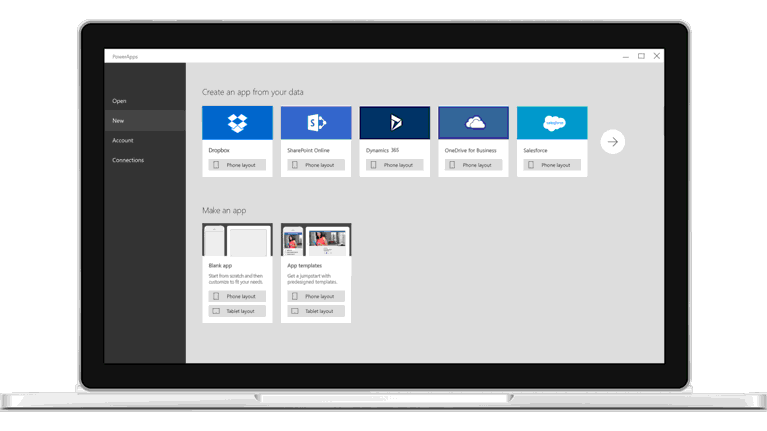

Willkommen bei **Geführtes Lernen** für **Microsoft PowerApps**. In diesem Onlinekurs, den Sie in Ihrem eigenen Tempo durcharbeiten können, wird PowerApps schrittweise vorgestellt, sodass Sie Ihre Kenntnisse nach und nach erweitern können.

Dieser Kurs für **Geführtes Lernen** umfasst eine Vielzahl von Abschnitten, die jeweils verschiedene Themen behandeln. In diesem Kurs sollen Informationen in leicht verständlichen Themengruppen mit einer logischen Reihenfolge behandelt werden, sodass Sie die Konzepte kennenlernen, Details verstehen und Beispiele bearbeiten können. Viele grafische Darstellungen unterstützen Sie beim Lernen.

Wenn Sie **Anfänger** beim Arbeiten mit PowerApps sind, ermöglicht dieser Kurs Ihnen den Einstieg. Wenn Sie mit PowerApps bereits vertraut sind, lernen Sie in diesem Kurs die Zusammenhänge zwischen verschiedenen Konzepten kennen und können Wissenslücken schließen. Wir hoffen, dass Ihnen der Kurs gefällt, und freuen uns, in Zukunft weitere Inhalte anbieten zu können.

## Was ist PowerApps?
**PowerApps** ist eine Sammlung von Softwarediensten und Apps, die zusammen das Erstellen und Freigeben von benutzerdefinierten Branchenanwendungen nachhaltig transformieren und beschleunigen.

PowerApps ist mit den **Clouddiensten und Datenquellen** verbunden, die Sie bereits verwenden, und gibt Ihnen die Möglichkeit, **schnell Apps zu erstellen**, die perfekt auf Ihre Anforderungen abgestimmt sind. Dabei können Sie auf bereits vorhandene Kenntnisse zurückgreifen. Sie können Apps sofort mit Kollegen im Web, auf Tablets und mobilen Geräten teilen. PowerApps ist außerdem in **Microsoft Flow** integriert, sodass Sie Workflows in Apps auslösen können. Mit PowerApps können Sie **einfach und schnell** arbeiten und innerhalb von Minuten eine App erstellen, die Daten aus Excel oder einem Clouddienst abruft. PowerApps ist aber auch robust und **ideal für Unternehmen** und kann komplexe Anforderungen wie das Nachverfolgen von Objekten in einem Unternehmen oder die Einbindung in Back-End-Systeme erfüllen.

## Komponenten von PowerApps
PowerApps besteht aus Komponenten zum Erstellen, Freigeben und Verwalten von Apps sowie aus Komponenten zum Ausführen dieser Apps. Sie können Apps in **PowerApps Studio für das Web** oder **PowerApps Studio für Windows** erstellen und dabei die **Datenverbindungen** verwenden, die für Ihre App benötigt werden. Über **web.powerapps.com** können Sie Datenverbindungen und lokale Gateways konfigurieren und verwalten und mit dem Common Data Service arbeiten, der in einem späteren Abschnitt beschrieben wird. Nachdem Sie eine App erstellt haben, können Sie sie in **Microsoft AppSource** freigeben oder im **Admin Center** verwalten.

Apps werden in einem Browser aus **Microsoft Dynamics 365** oder mit **PowerApps Mobile** ausgeführt, das für Windows-, iOS- und Android-Geräte verfügbar ist.

Im weiteren Verlauf dieses PowerApps-Kurses für „Geführtes Lernen“ werden wir uns an dieser Abfolge – Erstellen, Freigeben, Verwalten und Ausführen von Apps – orientieren.

## Einsatzmöglichkeiten von PowerApps in Ihrer Rolle
Mit PowerApps können **Wirtschaftsanalysten** und andere Experten **mit ihren bereits vorhandenen Kenntnissen Apps erstellen**. PowerApps wird aber auch von anderen Benutzern eingesetzt. Einige Anwender führen einfach von anderen erstellte Apps aus. Andere, die beruflich programmieren (professionelle Entwickler), können mit PowerApps schnell anspruchsvolle Apps erstellen.

Wie Sie PowerApps einsetzen, kann von Ihrer Rolle in einem Projekt oder in einem Team abhängen, und diese Rolle kann sich auch ändern. So kann z.B. einer Ihrer Kollegen eine App erstellen, die in das unternehmensweite CRM-System (Customer Relationship Management, Kundenbeziehungsmanagement) eingebunden ist, und Sie verwenden diese App regelmäßig, um Erfolg versprechende Vertriebschancen zu verfolgen. Sie können aber auch selbst Apps schreiben und diese in Ihrer Arbeitsgruppe teilen, wenn Ihre Apps für die anderen Mitarbeiter nützlich sind.

## Nächste Schritte
Nach diesem Überblick über diesen Kurs, PowerApps und seine wichtigsten Komponenten betrachten wir die einzelnen PowerApps-Komponenten im nächsten Thema genauer.

