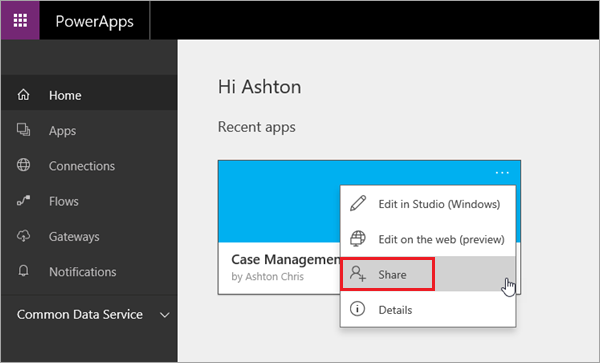
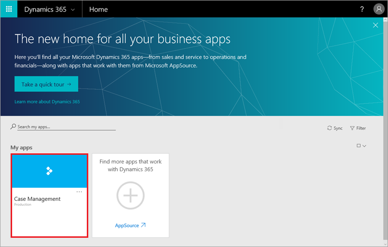

Es ist großartig Apps zu erstellen, die auf die Anforderungen Ihres eigenen Unternehmens abgestimmt sind, aber die Stärke von PowerApps kommt eigentlich erst dann ins Spiel, wenn Sie diese Apps auch für andere freigeben. Nachdem Sie gelernt haben, wie Sie eine App erstellen, wird in diesem Thema beschrieben, wie Sie sie freigeben. Sie können eine App für bestimmte Benutzer oder Gruppen freigeben, oder Sie geben Sie für Ihre gesamte Organisation frei. Wenn Sie eine App für eine andere Person freigeben, kann diese sie über Dynamics 365 in einem Browser oder in PowerApps Mobile für Windows, iOS oder Android ausführen. Wenn Sie einem Benutzer Berechtigungen für Mitwirkende zuweisen, kann er die App auch aktualisieren.

## Vorbereiten der App zum Freigeben
Bevor Sie sie für andere freigeben können, müssen Sie die App in der Cloud speichern. Geben Sie einen aussagekräftigen Namen und eine Beschreibung für die App an. So können die anderen Benutzer erkennen, um was für eine App es sich handelt, und sie in einer Liste auswählen. Klicken oder tippen Sie in PowerApps Studio auf **Datei**, und geben Sie dann eine Beschreibung ein.

Beachten Sie, dass alle Änderungen, die Sie an einer freigegebenen App vornehmen, beim Speichern der Änderungen sofort an die Personen weitergegeben werden, für die die App freigegeben wurde. Dies kann von Vorteil sein, wenn Sie Verbesserungen an der App vornehmen, es kann für die anderen aber auch nachteilig sein, wenn Sie Funktionen entfernen oder erheblich ändern.

## Eine App freigeben
Klicken Sie unter web.powerapps.com auf eine App-Kachel und dann auf die Auslassungspunkte (. . .). Klicken Sie dann auf **Freigeben**.

Jetzt können Sie eine App freigeben und außerdem die Versionsverwaltung für die App steuern, die wir im nächsten Thema behandeln werden. Geben Sie die Benutzer und Gruppen an, für die die App freigegeben werden soll, sowie die jeweiligen Rollen: **Benutzer** oder **Mitwirkender**. Klicken oder tippen Sie auf **Speichern**.

Wenn die Benutzer per E-Mail benachrichtigt werden sollen, erhalten alle, für die Sie die App freigegeben haben, eine E-Mail mit einem Link zu Dynamics 365. App-Mitwirkende erhalten außerdem einen Link zu web.powerapps.com.  Wenn ein Benutzer nicht auf den Link zu Dynamics 365 klickt, wird die App dort für ihn nicht angezeigt. Sie ist in AppSource verfügbar, er muss sie aber selbst zu Dynamics 365 hinzufügen.

## Berechtigungen und Lizenzierung
Wir werden Berechtigungen und Lizenzierung nicht ausführlich behandeln, möchten aber auf einige grundlegende Punkte im Zusammenhang mit der Freigabe eingehen:

* Benutzer und Mitwirkende benötigen Berechtigungen für alle Datenverbindungen und Gateways, die von einer freigegebenen App verwendet werden. Einige Berechtigungen werden implizit in der App gewährt, andere müssen explizit zugewiesen werden.
* Wenn die App Common Data Service-Entitäten verwendet, benötigen Benutzer und Mitwirkende Zugriff auf die Common Data Service-Datenbank. Mitwirkende benötigen auch eine P2-Lizenz für PowerApps, wenn sie direkt mit Entitäten arbeiten.

Das Freigeben von Apps ist ganz einfach und eine hervorragende Möglichkeit, eine App, die Sie hilfreich finden, für andere in Ihrer Organisation verfügbar zu machen. Im nächsten Thema erläutern wir, wie Sie steuern, welche Version einer App aktiv ist, wenn Sie die App verwenden und freigeben.

