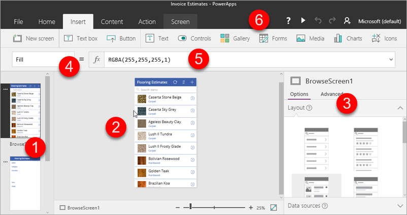
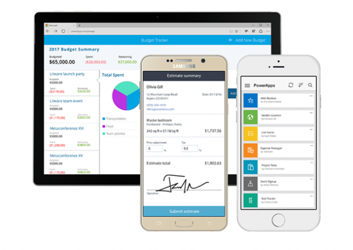
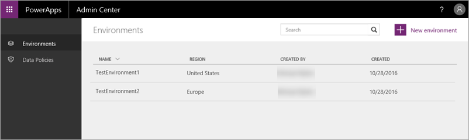

Im ersten Thema dieses Kurses für „Geführtes Lernen“ haben Sie die Hauptkomponenten von PowerApps kennengelernt. Jetzt gehen wir genauer auf die einzelnen Komponenten ein. Bei PowerApps handelt es sich um eine Sammlung von Softwarediensten und Apps, die zusammenarbeiten. Dazu gibt es verknüpfte Technologien, durch die ein leistungsfähiges Ökosystem entsteht. Die PowerApps-Komponenten:

* **Web.powerapps.com** – Verwalten und Freigeben der erstellten Apps
* **PowerApps Studio** – Erstellen von leistungsstarken Apps mit einfach zu verwendenden visuellen Tools
* **PowerApps Mobile** – Ausführen von Apps auf Windows-, iOS- und Android-Geräten
* **PowerApps Admin Center** – Verwalten von PowerApps-Umgebungen und anderen Komponenten
* **Common Data Service für Apps:** Integrieren von Geschäftsdaten mit dem Common Data Model

Wir erwarten nicht, dass Sie viel Zeit darauf verwenden zu verstehen, was PowerApps eigentlich *ist*, es ist aber vielleicht hilfreich, ein wenig mehr ins Detail zu gehen.

## web.powerapps.com
Wenn Sie Apps erstellen, arbeiten Sie in erster Linie hiermit. Sie können Ihre Kenntnisse mit den dort verfügbaren **Beispiel-Apps und Vorlagen** erweitern und alle Apps sehen, die Sie erstellt haben. Apps werden in **PowerApps Studio für das Web** oder **PowerApps Studio für Windows** erstellt und für Einzelpersonen und Organisationen freigegeben. Außerdem verwalten Sie Daten: **Verbindungen**, **Gateways** und **Entitäten** (diese werden in Kürze behandelt). Und Sie sehen alle **Flows**, die unter **flows.microsoft.com** erstellt wurden und die Sie in Ihre Apps integrieren können.

## PowerApps Studio
**PowerApps Studio** ist als Webanwendung verfügbar, die Sie in jedem modernen Browser verwenden können, sowie als Windows-Anwendung. PowerApps Studio enthält drei Bereiche und ein Menüband, durch die das Erstellen einer App mit dem **Erstellen einer PowerPoint-Foliengruppe vergleichbar ist**:

1. **Linke Navigationsleiste**: Hier können Sie eine Miniaturansicht für jeden Bildschirm in Ihrer App oder eine hierarchische Ansicht aller Steuerelemente auf den einzelnen Bildschirmen sehen.
2. **Mittlerer Bereich**: Hier wird der Bildschirm gezeigt, auf dem Sie arbeiten.
3. **Rechter Bereich**: Hier legen Sie Optionen wie Layout und Datenquellen fest.
4. Dropdownliste **Eigenschaft**: Hier wählen Sie die Eigenschaften aus, auf die Formeln angewendet werden.
5. **Bearbeitungsleiste**: Hier fügen Sie (wie in Excel) Formeln hinzu, mit denen das App-Verhalten definiert wird.
6. **Menüband**: Zum Hinzufügen von Steuerelementen und zum Anpassen von Designelementen.

## PowerApps Mobile
**PowerApps Mobile für Windows, iOS und Android** bietet eine Umgebung, in der Sie Apps suchen und verwenden können. Sie müssen nicht mehrere App-Stores aufrufen, sondern bleiben einfach in PowerApps und haben Zugriff auf alle Apps, die Sie erstellt haben und die andere Benutzer für Sie freigegeben haben. Wenn Sie Apps in PowerApps Mobile verwenden, können Sie die Funktionen Ihres Geräts optimal nutzen, z.B. Kamerasteuerelemente, GPS-Standortbestimmung usw.

## Admin Center
Das **PowerApps Admin Center** ist der zentrale Ort zum Verwalten von PowerApps für eine Organisation. Hier definieren Sie verschiedene **Umgebungen**, die Apps, Datenverbindungen und andere Elemente enthalten. Im Admin Center erstellen Sie außerdem Common Data Service-Datenbanken und verwalten Berechtigungen und Datenrichtlinien.

### Microsoft Common Data Service für Apps
**Common Data Service für Apps** erleichtert die Integration von Geschäftsdaten aus mehreren Quellen. Dieser Dienst umfasst das **Common Data Model**, das eine Vielzahl von **Entitäten** enthält, die in Anwendungen und Geschäftsprozessen verwendet werden. Der Dienst speichert die Daten skalierbar und zuverlässig und macht sie verfügbar, sodass sie von verschiedenen Anwendungen verwendet werden können. Bei diesen Anwendungen kann es sich um Apps handeln, die Sie in PowerApps, Dynamics 365, anderen Microsoft-Anwendungen oder Anwendungen von Drittanbietern erstellen. Die folgende Abbildung zeigt einen Ausschnitt einer Entität in web.powerapps.com.

Im nächsten Thema werden wir die verknüpften Technologien vorstellen, die von PowerApps verwendet werden, um ein leistungsfähiges Ökosystem für die App-Entwicklung bereitzustellen.

