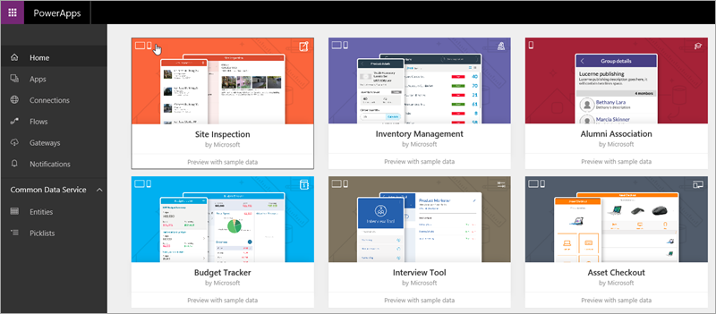
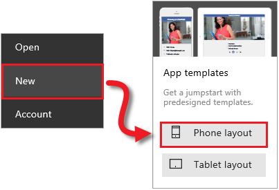
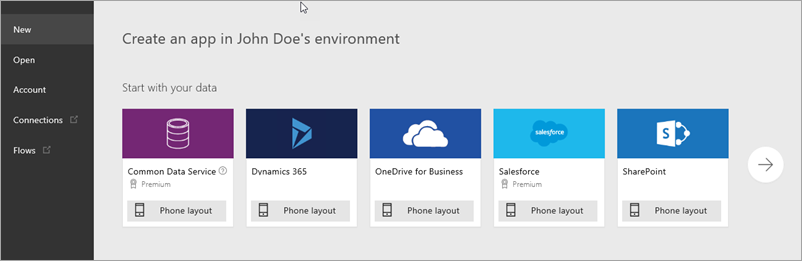

Nachdem Sie nun mit den Grundlagen von PowerApps vertraut sind, kommen wir zu einem **kurzen Überblick über den Einstieg in das Arbeiten mit Apps**. Wir betrachten Beispiel-Apps, das Erstellen von Apps aus einer Vorlage, das Verwenden von freigegebenen Apps und das Erstellen von Apps aus einer Datenquelle. Im nächsten Thema geht es dann um das Erstellen von Apps in der Praxis.

## Übersicht über Beispiel-Apps
In web.powerapps.com werden Sie mit einer Reihe von Beispiel-Apps begrüßt, die Sie in Ihrem Webbrowser verwenden können. Sehen Sie sich diese Apps genauer an, um einen **Eindruck von den Möglichkeiten zu erhalten** und zu verstehen, wie Ihr Unternehmen von PowerApps profitieren kann.

Jede Beispiel-App wurde für einen bestimmten Zweck entwickelt, z.B. für die Budgetverwaltung, eine Standortprüfung oder die Nachverfolgung von Servicetickets. Diese Apps enthalten Beispieldaten **als Anregung für eigene Ideen**. Diese App zeigt, wie ein Hersteller von Bodenbelägen seinen Servicemitarbeitern dabei helfen kann, bei Kundenbesuchen schnelle und präzise Kostenvoranschläge zu machen.

## App aus einer Vorlage erstellen
Eine weitere gute Möglichkeit zum Einstieg ist das **Erstellen einer App aus einer Vorlage**. Vorlagen sind im Grunde Beispiel-Apps, die Sie öffnen können, um sich über ihren Aufbau zu informieren. Sie enthalten Beispieldaten, die Ihnen einen Eindruck von den Möglichkeiten vermitteln, und wenn Sie sie in PowerApps Studio öffnen, **können Sie selbst sehen, wie eine App aufgebaut ist**.

Mit der Vorlage **Budget Tracker** können Sie z.B. eine App erstellen, mit der Sie den Überblick über das Budget für Projekte und Veranstaltungen behalten. Dabei können Sie benutzerdefinierte Kategorien, eine einfache Dateneingabe und Visualisierungen nutzen, die die Ausgaben übersichtlich aufschlüsseln.

## Verwenden von freigegebenen Apps
Falls Ihr Team mit dem Einsatz von PowerApps begonnen hat, wurden vielleicht schon **Apps für Sie freigegeben**. Wenn andere Benutzer Apps für Sie freigeben, werden diese in AppSource und in Dynamics 365 angezeigt, wenn Sie dies festlegen. Wenn Sie Inhalte in diesen Apps bereitstellen, werden sie auch in web.powerapps.com angezeigt.

## Erstellen einer App aus einer Datenquelle
Erstellen sie Apps in **PowerApps Studio**. Dort können Sie eine Verbindung mit Datenquellen herstellen und Apps in einem visuellen Designer erstellen.

Eine hervorragende Möglichkeit für den Einstieg ist das **Generieren einer App aus Ihren eigenen Daten**. Geben Sie in PowerApps einfach die gewünschte Datenquelle an (z.B. eine SharePoint-Liste), und sehen Sie zu, wie PowerApps **automatisch eine App mit drei Bildschirmen erstellt**, mit der Sie die Liste durchsuchen, Details zu den Datensätzen anzeigen und Daten bearbeiten können. Sie können **diese App dann anpassen** und Darstellung und Verhalten genau auf Ihre Vorstellungen abstimmen. Im nächsten Thema werden wir sehen, wie die folgende App erstellt wird.

Sie können Apps auch von Grund auf neu erstellen und dabei alle benötigten Elemente hinzufügen. Die einfachste Möglichkeit zum Kennenlernen von PowerApps besteht allerdings darin, **mit einer Beispiel-App oder Vorlage zu beginnen**, oder eine Verbindung mit einer Datenquelle herzustellen, sodass PowerApps die App für Sie generieren kann. Danach können Sie Ihrer Fantasie freien Lauf lassen – dazu haben Sie später in diesem Kurs genug Gelegenheit! Im nächsten Thema erfahren Sie, wie Sie eine App aus Daten generieren.

