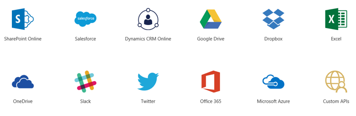

Die folgenden Technologien werden häufig mit PowerApps verwendet, um robuste Apps in Ihrer Organisation zu erstellen und freizugeben. Ihre Apps können Daten aus mehreren Quellen integrieren und Workflows zum Automatisieren von Aufgaben enthalten. 

* **Microsoft Flow**: Erstellen von automatisierten Workflows zwischen Ihren bevorzugten Apps und Diensten
* **Datenquellen, Verbindungen und Connectors sowie Gateways**: Einbinden von Daten aus der Cloud und lokalen Daten in Ihre Apps
* **Microsoft Dynamics 365**: Ausführen aller Unternehmens-Apps im Web
* **Microsoft AppSource**: Freigeben von Apps an diesem zentralen Speicherort für Microsoft und seine Partner

### Microsoft Flow
**Microsoft Flow** ist ein Dienst zum Automatisieren von Workflows in immer mehr Apps und Diensten, die Geschäftsbenutzer benötigen. Mit Microsoft Flow können die Prozesse in Ihrem Unternehmen beschleunigt werden, damit Sie weniger Zeit mit alltäglichen, sich wiederholenden Aufgaben verschwenden und mehr Zeit für die Dinge haben, die Sie wirklich tun möchten. Sie können mit Microsoft Flow in Verbindung mit PowerApps **Apps erstellen, die Workflows auslösen und darauf reagieren**.

### Datenquellen, Verbindungen und Connectors sowie Gateways
Es gibt viele **Datenquellen**, mit denen Sie möglicherweise arbeiten, und PowerApps verwendet **Connectors**, um **Verbindungen** mit diesen Datenquellen herzustellen. Einige der am häufigsten verwendeten Datenquellen werden unten aufgeführt – viele davon sind Clouddienste wie Salesforce. Connectors wirken vielleicht nicht wie die aufregendsten Komponenten der App-Entwicklung, sie sind aber unverzichtbar für die Arbeit mit Daten, die für Sie, Ihre Kollegen und Ihre Kunden wichtig sind. Für Daten, die lokal und nicht in der Cloud gespeichert sind, verwenden Sie ein **Gateway**, um eine zuverlässige Verbindung zwischen PowerApps und Ihrer Datenquelle bereitzustellen. Das Gateway befindet sich auf einem lokalen Computer und kommuniziert mit PowerApps.

### Microsoft Dynamics 365
**Dynamics 365** ist ein Clouddienst mit speziell entwickelten Apps für bestimmte Unternehmensanforderungen wie Automatisierung im Vertrieb, das operative Geschäft oder den Kundendienst. In PowerApps geben Sie Apps in AppSource frei, die dann von Benutzern, für die Sie sie freigeben, in Dynamics 365 sowie auf mobilen Geräten angezeigt und ausgeführt werden. Dass die Apps in Dynamics 365 vorliegen, bietet den Vorteil, dass **alle Unternehmens-Apps zentral ausgeführt werden können** – von Erstellern in Ihrer Organisation, von Microsoft und von Drittanbietern.

### Microsoft AppSource
**AppSource** bietet die Möglichkeit, **Apps von Kollegen, von Microsoft und seinen Partnern schnell zu finden und zu bewerten**. Wenn Sie eine App über PowerApps freigeben, machen Sie sie in AppSource verfügbar. Sie können auswählen, ob sie nur für Personen in Ihrer Organisation oder öffentlich verfügbar gemacht werden soll.

Nun wissen Sie etwas mehr über die verschiedenen Komponenten von PowerApps und die verknüpften Technologien. Sie müssen diese Liste nicht auswendig lernen, da wir im weiteren Verlauf dieses Kurses noch ausführlicher auf die Komponenten eingehen werden. Als Nächstes erhalten Sie eine Einführung in die Optionen zum Erstellen von Apps.

