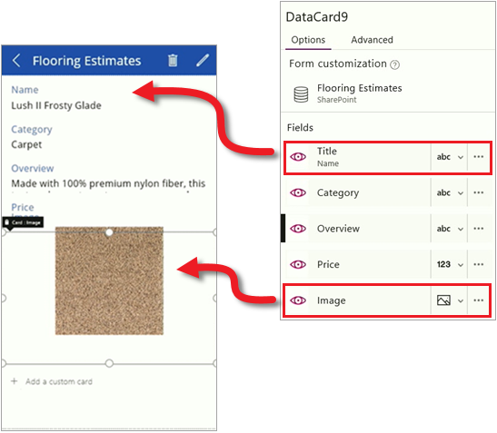
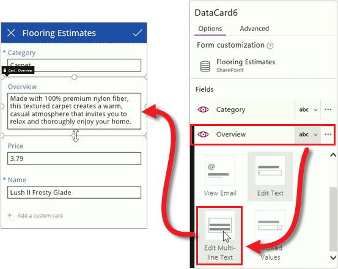

In den ersten beiden Themen in diesem Abschnitt haben Sie eine App aus einer SharePoint-Liste generiert und dann die drei verschiedenen Bildschirme der App genauer betrachtet. Die mit PowerApps generierte App kann bereits verwendet werden, aber meistens passen Sie eine App nach dem Generieren noch an. In diesem Thema erläutern wir einige einfache Änderungen für die einzelnen App-Bildschirme. Es gibt noch viel mehr Möglichkeiten zum Anpassen einer App – dazu kommen wir später in diesem Kurs. In der Zwischenzeit können Sie das, was Sie in diesem Thema gelernt haben, praktisch nutzen. Betrachten Sie eine beliebige App, die aus einer Liste, einer Excel-Datei oder einer anderen Quelle generiert wurde, und probieren Sie aus, wie Sie sie anpassen können. Dies ist wirklich die beste Möglichkeit, um den Aufbau einer App kennenzulernen.

## Bildschirm zum Durchsuchen
Wir beginnen mit dem Bildschirm zum Durchsuchen. Die SharePoint-Liste enthält ein Bild für jedes Produkt, das Bild wird allerdings nicht standardmäßig angezeigt. Lassen Sie uns dieses Problem beheben. Wählen Sie im rechten Bereich auf der Registerkarte **Layout** ein anderes Layout für den Bildschirm zum Durchsuchen aus. Sie können die Ergebnisse sofort sehen, da die App in PowerApps aktualisiert wird, sobald Sie Änderungen vornehmen.

Nachdem Sie das richtige Basislayout festgelegt haben, können Sie nun die angezeigten Felder ändern. Klicken oder tippen Sie auf ein Feld im ersten Element, und ändern Sie dann im rechten Bereich die Daten, die für jedes Element angezeigt werden. Dies bietet einen besseren Überblick über jedes Element in der Liste.

## Detailbildschirm
Wir möchten die Reihenfolge der Felder auf dem Detailbildschirm ändern und ebenfalls das Bild anzeigen. Es gibt verschiedene Steuerelemente auf diesem Bildschirm, das Verfahren unterscheidet sich daher etwas von den Schritten für den Bildschirm zum Durchsuchen. Klicken oder tippen Sie auf ein Feld, und ziehen Sie im rechten Bereich das Feld **Titel** nach oben. Klicken oder tippen Sie dann auf das Feld **Bild**, um es anzuzeigen.

## Bildschirm zum Erstellen/Bearbeiten
Abschließend soll auf dem Bildschirm, auf dem Einträge bearbeitet und erstellt werden, ein Feld geändert werden, um die Texteingabe zu vereinfachen. Klicken oder tippen Sie auf die Dropdownliste für das Feld **Übersicht**, und klicken oder tippen Sie dann auf das Steuerelement **Mehrzeiligen Text bearbeiten**.

Sie sehen, wie die Darstellung und Benutzerfreundlichkeit einer generierten App mit einigen einfachen Schritten erheblich verbessert werden kann. In diesem Thema haben wir uns auf die Benutzeroberfläche von PowerApps Studio konzentriert, die viele Optionen zum Anpassen von Apps bereitstellt. Im nächsten Thema befassen wir uns mit Formeln, die eine wichtige Rolle beim Steuern des App-Verhaltens spielen.  

