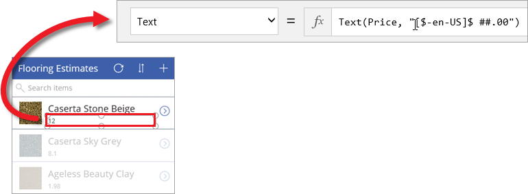
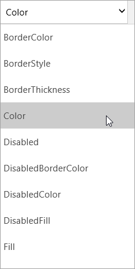
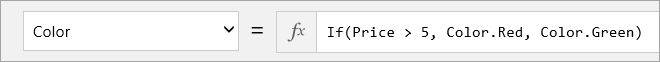

Einer der Hauptvorteile von PowerApps besteht darin, dass Sie keinen herkömmlichen Anwendungscode schreiben müssen – Sie müssen kein Entwickler sein, um Apps zu erstellen! Sie benötigen aber eine Möglichkeit, Logik in einer App auszudrücken und Navigation, Filtern, Sortieren und andere Funktionen in der App zu steuern. Hier kommen Formeln ins Spiel. Wenn Sie schon einmal Excel-Formeln verwendet haben, sollte Ihnen der Ansatz von PowerApps vertraut vorkommen. In diesem Thema zeigen wir ein paar einfache Formeln für die Textformatierung und betrachten dann drei Formeln, die die von PowerApps generierte App enthält. So erhalten Sie einen Eindruck davon, was mit Formeln möglich ist. Sie können sich dann mit anderen Formeln in der generierten App befassen und eigene Formeln schreiben.

## Grundlegendes zu Formeln und Eigenschaften
Im vorherigen Thema wurde ein Feld für den Preis in der Galerie des Bildschirms zum Durchsuchen hinzugefügt. Dieses wurde allerdings als einfach Zahl ohne Währungssymbol angezeigt. Angenommen, Sie möchten ein Dollarzeichen hinzufügen und die Textfarbe abhängig vom Preis des Artikels ändern (z.B. Rot bei mehr als 5 $, andernfalls Grün). Die folgende Abbildung zeigt das Konzept.

Beginnen wir mit der Währungsformatierung. Standardmäßig ruft PowerApps einfach einen Preiswert für jedes Element ab, der als **Text**-*Eigenschaft* der Bezeichnung festgelegt wird, in der der Preis angezeigt wird.

Um das Symbol für die US-Währung hinzuzufügen, klicken oder tippen Sie auf das Bezeichnung-Steuerelement und legen in der Bearbeitungsleiste die **Text**-Eigenschaft auf diese Formel fest.

Die Formel (`Text(Price, "[$-en-US]$ ##.00"`) verwendet die **Text**-*Funktion*, um anzugeben, wie die Zahl formatiert werden soll. Diese Formel ist mit einer Excel-Formel vergleichbar, PowerApps Formeln verweisen jedoch auf Steuerelemente und andere Elemente der App und nicht auf Zellen in einer Tabelle. Wenn Sie auf ein Steuerelement und dann auf die Dropdownliste mit den Eigenschaften klicken oder tippen, sehen Sie eine Liste von Eigenschaften, die für das Steuerelement relevant sind. Dies ist z.B. ein Ausschnitt aus der Liste der Eigenschaften für eine Bezeichnung. Einige Eigenschaften sind für eine Vielzahl von Steuerelementen und andere nur für ein bestimmtes Steuerelement relevant.

Wenn die Farbe bedingt auf Grundlage des Preises formatiert werden soll, verwenden Sie z.B. die folgende Formel für die **Color**-Eigenschaft der Bezeichnung: `If(Price > 5, Color.Red, Color.Green)`.

## Formeln in der generierten App
Nachdem Sie nun gesehen haben, wie Formeln in Verbindung mit Eigenschaften verwendet werden, betrachten wir nun Beispiele für Formeln, die PowerApps in der generierten App verwendet. Die Beispiele stammen alle vom Bildschirm zum Durchsuchen und arbeiten mit der OnSelect-Eigenschaft. Mit dieser Eigenschaft wird definiert, was geschieht, wenn ein Benutzer auf ein App-Steuerelement klickt oder tippt.

* Die erste Formel ist dem **IconNewItem1**-Steuerelement zugeordnet: . Sie können auf dieses Steuerelement klicken oder tippen, um vom Bildschirm zum Durchsuchen zum Bildschirm zum Bearbeiten/Erstellen zu wechseln und ein Element zu erstellen. 
  
  * Die Formel lautet wie folgt: `NewForm(EditForm1);Navigate(EditScreen1, ScreenTransition.None)`
  * Die Formel *instanziiert* ein neues Bearbeitungsformular und wechselt anschließend zum Bildschirm zum Bearbeiten/Erstellen, damit Sie ein neues Element erstellen können. Der Wert `ScreenTransition.None` bedeutet, dass kein Übergang zwischen den Bildschirmen erfolgt (z.B. Ausblenden).
* Die zweite Formel ist dem **IconSortUpDown1**-Steuerelement zugeordnet: . Sie können auf dieses Steuerelement klicken oder tippen, um die Liste der Elemente in der Galerie des Bildschirms zum Durchsuchen zu sortieren.
  
  * Die Formel lautet wie folgt: `UpdateContext({SortDescending1: !SortDescending1})`
  * Die Formel verwendet `UpdateContext` zum Aktualisieren einer *Variablen* mit der Bezeichnung `SortDescending1`. Der Wert der Variablen wechselt jeweils beim Klicken auf das Steuerelement. So wird an die Galerie auf diesem Bildschirm übermittelt, wie die Elemente sortiert werden sollen (weitere Details werden im Video erläutert). 
* Die dritte Formel ist dem **NextArrow1**-Steuerelement zugeordnet: . Sie können auf dieses Steuerelement klicken oder tippen, um vom Bildschirm zum Durchsuchen zum Detailbildschirm zu wechseln.
  
  * Die Formel lautet wie folgt: `Navigate(DetailScreen1, ScreenTransition.None)`
  * Die Formel navigiert zum Detailbildschirm, auch hier ohne Übergang.

Es gibt viele andere Formeln in der App, nehmen Sie sich daher ein wenig Zeit, klicken Sie auf Steuerelemente und sehen sich an, welche Formeln für verschiedene Eigenschaften festgelegt wurden.

## Zusammenfassung
Jetzt haben wir die generierte App ausführlich betrachtet und einen Blick hinter die Kulissen der Bildschirme, Steuerelemente, Eigenschaften und Formeln geworfen, die die Funktionen der App bestimmen. Wenn Sie und dabei begleitet haben, sollten Sie jetzt besser verstehen, wie eine generierte App funktioniert. Mit diesen Kenntnissen können Sie nun eigene Apps erstellen. 

Bevor wir mit dem nächsten Abschnitt fortfahren, möchten wir noch einmal zu SharePoint zurückkehren und zeigen, wie die App jetzt in die Liste integriert ist. Wie Sie sehen können, funktioniert **FlooringApp** jetzt wie eine *Ansicht* der Liste, und Sie starten die App, indem Sie auf **Öffnen** klicken. Dies bietet eine einfache Möglichkeit, Listen benutzerfreundlich zu verwalten.

Nachdem Sie den Abschnitt zur SharePoint-App bearbeitet haben, können Sie auswählen, wie Sie fortfahren möchten:

* [Verwalten von Apps](https://docs.microsoft.com/powerapps/guided-learning/manage-apps#step-1)
* [Erstellen und Anpassen einer App mit dem Common Data Service](https://docs.microsoft.com/powerapps/guided-learning/create-app-cds#step-1)

Im Abschnitt zur Verwaltung erfahren Sie, wie Sie Apps freigeben und verschiedene Versionen erstellen, und es werden Umgebungen erläutert, die Sie sich als Container für Apps, Daten und andere Ressourcen vorstellen können. Sie sollten den Abschnitt zur Verwaltung in jedem Fall bearbeiten, der Abschnitt zum Common Data Service enthält zudem wertvolle Informationen, u.a. weitere Anpassungen der App. 

