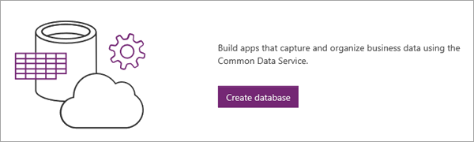
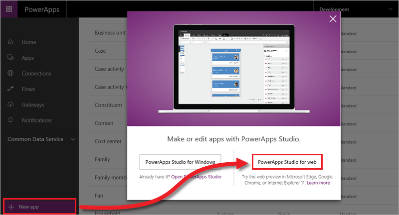

# Generieren einer App (Common Data Service)
In diesem Abschnitt des Kurses erstellen wir eine App auf Grundlage von *Entitäten* im Common Data Service. Entitäten sind Gruppen von freigegebenen Daten, die geändert, gespeichert und abgerufen werden können und mit denen eine Interaktion möglich ist. Wir generieren die App aus einer Entität, zeigen, wie Sie die App anpassen können, fügen eine weitere Datenquelle hinzu und rufen einen Flow aus der App auf. Wenn Sie den Abschnitt zum Erstellen einer App aus einer SharePoint-Liste bereits abgeschlossen haben, werden sich einige Themen wiederholen, diese werden hier jedoch ausführlicher behandelt, insbesondere zum Anpassen der App.

Wir erstellen eine App für das Fallmanagement, die z.B. von einer IT-Abteilung verwendet werden kann, um Hardware- und Softwareprobleme in einem Unternehmen nachzuverfolgen, zu priorisieren und zu bearbeiten. Beim Durchgehen der Themen fallen Ihnen aber sicher noch andere Anwendungsmöglichkeiten für eine solche App ein. Wir verwenden Daten aus dem Common Data Service, da dieser gut für das Speichern von Anwendungsdaten geeignet ist. Die gleiche App könnte aber auch aus einer anderen Datenquelle erstellt werden.

PowerApps umfasst eine komplexere Vorlage für das Fallmanagement, in der die gleichen Entitäten verwendet werden wie in der App, die hier erstellt wird. Nachdem Sie diesen Abschnitt durchgearbeitet haben, sollten Sie diese Vorlage näher betrachten, um einen Eindruck von den Möglichkeiten mit PowerApps zu erhalten.

## Erstellen einer Common Data Service-Datenbank
Der erste Schritt beim Erstellen dieser App ist das Erstellen einer Common Data Service-Datenbank, sofern noch nicht vorhanden. Common Data Service-Datenbanken werden in einer *Umgebung* erstellt. Eine Umgebung ist ein Container für Apps und andere Ressourcen (ausführliche Informationen zu Umgebungen erhalten Sie später in diesem Kurs). Ein *Umgebungsadministrator* kann diese Schritte zum Erstellen einer Datenbank ausführen. (Wenn Sie kein Administrator sind, wenden Sie sich an einen Administrator in Ihrer Organisation.)

Klicken Sie auf der Registerkarte **Start** auf **Datenbank erstellen**.

Geben Sie an, ob der Zugriff auf die Datenbank eingeschränkt werden soll (dies ist hier nicht der Fall), und klicken Sie auf **Datenbank erstellen**.

Wenn der Prozess abgeschlossen ist, werden alle Standardentitäten angezeigt, die im Common Data Model enthalten sind. Einige davon sind unten dargestellt.

## Generieren einer App aus der Entität „Case“
Nach dem Erstellen der Datenbank wird eine Verbindung mit der Entität „Case“ hergestellt und eine App generiert. Klicken Sie auf **Neue App** und dann auf **PowerApps Studio für Web**.

Wir erstellen eine Smartphone-App für eine Common Data Service-Entität, klicken oder tippen Sie daher unter **Common Data Service** auf **Telefonlayout**.

Wählen Sie auf dem nächsten Bildschirm eine Verbindung und eine zu verbindende Entität aus, und klicken Sie dann auf **Verbinden**.

Nachdem Sie auf **Verbinden** geklickt haben, wird die App von PowerApps generiert. PowerApps zieht eine Vielzahl von Rückschlüssen aus Ihren Daten, um eine sinnvolle App als Ausgangspunkt zu generieren.

## Anzeigen der App in PowerApps Studio
Ihre neue App mit drei Bildschirmen wird in PowerApps Studio geöffnet. Alle Apps, die aus Daten generiert wurden, weisen die gleichen Bildschirme auf:

* Der **Bildschirm zum Durchsuchen**: Hier können Sie die aus der Liste abgerufenen Daten durchsuchen, sortieren, filtern und aktualisieren und Elemente hinzufügen, indem Sie auf das Pluszeichen (+) klicken.
* Der **Detailbildschirm**: Hier werden weitere Informationen zu einem Element angezeigt, und Sie können das Element löschen oder bearbeiten.
* Der **Bildschirm zum Bearbeiten/Erstellen**: Hier können Sie vorhandene Elemente bearbeiten oder neue Elemente erstellen.

Klicken oder tippen Sie auf der linken Navigationsleiste rechts unten auf ein Symbol, um zur Miniaturansicht zu wechseln.

Klicken oder tippen Sie auf jede Miniaturansicht, um die Steuerelemente auf diesem Bildschirm anzuzeigen.

Als Nächstes betrachten wir die App genauer und passen sie dann an, um sie besser auf unsere Anforderungen zuzuschneiden.

