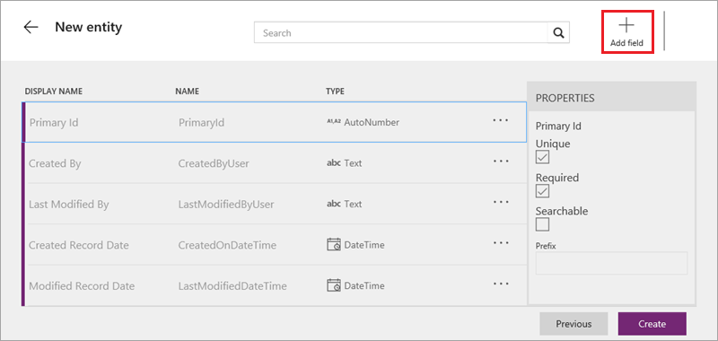

# Erstellen von benutzerdefinierten Entitäten
Der Common Data Service ist für alle unsere Geschäftskunden konzipiert, vom kleinen Geschäft bis hin zu Großunternehmen. Das Common Data Model umfasst eine Reihe von Standardentitäten für viele häufige Geschäftsszenarien. Im vorherigen Thema haben Sie gesehen, dass diese Standardentitäten bei Bedarf erweitert werden können. Manchmal brauchen Sie aber vielleicht etwas komplett anderes, um für Ihr Unternehmen spezifische Probleme zu lösen. In diesem Fall benötigen Sie eine benutzerdefinierte Entität, und in diesem Thema wird das Erstellen dieser Entitäten beschrieben.

Es gibt zwei Möglichkeiten zum Erstellen einer Entität:

* Sie erstellen die Entität von Grund auf neu. Dieses Verfahren wird in diesem Thema beschrieben.
* Sie erstellen eine Entität auf Grundlage einer anderen Entität, indem Sie die Felder und die Einstellungen der Entität, nicht jedoch die Daten kopieren.

## Erstellen einer neuen Entität
In diesem Beispiel erstellen wir eine benutzerdefinierte Entität für eine Produktbewertung mit dem Namen „Product review“ von Grund auf neu. Klicken Sie dazu zunächst auf der Registerkarte **Entitäten** auf **Neue Entität**. Füllen Sie die Felder **Entitätsname** (keine Leerzeichen oder Sonderzeichen), **Anzeigename** und **Beschreibung** aus. Klicken Sie dann auf **Weiter**.

Auf dem nächsten Bildschirm sehen Sie die fünf Standardfelder, die alle Standardentitäten und benutzerdefinierten Entitäten enthalten. Klicken Sie auf **Feld hinzufügen**, um eigene Felder hinzuzufügen.

In diesem Beispiel fügen wir vier Felder hinzu:

* **Review Date**, ein erforderliches Datumsfeld.
* **Product Rating**, ein erforderliches Ganzzahlfeld. Wir könnten hier eine Auswahlliste verwenden, mit der nur bestimmte Werte eingegeben werden können (z.B. 1–5), dieser Schritt soll aber nicht zu kompliziert werden.
* **Reviewer Name**, ein nicht erforderliches Textfeld.
* **Reviewer Comment**, ein ebenfalls nicht erforderliches Textfeld. 

Wenn Sie die Definition der Entität abgeschlossen haben, klicken Sie auf **Erstellen**. Nach dem Erstellen enthält die Entität keine Daten. Im nächsten Thema erfahren Sie, wie Sie Daten importieren können.

## Erstellen einer Beziehung zwischen zwei Entitäten
Da jede Bewertung einem bestimmten Produkt zugeordnet werden soll, müssen wir eine Beziehung zwischen der Entität „Product review“ und der Entität „Product“ erstellen. Klicken Sie in der Entität „Product review“ auf der Registerkarte **Beziehungen** auf **Neue Relationship**. Wählen Sie dann eine **Verknüpfte Entität** aus, und geben Sie Werte für **Name**, **Anzeigename** und **Beschreibung** ein. Klicken Sie auf **Speichern**, um die Beziehung zu erstellen.

## Herstellen einer Verbindung mit einer benutzerdefinierten Entität in PowerApps Studio
Das Herstellen einer Verbindung mit einer benutzerdefinierten Entität in PowerApps Studio unterscheidet sich nicht vom Verbinden einer Standardentität. Klicken Sie auf **Neu**, und klicken Sie anschließend unter **Common Data Service** auf **Telefonlayout**. Links werden die verfügbaren Datenverbindungen und rechts die Entitäten angezeigt.

Im nächsten Thema zeigen wir Ihnen, wie Sie Daten im Common Data Service verwalten.

