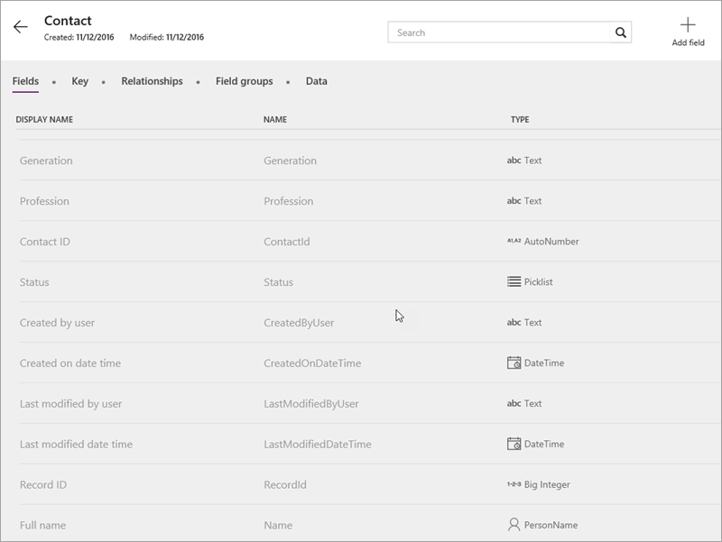

# Grundlegendes zu Entitäten
Im ersten Thema in diesem Abschnitt wurde der Common Data Service vorgestellt, der ein Common Data Model umfasst. Dieses Modell enthält wiederum Entitäten. Entitäten sind Gruppen von freigegebenen Daten, die geändert, gespeichert und abgerufen werden können und mit denen eine Interaktion möglich ist. In diesem Thema erfahren Sie mehr über Entitäten, Felder und Datentypen.

## Standardentitäten
Das Common Data Model umfasst eine Reihe von Standardentitäten, die häufige Geschäftsanforderungen abdecken. Einige Standardentitäten werden unten aufgeführt.

Diese Entitäten werden in Kategorien zusammengefasst, sodass leicht zu erkennen ist, welche häufig zusammen in Lösungen verwendet werden.

| Funktionsgruppe | Beschreibung |
| --- | --- |
| Customer Service |Customer Service-Entitäten verwalten Probleme Ihrer Kunden, einschließlich der Überwachung, Eskalation und Dokumentation. |
| Foundation |Die Foundation-Entitäten enthalten Informationen, die für fast jede andere Entitätsgruppe relevant sind. Diese Gruppe enthält Entitäten wie Address und Currency. |
| People, Organizations und Groups |Diese Entitäten umfassen eine Vielzahl von Personen und Organisationen, mit denen Sie interagieren, einschließlich Mitarbeiter, Auftragnehmer, Spender, Freiwillige, Fans, Alumni und Familien. |
| Purchasing |Mit den Purchasing-Entitäten können Sie Einkauflösungen erstellen. |
| Vertrieb |Mit den Sales-Entitäten können Sie End-to-End-Vertriebslösungen erstellen, angefangen bei der Verfolgung von Leads und Verkaufschancen über das Nachfassen bei Kontakten, Akzeptieren und Übermitteln von Aufträgen bis zum Senden von Rechnungen. |

## Felder und Datentypen
Jede Entität enthält eine Reihe von Standardfeldern, die Sie nicht ändern oder löschen können. Einige dieser Felder wie **Contact ID** sind für eine Entität spezifisch. Andere wie **Created on date time** gelten für alle Entitäten. Sie können Standardentitäten erweitern, indem Sie Felder hinzufügen. Klicken oder tippen Sie einfach auf **Feld hinzufügen**, und geben Sie die Eigenschaften für das neue Feld ein.

Wenn Sie eine völlig andere Entität benötigen und das Erweitern einer Standardentität nicht ausreicht, können Sie eine benutzerdefinierte Entität erstellen. Dies wird im nächsten Thema behandelt.

Die Felder in einer Entität verfügen jeweils über einen Datentyp, z.B. „Number“. Verschiedene Datentypen haben gegenüber einem allgemeinen Datentyp den Vorteil, dass mit der App unterschiedlichste Dinge möglich sind. Bei einem Feld mit dem Typ „Number“ kann in den Apps z.B. ein Schieberegler-Steuerelement verwendet werden, wenn ein Benutzer das Feld bearbeitet. Sie können aus mehr als einem Dutzend Datentypen auswählen – die folgende Liste enthält die wichtigsten Typen:

* Grundlegende Typen, z.B. „Text“ und „Number“
* Komplexere Typen, z.B. „Email“ und „Phone“
* Spezielle Typen, z.B. „Lookup“ (zum Erstellen von Beziehungen) und „Picklist“ (für eine vordefinierte Auswahl von Werten für ein Feld)  

## Arbeiten mit Entitäten
Wenn Sie eine Entität öffnen, sehen Sie viele Informationen und mehrere Aktionen, die Sie ausführen können. Wir betrachten kurz die verfügbaren Registerkarten und die Aktionen zum Verwalten der Entitätsdaten.

* **Felder**: Hier werden Felder und Datentypen angezeigt, und Sie können Felder hinzufügen, wie oben beschrieben.
* **Schlüssel**: Das Feld, das jede Zeile in einer Entität identifiziert, z.B. „Contact ID“ bei der Entität „Contact“.
* **Beziehungen**: Verbindungen zwischen verknüpften Entitäten wie „Product“ und „Product Category“. Im nächsten Thema wird hierzu ein Beispiel betrachtet.
* **Feldgruppen:** Hiermit werden verschiedene Verhaltensweisen gesteuert, z.B. welche Felder beim Erstellen eines App-Bildschirms in PowerApps automatisch angezeigt werden.
* **Daten**: Hier können Sie Beispieldaten und nach dem Importieren Ihren eigenen Daten durchsuchen.

* **In Excel öffnen**: Wenn Sie das PowerApps-Add-In installiert haben, können Sie mit dieser Option Ihre Daten in Excel untersuchen und bearbeiten.
* **Daten importieren**: Importieren Sie Daten aus Excel und CSV-Dateien.
* **Daten exportieren**: Hiermit können Sie Daten in eine Excel-Datei exportieren.
* **Vorlage exportieren**: Hiermit exportieren Sie die Struktur einer Entität in eine Excel-Datei, um die Datei mit Daten aufzufüllen und dann wieder in die Entität zu importieren.
* **Einstellungen** und **Löschen**: Für Standardentitäten nicht verfügbar.

## Herstellen einer Verbindung mit einer Standardentität in PowerApps Studio
Nachdem Sie Entitäten nun kennengelernt haben, betrachten wir das Herstellen einer Verbindung mit der Entität „Contact“ in PowerApps Studio. Klicken Sie auf **Neu**, und klicken Sie anschließend unter **Common Data Service** auf **Telefonlayout**. Links werden die verfügbaren Datenverbindungen und rechts die Entitäten angezeigt. Versuchen Sie selbst, eine Verbindung herzustellen und eine App aus der Entität zu erstellen.

Im nächsten Thema zeigen wir Ihnen, wie Sie benutzerdefinierte Entitäten sowie Beziehungen zwischen Entitäten erstellen.

