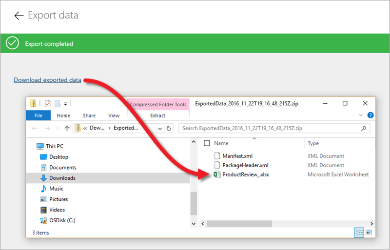
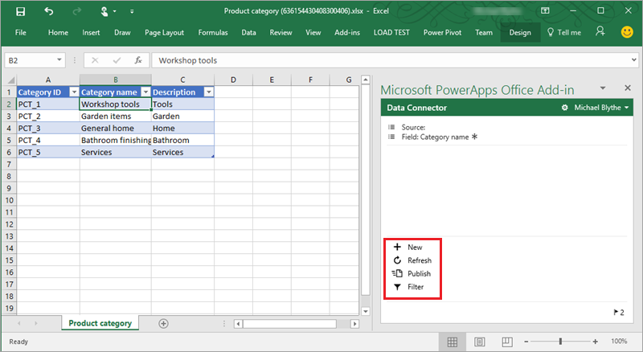

# Verwalten von Entitätsdaten
In diesem Thema wird die Datenverwaltung im Common Data Service behandelt. Das Importieren und Exportieren von Daten wurde in anderen Themen bereits angesprochen, jetzt gehen wir ausführlich auf das Arbeiten mit Daten in Excel ein.

## Importieren von Daten aus Excel oder CSV
In diesem Beispiel importieren wir Daten aus Excel in die Entität „Product Review“, die im letzten Thema erstellt wurde. Sie können auch Daten aus CSV-Dateien importieren, die häufig für die Datenverwaltung verwendet werden. Hier sehen Sie noch einmal eine Entität. In diesem Thema konzentrieren wir uns auf den markierten Bereich.

Klicken Sie in einer Entität auf **Daten importieren**, und navigieren Sie dann zu der Datei, aus der Sie Daten importieren möchten. Klicken Sie auf **Zuordnung anzeigen**, und stellen Sie sicher, dass die Spalten in der Excel-Datei den richtigen Feldern in der Entität zugeordnet sind. Wenn Sie die Zuordnungen erstellt haben, klicken Sie auf **Änderungen speichern**. Klicken Sie auf dem Hauptbildschirm auf **Import**.

## Exportieren von Daten nach Excel
Exportieren Sie Daten, wenn Sie außerhalb des Common Data Service darauf zugreifen möchten. Klicken Sie in einer Entität auf **Daten exportieren**, und warten Sie, bis die ZIP-Datei generiert wurde. Öffnen Sie die ZIP-Datei, um die exportierten Daten anzuzeigen. 

## Exportieren einer Vorlage in Excel
Neben Daten können Sie auch eine Vorlage herunterladen. Bei einer Vorlage handelt es sich um eine Excel-Datei mit einer Struktur, die den Feldern einer Entität entspricht, die jedoch keine Daten enthält. Nachdem Sie die Vorlage heruntergeladen haben, füllen Sie sie manuell oder programmgesteuert auf und importieren sie wieder in den Dienst. Klicken Sie in einer Entität auf **Vorlage exportieren**, und geben Sie dann die gewünschten Felder an (in diesem Fall habe ich ein einzelnes Feld ausgewählt). Klicken Sie auf **In Excel exportieren**, und warten Sie, bis die Excel-Datei generiert wird. Öffnen Sie die Excel-Datei, um die exportierte Vorlage mit den ausgewählten Feldern anzuzeigen.

## Öffnen und Bearbeiten von Daten in Excel
Im letzten Schritt betrachten wir die Option **In Excel öffnen**. Wenn Sie das PowerApps-Add-In installiert haben, können Sie mit dieser Option Ihre Daten in Excel untersuchen und bearbeiten. Klicken Sie in einer Entität auf **In Excel öffnen**, und öffnen Sie dann die Datei. Wenn Sie das Bearbeiten aktivieren, stellt das Add-In eine Live-Verbindung mit der Entität im Dienst her, und die Arbeitsmappe wird mit Daten aufgefüllt. Sie können die Daten direkt in der Arbeitsmappe bearbeiten und Zeilen hinzufügen und löschen. Klicken Sie auf **Veröffentlichen**, um die Änderungen zu speichern. Sie können Daten auch aktualisieren, um sicherzustellen, dass Sie mit einer aktuellen Version arbeiten, und Daten filtern, was besonders bei Entitäten mit großen Datenmengen praktisch ist.

Hiermit wird das Thema zum Verwalten von Daten im Common Data Service abgeschlossen – Daten importieren, exportieren und in Excel bearbeiten. Im nächsten Thema befassen wir uns mit der Sicherheit der Daten.

