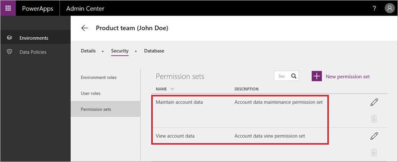

# Sicherheit im Common Data Service
In diesem Thema wird die Sicherheit im Common Data Service behandelt. Der Dienst verwendet ein rollenbasiertes System, um den Benutzern Berechtigungen für Daten zu gewähren. Das Sicherheitsmodell ist eine Hierarchie, wobei jede Ebene eine andere Zugriffsebene darstellt. Auf der untersten Ebene befinden sich einzelne Berechtigungen zum Erstellen, Lesen, Aktualisieren und Löschen für eine einzelne Entität. Eine Sammlung dieser Berechtigungen auf Entitätsebene bildet einen Berechtigungssatz. Einer oder mehrere Berechtigungssätze können dann von einer Rolle verwendet werden. Eine Rolle befindet sich auf der obersten Ebene – sie umfasst alle Berechtigungen, die ein Benutzer oder eine Gruppe von Benutzern benötigt.

## Grundlegendes zu Rollen und Berechtigungssätzen
In diesem Kurs ging es meistens um powerapps.com und PowerApps Studio. In diesem Thema wird das PowerApps Admin Center genauer betrachtet. Wenn Sie im Admin Center auf eine Umgebung klicken, werden unter **Sicherheit** Registerkarten für **Umgebungsrollen** (in einem vorherigen Thema erläutert), **Benutzerrollen** und **Berechtigungssätze** angezeigt. Standardmäßig gibt es zwei Benutzerrollen:

* **Datenbankbesitzer** ist eine Administratorrolle, die uneingeschränkten Zugriff auf alle Entitäten gewährt.
* **Organisationsbenutzer** ist die Standardrolle, die allen Benutzern zugewiesen wird. Diese Rolle ermöglicht allen Benutzern den Zugriff auf Entitäten, die öffentliche Daten enthalten.

Standardmäßig gibt es zwei Berechtigungssätze für jede Entität: 

* **Verwalten** ermöglicht den Vollzugriff: Berechtigungen zum Erstellen, Lesen, Aktualisieren und Löschen.
* **Anzeigen** bietet schreibgeschützten Zugriff.

Die folgende Abbildung zeigt die Standardberechtigungssätze für die Entität „Account“. 

Im Video erfahren Sie, wie Sie zusätzliche Rollen und Berechtigungssätze erstellen und so den Zugriff für Ihre Anwendungen genau definieren können. Wir erstellen den Berechtigungssatz **Maintain product review**, der Vollzugriff auf die benutzerdefinierte Entität gewährt, die in einem früheren Thema erstellt wurde. Außerdem wird die Rolle **ReviewApp Owner** erstellt, der der Berechtigungssatz zugewiesen wird.  

## Einschränken des Zugriffs auf eine Datenbank
Als in einem vorhergehenden Thema eine Datenbank erstellt wurde, haben wir den Standardwert übernommen und den Zugriff auf die Datenbank nicht eingeschränkt. Klicken Sie zum Ändern des Zugriffs auf der Registerkarte **Datenbank** auf **Zugriff beschränken**, und bestätigen Sie die Änderung.

Im eingeschränkten Modus müssen Sie jedem Benutzer eine oder mehrere Rollen zuweisen. Eine Rolle kann für eine bestimmte Position innerhalb des Unternehmens eingerichtet und jeder Person in dieser Position zugewiesen werden. Benutzer können basierend auf den Azure Active Directory-Benutzergruppen, denen sie angehören, auch automatisch zu Rollen hinzugefügt werden.

## Zusammenfassung
Auch wenn die Sicherheit ein komplexes Thema ist, können Sie sich einfach die Hierarchie der Berechtigungen vor Augen halten. Sie beginnt mit den Berechtigungen zum Erstellen, Lesen, Aktualisieren und Löschen für eine Entität. Diese können zu Berechtigungssätzen zusammengefasst werden, die dann Rollen zugewiesen werden. Dies ist ein flexibles System, mit dem Sie den Datenzugriff relativ präzise steuern können. 

Damit sind wir am Ende des Abschnitts zum Common Data Service und auch am Ende dieses Kurses für „Geführtes Lernen“ angelangt. Wir hoffen, dass es Ihnen gefallen hat und Sie viel gelernt haben. Sie können uns jederzeit Feedback senden und sollten auch in Zukunft vorbeischauen, da wir in nächster Zeit weitere Inhalte hinzufügen werden. Wenn Sie ausführliche Informationen suchen, finden Sie diese in der [PowerApps-Dokumentation](https://powerapps.microsoft.com/tutorials/getting-started/). 

