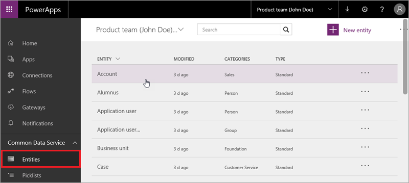

# Der Common Data Service
Daten stehen im Zentrum von Unternehmensanwendungen und -prozessen – Daten aus Excel, aus lokalen Quellen wie SQL Server und aus Clouddatenquellen wie Salesforce und SharePoint Online. Daten können im Zusammenhang mit Kunden, Verkäufen, Mitarbeitern und vielem anderen stehen, sie sind aber immer von entscheidender Bedeutung für Ihr Unternehmen und spielen eine wichtige Rolle in den Apps, die Sie in PowerApps erstellen. Sie haben in diesem Kurs schon verschiedene Typen von Datenquellen kennengelernt und verwendet, und der Microsoft Common Data Service wurde bereits erwähnt. In diesem Abschnitt werden wir den Dienst ausführlich behandeln, die Vorteile erläutern und die Verwendung zeigen.

## Grundlegendes zum Dienst
Beginnen wir mit einigen Diagrammen. Das erste Diagramm haben Sie vielleicht schon einmal gesehen – es zeigt die Komponenten der Microsoft-Plattform für Geschäftsanwendungen. Sie sind offensichtlich mit PowerApps vertraut, aber Sie haben möglicherweise auch schon Microsoft Flow, Power BI oder anderen Komponenten verwendet. Sie sehen hier den Common Data Service sowie Connectors und Gateways, die für alle diese Komponenten relevant sind. Zurzeit wird der Common Data Service in erster Linie mit PowerApps und Microsoft Flow verwendet, er wird in Zukunft aber auch für andere Komponenten verfügbar sein.

Nachdem Sie jetzt die Einordnung des Common Data Service gesehen haben, betrachten wir die einzelnen Komponenten. Sie können sich den Common Data Service als Hierarchie vorstellen. Auf der untersten Ebene speichert der Dienst Daten skalierbar und zuverlässig und macht diese Daten verfügbar, sodass sie von verschiedenen Anwendungen verwendet werden können. Die nächste Ebene ist das Common Data Model, das eine Vielzahl von Entitäten enthält, die in Anwendungen und Geschäftsprozessen verwendet werden: Entitäten wie „Account“, „Contact“, „Product“ und „Sales Order“. Sie können die Standardentitäten entsprechend den Anforderungen Ihres Unternehmens erweitern und benutzerdefinierte Entitäten erstellen.

Eine Entität ist einfach eine Kombination aus den Metadaten, die sie beschreiben (Feldnamen, Datentypen usw.), und den Daten, die Sie darin speichern. Wenn Sie mit Access oder anderen Datenbanken vertraut sind, können Sie sich eine Entität wie eine Art Tabelle vorstellen. Wir werden Entitäten im nächsten Thema ausführlicher betrachten, jetzt befassen wir uns aber mit den Vorteilen beim Arbeiten mit Entitätsdaten im Common Data Service:

* **Einfach zu verwalten**: Sowohl die Metadaten als auch die Daten werden in der Cloud gespeichert. Sie müssen sich nicht um die Details kümmern, wie diese gespeichert werden.
* **Einfache Freigabe**: Sie können Daten problemlos für Ihre Kollegen freigeben, da die Berechtigungen von PowerApps verwaltet werden.
* **Bequem zu sichern**: Daten werden sicher gespeichert, damit Benutzer sie nur dann sehen können, wenn Sie ihnen Zugriff gewähren. Durch die rollenbasierte Sicherheit können Sie den Zugriff auf Entitäten für verschiedene Benutzer innerhalb Ihrer Organisation steuern.
* **Umfassende Metadaten**: Datentypen und Beziehungen werden direkt in PowerApps genutzt. Wenn Sie z.B. den Feldtyp als URL definieren, werden die Daten innerhalb Ihrer App als Hyperlink angezeigt.
* **Produktivitätstools**: Entitäten sind in den Add-Ins für Microsoft Excel und Outlook verfügbar, um die Produktivität zu steigern und die Verfügbarkeit Ihrer Daten sicherzustellen.
* **Auswahllisten**: Sie können aus einer Vielzahl von Standardauswahllisten wählen, um schnell Dropdownlisten in Entitäten und Apps bereitzustellen.

## Erstellen einer Common Data Service-Datenbank
Common Data Service-Datenbanken werden in einer *Umgebung* erstellt. Umgebungen wurden in diesem Kurs bereits vorgestellt, daher hier nur eine kurze Wiederholung: Eine Umgebung ist ein Container für Apps und andere Ressourcen wie den Common Data Service. Jeder Umgebung kann eine Instanz des Diensts zugeordnet werden. Wenn Sie als Umgebungsadministrator den Dienst in einer Umgebung hinzufügen möchten, gehen Sie folgendermaßen vor.

Klicken Sie auf der Registerkarte **Start** auf **Datenbank erstellen**.

Geben Sie an, ob der Zugriff auf die Datenbank eingeschränkt werden soll, und klicken Sie auf **Create my database** (Eigene Datenbank erstellen).

Wenn der Prozess abgeschlossen ist, werden alle Standardentitäten angezeigt, die im Common Data Model enthalten sind. Einige davon sind unten dargestellt.

Wenn Sie noch nicht mit Datenbanken gearbeitet haben, wurden in diesem Thema möglicherweise für Sie neue Dinge behandelt. Das Konzept ist aber eigentlich unkompliziert: Der Common Data Service stellt eine sichere und zuverlässige Möglichkeit zum Speichern von Daten und zum Behandeln dieser Daten in Form von häufig verwendeten Entitäten dar, z.B. „Account“, „Contact“, „Product“ und „Sales Order“. Im nächsten Thema werden Entitäten ausführlicher behandelt.

