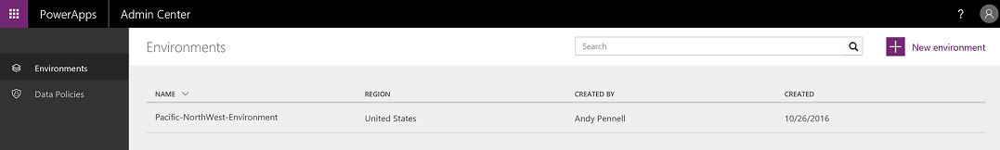

# Einführung in das Admin Center für PowerApps
  

Im [Admin Center](https://admin.powerapps.com) können Sie folgende Aktionen ausführen:

* Verwalten von Benutzern, Berechtigungen und Rollen in [Umgebungen](environments-administration.md). (PowerApps P2-Plan erforderlich)
* Verwalten von [Richtlinien zur Verhinderung von Datenverlust](prevent-data-loss.md), die steuern, wie Geschäftsdaten für Dienste in PowerApps freigegeben werden. (PowerApps P2-Plan oder globale Office 365-Administratorberechtigungen erforderlich)

Alle von Ihnen im Admin Center vorgenommenen Änderungen sind für Benutzer innerhalb der Organisation sofort verfügbar.     

