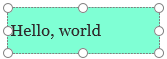

# Hinzufügen und Konfigurieren eines Canvas-App-Steuerelements in PowerApps

Fügen Sie Ihrer Canvas-App vielfältige Benutzeroberflächenelemente hinzu, und konfigurieren Sie Aspekte ihrer Darstellung und ihres Verhaltens direkt, über die Symbolleiste, auf der Registerkarte **Eigenschaften** oder in der Bearbeitungsleiste. Diese Elemente der Benutzeroberfläche werden als Steuerelemente bezeichnet, während die von Ihnen konfigurierten Aspekte als Eigenschaften bezeichnet werden.

## Voraussetzungen

1. Wenn Sie noch nicht über eine powerapps-Lizenz verfügen, [registrieren](../signup-for-powerapps.md)Sie sich, und melden Sie sich dann [an](https://make.powerapps.com?utm_source=padocs&utm_medium=linkinadoc&utm_campaign=referralsfromdoc).
1. Zeigen Sie unter **eigene APP erstellen**mit der Maus auf die **Canvas-App**, und klicken Sie dann auf **diese APP erstellen**.
1. Wenn Sie aufgefordert werden, die Einführungstour durchzubringen, wählen Sie **weiter** aus, um sich mit wichtigen Bereichen der powerapps-Schnittstelle vertraut zu machen (oder wählen Sie über **springen**).

    Sie können die Tour später jederzeit durchführen, indem Sie das Fragezeichen-Symbol in der Nähe der oberen rechten Ecke des Bildschirms auswählen und dann **die Einführungstour durchführen**.

## Hinzufügen und Auswählen eines Steuer Elements

Führen Sie auf der Registerkarte **Einfügen** einen der folgenden Schritte aus:

- Wählen Sie **Bezeichnung** oder **Schaltfläche** aus, um einen dieser Steuerelement Typen hinzuzufügen.
- Wählen Sie eine Kategorie von Steuerelementen aus, und wählen Sie dann den Typ des Steuer Elements aus, das Sie hinzufügen möchten.

Wählen Sie beispielsweise **neuer Bildschirm**aus, und klicken Sie dann auf **leer** , um der APP einen leeren Bildschirm hinzuzufügen. (Bildschirme sind ein Typ von Steuerelementen, die andere Steuerelement Typen enthalten können.)

Der neue Bildschirm heißt **Screen2** und wird im linken Navigationsbereich angezeigt. In diesem Bereich wird eine hierarchische Liste der Steuerelemente in ihrer App angezeigt, sodass Sie jedes Steuerelement problemlos suchen und auswählen können.

Um zu veranschaulichen, wie diese Liste funktioniert, wählen Sie auf der Registerkarte **Einfügen** die Option **Bezeichnung** . Das neue Steuerelement wird in der hierarchischen Liste unter **Screen2** angezeigt.

Im Bildschirm umgibt ein Feld mit sechs Handles standardmäßig die Bezeichnung. Dieser Typ von Box umgibt, welches Steuerelement ausgewählt ist. Wenn Sie den Bildschirm auswählen, indem Sie darauf klicken oder tippen (aber außerhalb der Bezeichnung), wird das Feld von der Bezeichnung nicht mehr angezeigt. Um die Bezeichnung erneut auszuwählen, klicken oder tippen Sie darauf, oder klicken oder tippen Sie in der hierarchischen Liste der Steuerelemente auf Ihren Namen.

> [!IMPORTANT]
> Sie müssen immer ein Steuerelement auswählen, bevor Sie es konfigurieren können.

## Umbenennen eines Steuer Elements

Zeigen Sie in der hierarchischen Liste der Steuerelemente auf das Steuerelement, das Sie umbenennen möchten, wählen Sie die Schaltfläche mit den Auslassungs Punkten, und wählen Sie dann **Umbenennen**aus. Sie können dann einen eindeutigen, einprägsamen Namen eingeben, um das Erstellen Ihrer APP zu vereinfachen.

## Löschen eines Steuer Elements

Zeigen Sie in der hierarchischen Liste der Steuerelemente auf das Steuerelement, das Sie löschen möchten, wählen Sie die Schaltfläche mit den Auslassungs Zeichen aus, und wählen Sie dann **Löschen**aus. Zum Löschen eines Steuer Elements, das kein Bildschirm ist, können Sie auch das-Steuerelement im Zeichenbereich auswählen und dann die ENTF-Taste drücken.

## Bildschirme neu anordnen

Zeigen Sie in der hierarchischen Liste der Steuerelemente auf einen Bildschirm, den Sie nach oben oder unten verschieben möchten, wählen Sie die Schaltfläche mit den Auslassungs Zeichen aus, und klicken Sie dann **auf nach oben** oder **nach unten**.

> [!NOTE]
> Wenn die APP geöffnet wird, wird der Bildschirm am oberen Rand der hierarchischen Liste der Steuerelemente in der Regel zuerst angezeigt. Sie können jedoch einen anderen Bildschirm angeben, indem Sie die **[OnStart](controls/control-screen.md)** -Eigenschaft auf eine Formel festlegen, die die **[Navigate](functions/function-navigate.md)** -Funktion enthält.

## Verschieben und Ändern der Größe eines Steuer Elements

Um ein Steuerelement zu verschieben, wählen Sie es aus, zeigen Sie mit der Maus darauf, dass der Pfeil mit vier Spitzen angezeigt wird, und ziehen Sie das Steuerelement dann an eine andere Position.

Wenn Sie die Größe eines Steuer Elements ändern möchten, wählen Sie es aus, zeigen Sie auf ein beliebiges Handle im Feldauswahl, sodass der zweistufige Pfeil angezeigt wird, und ziehen Sie dann das handle.

> [!NOTE]
> Wie in diesem Thema später beschrieben wird, können Sie auch ein Steuerelement verschieben und die Größe ändern, indem Sie eine beliebige Kombination der Eigenschaften **[X](controls/properties-size-location.md)** , **[Y](controls/properties-size-location.md)** , **[height](controls/properties-size-location.md)** und **[Width](controls/properties-size-location.md)** in der Bearbeitungs Leiste ändern.

## Ändern des Texts einer Bezeichnung oder einer Schaltfläche

Wählen Sie eine Bezeichnung oder eine Schaltfläche aus, doppelklicken Sie auf den Text, der im Steuerelement angezeigt wird, und geben Sie dann den gewünschten Text ein.

> [!NOTE]
> Wie in diesem Thema später beschrieben wird, können Sie diesen Text auch ändern, indem Sie seine Text-Eigenschaft in der **[Bearbeitungs](controls/properties-core.md)** Leiste ändern.

## Konfigurieren eines Steuerelements über die Symbolleiste

Durch Konfigurieren eines Steuerelements über die Symbolleiste können Sie eine größere Anzahl von Optionen als beim direkten Konfigurieren eines Steuerelements angeben.

Sie können z. b. eine Bezeichnung auswählen, die Registerkarte **Home** auswählen und dann die Schriftart des Texts in der Bezeichnung ändern.

## Konfigurieren eines Steuerelements auf der Registerkarte „Eigenschaften“

Mithilfe der Registerkarte **Eigenschaften** können Sie eine größere Anzahl von Optionen angeben, als Sie durch Konfigurieren eines Steuer Elements über die Symbolleiste erreichen können.

Beispielsweise können Sie ein Steuerelement auswählen und es dann ein-oder ausblenden, indem Sie dessen **sichtbare** Eigenschaft ändern.

## Konfigurieren eines Steuerelements in der Bearbeitungsleiste

Anstatt ein Steuerelement direkt auf der Symbolleiste oder auf der Registerkarte **Eigenschaften** zu konfigurieren, können Sie ein Steuerelement konfigurieren, indem Sie eine Eigenschaft in der Eigenschaften Liste auswählen und dann einen Wert in der Bearbeitungs Leiste angeben. Mit dieser Vorgehensweise können Sie Eigenschaften nach ihrer alphabetischen Reihenfolge durchsuchen, und Sie können mehr Werttypen angeben.

Sie können z. b. eine Bezeichnung auswählen und Sie dann auf folgende Weise konfigurieren:

- Verschieben Sie Sie, indem Sie in der Liste Eigenschaften die Option **X** oder **Y** auswählen und dann eine andere Zahl in der Bearbeitungs Leiste angeben.

    

- Ändern Sie die Größe, indem Sie in der Liste Eigenschaften die Option **Höhe** oder **Breite** auswählen und dann in der Bearbeitungs Leiste eine andere Nummer angeben.

    

- Ändern Sie den Text, indem Sie in der Liste Eigenschaften die Option **Text** auswählen und dann eine beliebige Kombination einer Literalzeichenfolge, eines Ausdrucks oder einer Formel in der Bearbeitungs Leiste angeben.

    - Eine Literalzeichenfolge wird in Anführungszeichen eingeschlossen und bei der Typisierungs Anzeige genau angezeigt. **"Hello, World"** ist eine Literalzeichenfolge.

        

    - Ein Ausdruck enthält keine Funktion und basiert häufig auf einer Eigenschaft eines anderen Steuer Elements. **Screen1. Height** ist ein Ausdruck, der die Höhe von **Screen1**anzeigt.

        

    - Eine Formel umfasst eine oder mehrere Funktionen. Die **Now** -Funktion gibt das aktuelle Datum und die aktuelle Uhrzeit in der lokalen Zeitzone zurück, und die **Text** Funktion formatiert Werte wie Datumsangaben, Uhrzeiten und Währungen.

        

        Formeln sind in der Regel viel komplexer als in diesem Beispiel, sodass Sie Daten aktualisieren, sortieren, Filtern und andere Vorgänge ausführen können. Weitere Informationen finden Sie in der [Formel Referenz](formula-reference.md).

## Nächste Schritte

- Hier finden Sie Schritt-für-Schritt-Anleitungen zum Konfigurieren allgemeiner Steuerelemente, wie z. b. [Bildschirme](add-screen-context-variables.md), [Listen](add-list-box-drop-down-list-radio-button.md), [Galerien](add-gallery.md), [Formulare](add-form.md)und [Diagramme](use-line-pie-bar-chart.md).
- Hier finden Sie Referenzinformationen zu den einzelnen Steuerelement Typen in der [Steuerelement Referenz](reference-properties.md).
