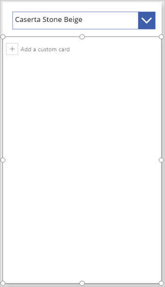

# Anzeigen, bearbeiten oder Hinzufügen eines Datensatzes in einer Canvas-App

Fügen Sie in einer Canvas-App ein Formular **[anzeigen](controls/control-form-detail.md)** -Steuerelement hinzu, und konfigurieren Sie es, um alle Felder in einem Datensatz anzuzeigen. Außerdem können Sie ein Formular **[Bearbeiten](controls/control-form-detail.md)** -Steuerelement hinzufügen und konfigurieren, um ein beliebiges Feld in einem Datensatz zu bearbeiten, einen Datensatz hinzuzufügen und die Änderungen in einer Datenquelle zu speichern

## Voraussetzungen

- Erfahren Sie, wie Sie ein Steuerelement in Power apps [Hinzufügen und konfigurieren](add-configure-controls.md) .
- Laden Sie [diese Excel-Datei](https://az787822.vo.msecnd.net/documentation/get-started-from-data/FlooringEstimates.xlsx) mit Beispieldaten für dieses Lernprogramm herunter.
- Laden Sie die Excel-Datei in ein [Cloudspeicherkonto](connections/cloud-storage-blob-connections.md) hoch, z.B. in OneDrive for Business.
- Erstellen oder öffnen Sie eine APP für Smartphones, und fügen Sie der Tabelle " **flooringestimates** " in der Excel-Datei [eine Verbindung hinzu](add-data-connection.md) .

    Sie können einer Tablet-App ein Formular hinzufügen, dieses Thema wird jedoch nicht gefunden, da das Formular standardmäßig drei Spalten enthält.

- Wenn Sie eine vorhandene APP öffnen, [fügen Sie Ihr einen Bildschirm hinzu](add-screen-context-variables.md) .

## Hinzufügen eines Formulars und Anzeigen von Daten
1. Fügen Sie auf einem leeren Bildschirm ein **[Dropdown](controls/control-drop-down.md)** -Steuerelement hinzu, und nennen Sie es " **Choice**".

    > [!NOTE]
   > Weitere Informationen zum Hinzufügen und Umbenennen eines Steuerelements sowie zum Festlegen einer Eigenschaft finden Sie unter [Hinzufügen und Konfigurieren eines Steuerelements](add-configure-controls.md).

1. Legen Sie auf der Registerkarte **Eigenschaften** im rechten Bereich **Elemente** auf `FlooringEstimates` und **Wert** auf `Name`fest.

    

    In der Liste werden Namen von Bodenbelägen aus der Datenquelle aufgeführt.

1. Fügen Sie ein Formular **Bearbeiten** -Steuerelement hinzu, verschieben Sie es unter **choosproduct**, und ändern Sie dann die Größe des Formulars, sodass es den meisten Bildschirm abdeckt.

    

    > [!NOTE]
   > In diesem Thema wird das **Bearbeitungs** Formular-Steuerelement beschrieben, aber ähnliche Prinzipien gelten für das Formular Formular **anzeigen** .

1. Legen Sie die **[DataSource](controls/control-form-detail.md)** -Eigenschaft des Formulars auf **flooringestimates** und deren **[Item](controls/control-form-detail.md)** -Eigenschaft auf diese Formel fest:

    `First(Filter(FlooringEstimates; Name=ChooseProduct.Selected.Value))`

   Mit dieser Formel wird angegeben, dass im Formular nach abgeschlossener Konfiguration der Datensatz angezeigt wird, den der Benutzer in **ChooseProduct** auswählt.

1. Wählen Sie auf der Registerkarte **Eigenschaften** im rechten **Bereich Felder bearbeiten**aus.

    

1. Wählen Sie im Bereich **Felder** die Option **Feld hinzufügen** aus, aktivieren Sie jeweils das Kontrollkästchen für jedes Feld, und klicken Sie auf **Hinzufügen**.

    

1. Wählen Sie die Auslassungs Punkte (...) neben **Feld hinzufügen**aus, wählen Sie **alle**reduzieren aus, und ziehen Sie dann den **Namen** an den Anfang der Liste.

    

    Das **Bearbeitungs** Formular-Steuerelement spiegelt Ihre Änderung wider.

    

## Festlegen des Kartentyps für ein Feld
1. Erweitern Sie im Bereich **Felder** das Feld **Price** , indem Sie den Pfeil nach unten auswählen.

1. Öffnen Sie die Liste **Typ des Steuer** Elements, und wählen Sie **Schieberegler bearbeiten**aus.

    

    Im Formular zeigt das Feld **Price** anstelle eines **Text Eingabe** -Steuer Elements ein **Schieberegler** -Steuerelement an.

1. optionale Führen Sie den gleichen Vorgang aus, um das Steuerelement für das **Übersichts** Feld in ein **mehrzeilige Text Steuerelement** zu ändern.

## (Nur „Formular bearbeiten“) Speichern der Änderungen

1. Benennen Sie das Formular in **EditForm**um.

1. Fügen Sie ein **[Button](controls/control-button.md)** -Steuerelement (Schaltfläche) hinzu, und legen Sie seine **[OnSelect](controls/properties-core.md)** -Eigenschaft auf diese Formel fest:

   `SubmitForm(EditForm)`

1. Drücken Sie F5, um die Vorschau zu öffnen, den Namen eines Produkts zu ändern und dann die Schaltfläche auszuwählen, die Sie erstellt haben.

    Die **[SubmitForm](functions/function-form.md)** -Funktion speichert die Änderungen an der Datenquelle.

1. optionale Schließen Sie die Vorschau durch Drücken von ESC (oder durch Auswählen des Symbols schließen in der oberen rechten Ecke).

## Nächste Schritte
Erfahren Sie mehr über das Arbeiten mit [Formularen](working-with-forms.md) und [Formeln](working-with-formulas.md).
