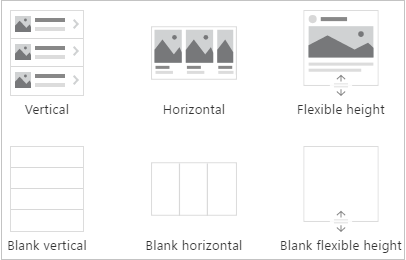
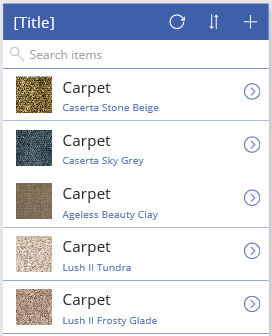
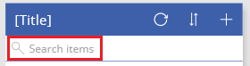

# <a name="show-a-list-of-items-in-powerapps"></a>Anzeigen einer Liste mit Elementen in PowerApps

Sie können eine Liste von Elementen aus beliebigen Datenquellen anzeigen, indem Sie Ihrer Canvas-App ein **[Katalog](controls/control-gallery.md)** -Steuerelement hinzufügen. In diesem Thema wird Excel als Datenquelle verwendet. Filtern Sie die Liste, indem Sie das **Katalog**-Steuerelement so konfigurieren, dass nur die Elemente angezeigt werden, die dem Filterkriterium in einem **[Texteingabe](controls/control-text-input.md)** -Steuerelement entsprechen.

## <a name="prerequisites"></a>Voraussetzungen

- Erfahren Sie, wie Sie in PowerApps [ein Steuerelement hinzufügen und konfigurieren](add-configure-controls.md).

- Einrichten der Beispieldaten:
    1. Laden Sie [diese Excel-Datei](https://az787822.vo.msecnd.net/documentation/get-started-from-data/FlooringEstimates.xlsx) mit Beispieldaten für dieses Lernprogramm herunter.

    2. Laden Sie die Excel-Datei in ein [Cloudspeicherkonto](connections/cloud-storage-blob-connections.md) hoch, z.B. in OneDrive for Business.

- Öffnen Sie eine leere App:
    1. [Melden Sie sich bei PowerApps an](https://make.powerapps.com?utm_source=padocs&utm_medium=linkinadoc&utm_campaign=referralsfromdoc).

    1. Wählen Sie unter **Eigene App erstellen** die Option **Canvas-App ohne Vorlage** aus.

    1. Geben Sie einen Namen für Ihre App an, wählen Sie **Telefon** aus, und klicken Sie dann auf **Erstellen**.

    1. Wenn das Dialogfeld **Willkommen bei Power apps Studio** angezeigt wird, wählen Sie über **springen**aus.

    1. [Fügen Sie eine Verbindung](add-data-connection.md) mit der **FlooringEstimates**-Tabelle in der Excel-Datei hinzu.

## <a name="add-a-gallery-to-a-blank-screen"></a>Hinzufügen eines Katalogs zu einem leeren Bildschirm

1. Wählen Sie auf der Registerkarte **Einfügen** die Option Katalog aus, und **Wählen Sie dann** **vertikal**aus.

    

1. Öffnen Sie auf der Registerkarte **Eigenschaften** im rechten Bereich die Liste **Elemente** , und wählen Sie dann **Boden Schätzungen**aus.

    

1. optionale Wählen Sie in der Liste **Layout** eine andere Option aus.

## <a name="add-a-gallery-in-a-screen"></a>Hinzufügen eines Katalogs in einem Bildschirm

1. Wählen Sie auf der Registerkarte **Startseite** die Option **neuer Bildschirm** > **Liste**aus.

    Ein Bildschirm mit einem Katalog **-Steuerelement** und anderen Steuerelementen, z. b. einer Suchleiste, wird angezeigt.

1. Legen Sie die **Items**-Eigenschaft des Katalogs auf `FlooringEstimates` fest.

    Im **Katalog**-Steuerelement werden die Beispieldaten angezeigt.

    

## <a name="add-a-control-to-the-gallery-control"></a>Hinzufügen eines Steuerelements zum Katalog-Steuerelement
Bevor Sie weitere Anpassungen vornehmen, sollten Sie sicherstellen, dass das Layout **für das Katalog-Steuerelement** am ehesten den gewünschten Anforderungen entspricht. Von dort aus können Sie die **Katalog Vorlage weiter** ändern, mit der bestimmt wird, wie alle Daten im Katalog **-Steuerelement** angezeigt werden.

1. Wählen Sie die Vorlage aus, indem Sie am unteren Rand des Katalog-Steuer Elements klicken oder tippen und dann **in der oberen** linken Ecke das Stift Symbol auswählen.

    

2. Fügen Sie bei ausgewählter Vorlage ein **[Label](controls/control-text-box.md)** -Steuerelement (Bezeichnung) hinzu, verschieben Sie es, und ändern Sie seine Größe, sodass es sich nicht mit anderen Steuerelementen in der Vorlage überschneidet.

    

3. Wählen Sie den Katalog aus, und wählen Sie dann im rechten **Bereich** auf der Registerkarte **Eigenschaften** die Option **Bearbeiten** aus.

4. Wählen Sie die soeben in diesem Verfahren hinzugefügte Bezeichnung aus, und öffnen Sie die hervorgehobene Liste im Bereich **Daten**.

    

5. Klicken oder tippen Sie in dieser Liste auf **Price** (Preis).

    Im **Katalog**-Steuerelement werden die neuen Werte angezeigt.

    

## <a name="filter-and-sort-a-gallery"></a>Filtern und Sortieren eines Katalogs
Die **[Items](controls/properties-core.md)** -Eigenschaft eines **Katalog**-Steuerelements bestimmt, welche Elemente angezeigt werden. In diesem Verfahren konfigurieren Sie diese Eigenschaft so, dass Sie auch bestimmt, welche Datensätze basierend auf Filterkriterien und in welcher Reihenfolge angezeigt werden.



1. Legen Sie die **[Items](controls/properties-core.md)** -Eigenschaft des **Katalog**-Steuerelements auf diese Formel fest:

    ```powerapps-comma
    Sort
        (If
            (IsBlank(TextSearchBox1.Text);
            FlooringEstimates;
            Filter(
                FlooringEstimates;
                TextSearchBox1.Text in Text(Name)
            )
        );
        Name;
        If(
            SortDescending1;
            SortOrder.Descending;
            SortOrder.Ascending
        )
    )
    ```

    Weitere Informationen zu den Funktionen in dieser Formel finden Sie unter [formula reference (Formelreferenz)](formula-reference.md).

1. Doppelklicken Sie auf das Suchfeld, und geben Sie dann Part oder all einen Produktnamen ein.

    Es werden nur die Elemente angezeigt, die das Filter Kriterium erfüllen.

1. Wählen Sie beim Drücken der Alt-Taste das Sortier Symbol einmal oder mehrmals aus, um die Sortierreihenfolge zu ändern.

    Die Datensätze werden auf der Grundlage des Produkt namens zwischen aufsteigender und absteigender alphabetischer Reihenfolge gewechselt.

## <a name="highlight-the-selected-item"></a>Hervorheben des ausgewählten Elements
Legen Sie die **templatefill** -Eigenschaft des Katalog-Steuer Elements auf eine Formel fest **, die diesem** Beispiel ähnelt, aber Sie können bei Bedarf andere Farben angeben:

**If(ThisItem.IsSelected; LightCyan; White)**

## <a name="change-the-default-selection"></a>Ändern der Standardauswahl
Legen Sie die **Default**-Eigenschaft des **Katalog**-Steuerelements auf den Datensatz fest, der standardmäßig ausgewählt sein soll. Sie können z. b. das fünfte Element in der Datenquelle **flooringestimates** angeben:

**Last(FirstN(FlooringEstimates; 5))**

In diesem Beispiel geben Sie das erste Element in der Kategorie **Hardwood** der Datenquelle **FlooringEstimates** an:

**First(Filter(FlooringEstimates; Category = "Hardwood"))**

## <a name="next-steps"></a>Nächste Schritte
Informationen zum Arbeiten mit [Formularen](working-with-forms.md) und [Formeln](working-with-formulas.md).
