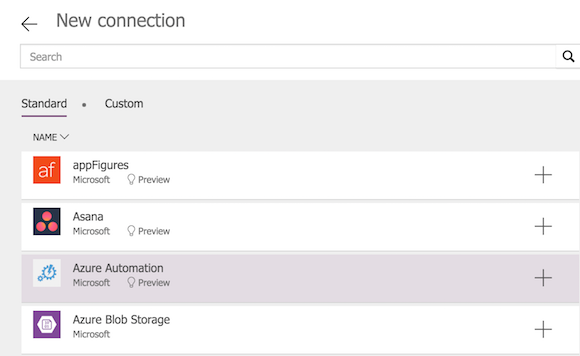
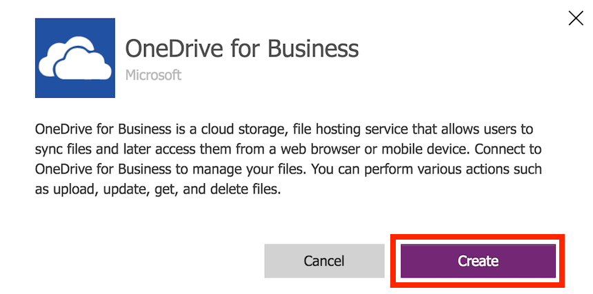

# Verwalten von Canvas-App-Verbindungen in powerapps
Stellen Sie in [powerapps.com](https://make.powerapps.com?utm_source=padocs&utm_medium=linkinadoc&utm_campaign=referralsfromdoc) eine Verbindung mit einer oder mehreren Datenquellen her, löschen Sie eine Verbindung, oder aktualisieren Sie ihre Anmeldeinformationen.

Über die Datenverbindung der Canvas-App können Verbindungen mit SharePoint, SQL Server, Office 365, OneDrive for Business, Salesforce, Excel und vielen anderen [Datenquellen](connections-list.md) hergestellt werden.

Ihr nächster Schritt nach diesem Artikel besteht darin, Daten aus der Datenquelle in der App anzuzeigen und zu verwalten; siehe folgende Beispiele:

* Herstellen einer Verbindung mit OneDrive for Business und Verwalten von Daten in einer Excel-Arbeitsmappe in der App.
* Aktualisieren einer Liste auf einer SharePoint-Website.
* Herstellen einer Verbindung mit SQL Server und Aktualisieren einer Tabelle aus Ihrer App.
* Senden einer E-Mail in Office 365
* Senden eines Tweets.
* Verbinden mit Twilio und senden einer SMS-Nachricht von Ihrer App.

## Erforderliche Komponenten
1. [Registrieren Sie sich](../signup-for-powerapps.md) für powerapps.
2. Melden Sie sich bei [make.powerapps.com](https://make.powerapps.com?utm_source=padocs&utm_medium=linkinadoc&utm_campaign=referralsfromdoc) mit den gleichen Anmelde Informationen an, die Sie bei der Registrierung verwendet haben.

## Hintergrundinformationen zu Datenverbindungen
Die meisten powerapps-Apps verwenden externe Informationen, die als **Datenquellen** bezeichnet werden und in Clouddiensten gespeichert sind. Ein gängiges Beispiel ist eine Tabelle in einer Excel-Datei, die in OneDrive for Business gespeichert ist. Apps können über **Verbindungen** auf diese Datenquellen zugreifen.

Der verbreitetste Typ von Datenquelle ist die Tabelle, aus der Informationen abgerufen und in der Informationen gespeichert werden können. Über Verbindungen mit Datenquellen können Sie Daten in Microsoft Excel-Arbeitsmappen, SharePoint-Listen, SQL-Tabellen und vielen anderen Formaten lesen und schreiben; diese können in Clouddiensten wie OneDrive for Business, DropBox, SQL Server usw. gespeichert sein.

Es gibt andere Arten von Datenquellen, bei denen es sich nicht um Tabellen handelt, z. b. e-Mail, Kalender, Twitter und Benachrichtigungen.

Mithilfe von **[Katalog](controls/control-gallery.md)** -, **[Formular anzeigen](controls/control-form-detail.md)** - und **[Formular bearbeiten](controls/control-form-detail.md)** -Steuerelementen können Sie auf einfache Weise eine App erstellen, die Daten aus einer Datenquelle liest und schreibt. Lesen Sie zunächst den Artikel [Understand data forms (Grundlegendes zu Datenformularen)](working-with-forms.md).

Zusätzlich zum Erstellen und Verwalten von Verbindungen in [powerapps.com](https://make.powerapps.com?utm_source=padocs&utm_medium=linkinadoc&utm_campaign=referralsfromdoc) können Sie auch Verbindungen erstellen, wenn Sie die folgenden Aufgaben ausführen:

* Automatisches Generieren einer [App aus Daten](app-from-sharepoint.md), z. B. aus einer benutzerdefinierten SharePoint-Liste.
* Aktualisieren Sie eine vorhandene App, oder erstellen Sie eine wie in [Eine Verbindung hinzufügen](add-data-connection.md) beschrieben neu.
* Öffnen einer App, die ein anderer Benutzer erstellt und [für Sie freigegeben](share-app.md) hat.

> [!NOTE]
> Wenn Sie stattdessen powerapps Studio verwenden möchten, öffnen Sie das Menü **Datei** , und klicken oder tippen Sie dann auf **Connections**, [powerapps.com](https://make.powerapps.com?utm_source=padocs&utm_medium=linkinadoc&utm_campaign=referralsfromdoc) wird geöffnet, sodass Sie dort Verbindungen erstellen und verwalten können.

## Erstellen einer neuen Verbindung
1. Wenn Sie dies noch nicht getan haben, melden Sie sich bei [make.powerapps.com](https://make.powerapps.com?utm_source=padocs&utm_medium=linkinadoc&utm_campaign=referralsfromdoc)an.
2. Erweitern Sie im linken Navigationsbereich **Daten** , und wählen Sie **Verbindungen**aus.
   
    
3. Wählen Sie **neue Verbindung**aus.
   
    
4. Wählen Sie in der angezeigten Liste einen Connector aus, und befolgen Sie dann die Eingabe Aufforderungen.
   
   
5. Wählen Sie die Schaltfläche **Erstellen** aus.
   
   
6. Befolgen Sie die Eingabeaufforderungen. Bei einigen Connectors werden Sie aufgefordert, Anmeldeinformationen einzugeben, einen bestimmten Datensatz anzugeben oder andere Schritte auszuführen. Bei anderen (z.B. **Microsoft Translator**) ist dies nicht der Fall.
   
   Diese Connectors erfordern möglicherweise zusätzliche Informationen, bevor Sie sie verwenden können.
   
   * [SharePoint](connections/connection-sharepoint-online.md)
   * [SQL Server](connections/connection-azure-sqldatabase.md)

Der neue Connector wird unter **Verbindungen** angezeigt, und Sie können ihn [zu einer App hinzufügen](add-data-connection.md).

## Eine Verbindung aktualisieren oder löschen
Suchen Sie in der Liste der Verbindungen die Verbindung, die Sie aktualisieren oder löschen möchten, und wählen Sie dann die Auslassungs Punkte (...) auf der rechten Seite der Verbindung aus.

* Um die Anmelde Informationen für eine Verbindung zu aktualisieren, wählen Sie das Schlüsselsymbol aus, und geben Sie dann die Anmelde Informationen für diese Verbindung an.
* Wählen Sie löschen aus, um die Verbindung zu löschen.
* Wählen Sie das Informationssymbol aus, um die Verbindungsdetails anzuzeigen.

