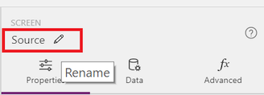
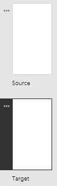

# Hinzufügen eines Bildschirms und Wechseln zwischen Bildschirmen
Erstellen Sie eine App mit mehreren Bildschirmen, und bieten Sie Benutzern Möglichkeiten, zwischen diesen Bildschirmen zu wechseln.

## Voraussetzungen
* Erfahren Sie, wie Sie ein [Steuerelement konfigurieren](add-configure-controls.md).
* Erstellen oder öffnen Sie eine App.

## Hinzufügen und Umbenennen eines Bildschirms
1. Klicken oder tippen Sie auf der Registerkarte **Start** auf **Neuer Bildschirm**.

    

2. Klicken oder tippen Sie im rechten Bereich auf den Namen des Bildschirms (direkt über der Registerkarte **Eigenschaften**), und geben Sie anschließend den neuen Namen **Source** (Quelle) ein.

    

3. Fügen Sie einem weiteren Bildschirm hinzu, und benennen Sie diesen **Target**.

    

## Navigation hinzufügen
1. Öffnen Sie bei ausgewähltem Bildschirm **Source** die Registerkarte **Einfügen**, klicken oder tippen Sie auf **Symbole** und anschließend auf den **Pfeil „Weiter“**.  

    

2. (optional) Verschieben Sie den Pfeil, sodass er sich in der unteren rechten Ecke des Bildschirms befindet.

3. Klicken oder tippen Sie bei ausgewähltem Pfeil auf die Registerkarte **Aktion** und anschließend auf **Navigieren**.

    Die **[OnSelect](controls/properties-core.md)**-Eigenschaft für den Pfeil wird automatisch auf eine **Navigate**-Funktion festgelegt.  

    

    Wenn ein Benutzer auf den Pfeil klickt oder tippt, wird der Bildschirm **Target** eingeblendet.

4. Fügen Sie im Bildschirm **Target** einen **Pfeil „Zurück“** hinzu, und legen Sie dessen **[OnSelect](controls/properties-core.md)**-Eigenschaft auf die folgende Formel fest:
    **Navigate(Source, ScreenTransition.Fade)**

5. Öffnen Sie den Vorschaumodus ( oder drücken Sie F5), und wechseln Sie dann zwischen den Bildschirmen, indem Sie auf die hinzugefügten Pfeile klicken oder tippen.

6. Drücken Sie **ESC**, um zum Standardarbeitsbereich zurückzukehren.
