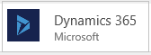
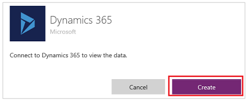
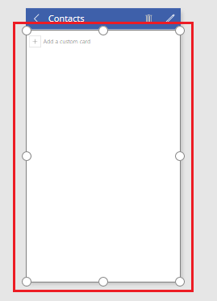

# Herstellen einer Verbindung mit Dynamics 365 aus Power apps
Mit powerapps können Sie Mobile Apps mit geringem oder ohne Code schnell generieren, anpassen, freigeben und ausführen. Mithilfe des Dynamics 365-Connectors können Sie nützliche mobile Apps erstellen, die Sie in nur wenigen Minuten für Ihre Organisation freigeben können.

Mithilfe der Schritte in diesem Thema erstellen Sie eine APP, in der Benutzer Kontakte in Modell gesteuerten apps in Dynamics 365 (Dynamics 365 Sales, Dynamics 365 Customer Service, Dynamics 365 Field Service, Dynamics 365 Marketing) durchsuchen, hinzufügen, löschen und aktualisieren können. und Dynamics 365 Project Service Automation). Benutzer können die App [in einem Browser](../../../user/run-app-browser.md) oder [auf einem mobilen Gerät](../../../user/run-app-client.md) wie einem Smartphone ausführen.

> [!NOTE]
> Es wird empfohlen, beim Herstellen einer Verbindung mit Modell gesteuerten apps in Dynamics 365 einen robusteren [Common Data Service-Connector](connection-common-data-service.md) zu verwenden.

## Voraussetzung
Zum Durcharbeiten dieses Lernprogramms benötigen Sie ein Microsoft Office 365-Konto mit einem Dynamics 365-Abonnement.

## Verbindung erstellen
1. [Melden Sie sich bei powerapps an](https://make.powerapps.com?utm_source=padocs&utm_medium=linkinadoc&utm_campaign=referralsfromdoc).
2. Klicken Sie in der linken Navigationsleiste auf **Verbindungen**.
   
    
3. Klicken Sie in der rechten oberen Ecke auf **Neue Verbindung**.
   
    
4. Klicken Sie in der Liste der Verbindungen auf **Dynamics 365**.
   
    
5. Klicken Sie im Dialogfeld auf **Erstellen**.
   
    
6. Geben Sie im Dialogfeld **Bei einem Konto anmelden** Ihre Anmeldeinformationen für den Dynamics 365 (Online)-Mandanten an.
   
    Eine Verbindung wird erstellt.

## Eine App automatisch generieren
1. [Melden Sie sich bei powerapps an](https://make.powerapps.com?utm_source=padocs&utm_medium=linkinadoc&utm_campaign=referralsfromdoc), und klicken Sie dann in der unteren linken Ecke auf **neue APP** .
   
    
2. Klicken Sie unter **Mit eigenen Daten beginnen** in der Kachel **Dynamics 365** auf **Telefonlayout**.
   
    
3. Wählen Sie unter **Verbindungen** die gewünschte Verbindung und anschließend ein Dataset aus, das der Instanz von Dynamics 365 entspricht, die Sie in der App verwalten.
4. Klicken Sie unter **Tabelle auswählen** auf **Kontakte**, und klicken Sie anschließend auf **Verbinden**.
5. Klicken oder tippen Sie auf der linken Navigationsleiste rechts unten auf ein Symbol, um zur Miniaturansicht zu wechseln.
   
    

Powerapps generiert eine APP mit drei Bildschirmen auf der Grundlage von Kontaktdaten Sätzen.

* **BrowseScreen1**. Dieser Bildschirm wird standardmäßig angezeigt, wenn Benutzer die App öffnen. In der linken Navigationsleiste wird eine Vorschauminiatur für diesen Bildschirm über den beiden anderen Bildschirmen angezeigt.
* **DetailScreen1**. Dieser Bildschirm wird angezeigt, wenn Benutzer im **BrowseScreen1** auf ein Element klicken.  In der linken Navigationsleiste wird eine Vorschauminiatur für **DetailScreen1** zwischen den beiden anderen Bildschirmen angezeigt.
* **EditScreen1**. Dieser Bildschirm wird angezeigt, wenn Benutzer auf das Bearbeitungssymbol für ein Element im **DetailScreen1** klicken. In der linken Navigationsleiste wird eine Vorschauminiatur für **EditScreen1** unter den beiden anderen Bildschirmen angezeigt.

Die App kann in ihrem ursprünglichen Zustand ausgeführt werden, sie kann jedoch durch Optimieren der Informationen auf den einzelnen Bildschirmen nützlicher gestaltet werden.

## Anpassen von BrowseScreen1
In diesem Verfahren konfigurieren Sie **BrowseScreen1** so, dass für die einzelnen Kontakte jeweils der Vorname und der Nachname angezeigt werden. Die Daten werden alphabetisch nach dem Nachnamen sortiert, und sie enthalten Bilder in einem zweispaltigen Raster.

1. Wählen Sie im **BrowseScreen1** den Katalog aus, indem Sie auf einen beliebigen Datensatz darin klicken (mit Ausnahme des ersten Datensatzes).
   
    
2. Klicken oder tippen Sie im rechten Bereich auf die Registerkarte **Daten**.
3. Klicken oder tippen Sie in der Liste der Layouts auf das Layout, in dem Bilder und Texte in einem zweispaltigen Raster angezeigt werden.
   
    Sie müssen möglicherweise einen Bildlauf nach unten ausführen, um diese Option anzuzeigen.
   
    
4. Kopieren Sie diese Formel, und fügen Sie sie bei ausgewähltem Katalog in der Bearbeitungsleiste (rechts neben der Schaltfläche **fx**) ein:
   
    `SortByColumns(Search(Filter(Contacts,statuscode=1), TextSearchBox1.Text, "lastname"), "lastname", If(SortDescending1, Descending, Ascending))`
5. Legen Sie im rechten Bereich die obere Dropdownliste auf **firstname** und die mittlere Dropdownliste auf **lastname** fest.
   
    
6. (optional) Klicken Sie im Menü **Datei** auf **Speichern unter**, geben Sie einen Namen für die App ein, und klicken Sie auf **Speichern**.
   
    In der Standardeinstellung wird die App in der Cloud gespeichert. Klicken Sie auf **Dieser Computer**, um die App lokal zu speichern.

## Anpassen von DetailsScreen1 und EditScreen1
1. Klicken Sie in der linken Navigationsleiste auf die mittlere Miniaturansicht, um **DetailsScreen1** auszuwählen.
2. Klicken Sie im **DetailScreen1** auf eine beliebige Stelle unter der Titelleiste, um im rechten Bereich Anpassungsoptionen einzublenden.
   
    
3. Klicken Sie im rechten Bereich auf das Augensymbol für jedes Feld, um es auszublenden.
   
    
4. Klicken Sie auf eine beliebige Stelle unter der Titelleiste, um **Form1** auszuwählen.
   
    
5. Klicken Sie im rechten Bereich auf das Augensymbol für jedes dieser Felder, sodass im Bildschirm ein Bild (sofern die Tabelle eines enthält) und andere Felder für jeden Kontakt angezeigt werden:
   
   * **entityimage**
   * **firstname**
   * **lastname**
   * **mobilephone**
   * **emailaddress1**
     
     Der rechte Bereich ähnelt nun dem in dieser Abbildung dargestellten:
     
     
6. Wählen Sie **EditScreen1** aus, indem Sie auf die untere Miniaturansicht in der linken Navigationsleiste klicken.
7. Führen Sie die Schritte in diesem Verfahren erneut aus, um **EditScreen1** auf die gleiche Weise wie **DetailsScreen1** anzupassen.
8. (optional) Speichern Sie die App.

## Weitere Schritte
* Testen Sie die App im Vorschaumodus, indem Sie in der linken Navigationsleiste auf **BrowseScreen1** klicken und anschließend F5 drücken oder indem Sie in der oberen rechten Ecke auf  klicken.
* [Geben Sie die App frei](../share-app.md).
* [Fügen Sie eine zweite Datenquelle hinzu](../add-data-connection.md).

