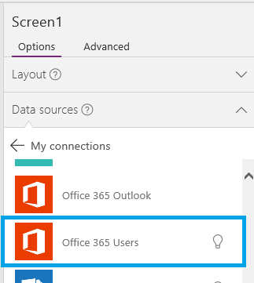
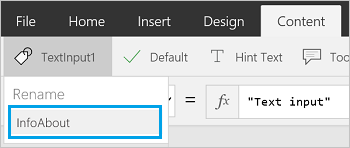

# Herstellen einer Verbindung mit Office 365-Benutzer aus PowerApps

Office 365-Benutzer bietet Ihnen Zugriff auf Benutzerprofile in Ihrer Organisation mithilfe Ihres Office 365-Kontos. Sie können verschiedene Aktionen ausführen, z. B. Ihr Profil, das Profil eines Benutzers, den Vorgesetzten oder die direkten Mitarbeiter eines Benutzers abrufen.

Sie können diese Informationen in einer Bezeichnung in Ihrer App anzeigen. Sie können eine Funktion oder mehrere Funktionen anzeigen und sogar verschiedene Funktionen kombinieren. Beispielsweise können Sie einen Ausdruck erstellen, der den Benutzernamen und die Telefonnummer kombiniert, und dann diese Information in der App anzeigen.

In diesem Thema wird gezeigt, wie Sie Office 365-Benutzer als Verbindung hinzufügen, Office 365-Benutzer Ihrer App als Datenquelle hinzufügen und wie Sie Tabellendaten in einem Katalogsteuerelement verwenden.

[!INCLUDE [connection-requirements](../../../includes/connection-requirements.md)]

## Eine Verbindung hinzufügen
1. [Fügen Sie eine Datenverbindung hinzu](../add-data-connection.md), und wählen Sie **Office 365-Benutzer** aus:  

    
2. Wählen Sie **Verbinden** aus, und wenn Sie aufgefordert werden, sich anzumelden, geben Sie Ihr Geschäftskonto ein.

Die Verbindung mit Office 365-Benutzer wurde erstellt und Ihrer App hinzugefügt. Sie kann jetzt verwendet werden.

## Verwenden der Verbindung in der App
### Informationen über den aktuellen Benutzer anzeigen
1. Wählen Sie im Menü **Insert** (Einfügen) die Option **Label** (Bezeichnung) aus
2. Legen Sie in der Funktionsleiste die **[Text](../controls/properties-core.md)** -Eigenschaft auf eine der folgenden Formeln fest:

   `Office365Users.MyProfile().City`  
   `Office365Users.MyProfile().CompanyName`  
   `Office365Users.MyProfile().Country`  
   `Office365Users.MyProfile().Department`  
   `Office365Users.MyProfile().DisplayName`  
   `Office365Users.MyProfile().GivenName`  
   `Office365Users.MyProfile().Id`  
   `Office365Users.MyProfile().JobTitle`  
   `Office365Users.MyProfile().Mail`  
   `Office365Users.MyProfile().MailNickname`  
   `Office365Users.MyProfile().mobilePhone`  
   `Office365Users.MyProfile().OfficeLocation`  
   `Office365Users.MyProfile().PostalCode`  
   `Office365Users.MyProfile().Surname`  
   `Office365Users.MyProfile().TelephoneNumber`  
   `Office365Users.MyProfile().UserPrincipalName`  
   `Office365Users.MyProfile().AccountEnabled`  
   `Office365Users.MyProfile().BusinessPhones`

In der Bezeichnung werden die Informationen über den aktuellen Benutzer angezeigt, die Sie eingegeben haben.

### Anzeigen von Informationen zu einem anderen Benutzer
1. Klicken Sie im Menü **Insert** (Einfügen) auf **Text**, und wählen Sie dann **Texteingabe** (Texteingabe) aus. Benennen Sie das Steuerelement in **InfoAbout** um:  

    
2. Geben Sie in **InfoAbout** eine E-Mail-Adresse eines Benutzers in Ihrer Organisation ein, oder fügen Sie sie ein. Geben Sie z. B. *IhrName*@*IhrUnternehmen.com* ein.
3. Fügen Sie ein **Label** (Bezeichnung) hinzu (Menü **Einfügen**), und legen Sie seine **[Text](../controls/properties-core.md)** -Eigenschaft auf eine der folgenden Formeln fest:

   * So zeigen Sie Informationen zu einem anderen Benutzer an:  

     `Office365Users.UserProfile(InfoAbout.Text).City`  
     `Office365Users.UserProfile(InfoAbout.Text).CompanyName`  
     `Office365Users.UserProfile(InfoAbout.Text).Country`  
     `Office365Users.UserProfile(InfoAbout.Text).Department`  
     `Office365Users.UserProfile(InfoAbout.Text).DisplayName`  
     `Office365Users.UserProfile(InfoAbout.Text).GivenName`  
     `Office365Users.UserProfile(InfoAbout.Text).Id`  
     `Office365Users.UserProfile(InfoAbout.Text).JobTitle`  
     `Office365Users.UserProfile(InfoAbout.Text).Mail`  
     `Office365Users.UserProfile(InfoAbout.Text).MailNickname`  
     `Office365Users.UserProfile(InfoAbout.Text).mobilePhone`  
     `Office365Users.UserProfile(InfoAbout.Text).OfficeLocation`  
     `Office365Users.UserProfile(InfoAbout.Text).PostalCode`  
     `Office365Users.UserProfile(InfoAbout.Text).Surname`  
     `Office365Users.UserProfile(InfoAbout.Text).TelephoneNumber`  
     `Office365Users.UserProfile(InfoAbout.Text).UserPrincipalName`  
     `Office365Users.UserProfile(InfoAbout.Text).AccountEnabled`  
     `Office365Users.UserProfile(InfoAbout.Text).BusinessPhones`

   * So zeigen Sie Informationen zum Vorgesetzten eines anderen Benutzers an:  

     `Office365Users.Manager(InfoAbout.Text).City`  
     `Office365Users.Manager(InfoAbout.Text).CompanyName`  
     `Office365Users.Manager(InfoAbout.Text).Country`  
     `Office365Users.Manager(InfoAbout.Text).Department`  
     `Office365Users.Manager(InfoAbout.Text).DisplayName`  
     `Office365Users.Manager(InfoAbout.Text).GivenName`  
     `Office365Users.Manager(InfoAbout.Text).Id`  
     `Office365Users.Manager(InfoAbout.Text).JobTitle`  
     `Office365Users.Manager(InfoAbout.Text).Mail`  
     `Office365Users.Manager(InfoAbout.Text).MailNickname`  
     `Office365Users.Manager(InfoAbout.Text).mobilePhone`  
     `Office365Users.Manager(InfoAbout.Text).OfficeLocation`  
     `Office365Users.Manager(InfoAbout.Text).PostalCode`  
     `Office365Users.Manager(InfoAbout.Text).Surname`  
     `Office365Users.Manager(InfoAbout.Text).TelephoneNumber`  
     `Office365Users.Manager(InfoAbout.Text).UserPrincipalName`  
     `Office365Users.Manager(InfoAbout.Text).AccountEnabled`  
     `Office365Users.Manager(InfoAbout.Text).BusinessPhones`

In der Bezeichnung werden die Informationen angezeigt, die Sie über den von Ihnen angegebenen Benutzer oder den Vorgesetzten dieses Benutzers eingegeben haben.

> [!NOTE]
> Wenn Sie eine App basierend auf einer Entität im Common Data Service entwickeln, können Sie einen Benutzer anhand der ID statt anhand der E-Mail-Adresse angeben.

Beispielsweise können Sie [eine App automatisch erstellen](../data-platform-create-app.md), einen Bildschirm hinzufügen, der ein **Label**-Steuerelement (Bezeichnung) enthält, und die **Text**-Eigenschaft des Steuerelements auf diese Formel festlegen:
 **Office365Users.UserProfile(BrowseGallery1.Selected.CreatedByUser).DisplayName**

Wenn Sie einen Kontakt erstellen und in der App diesen Kontakt im Bildschirm zum Durchsuchen auswählen, wird im **Label**-Steuerelement (Bezeichnung) der Anzeigename angezeigt.

### Anzeigen der direkt unterstellten Mitarbeiter eines anderen Benutzers
1. Fügen Sie ein Texteingabe-Steuerelement hinzu (Menü **Insert** (Einfügen) > **Text** > **Text input**  (Texteingabe)), und benennen Sie es in **InfoAbout** um.
2. Geben Sie in **InfoAbout** die E-Mail-Adresse eines Benutzers in Ihrer Organisation ein. Geben Sie z. B. *NameIhresVorgesetzten*@*IhrUnternehmen.com* ein.
3. Fügen Sie einen Katalog **mit Text** hinzu (Menü **Insert** (Einfügen) > **Gallery** (Katalog)), und legen Sie dessen **[Items](../controls/properties-core.md)** -Eigenschaft auf die folgende Formel fest:

    `Office365Users.DirectReports(InfoAbout.Text)`

    Im Katalog werden Informationen zu den direkt unterstellten Mitarbeitern des von Ihnen eingegebenen Benutzers angezeigt.

    Wenn der Katalog ausgewählt ist, werden im rechten Bereich Optionen für diesen Katalog angezeigt.
4. Wählen Sie in der zweiten Liste **JobTitle** aus. Wählen Sie in der dritten Liste **DisplayName** aus. Der Katalog wird mit diesen Werten aktualisiert.  

> [!NOTE]
> Das erste Feld ist eigentlich eine Bildsteuerung. Wenn Sie über kein Bild verfügen, können Sie die Bildsteuerung löschen und stattdessen eine Bezeichnung hinzufügen. Unter [Hinzufügen und Konfigurieren von Steuerelementen](../add-configure-controls.md) finden Sie viele hilfreiche Informationen.

### Nach Benutzern suchen
1. Fügen Sie ein Texteingabe-Steuerelement hinzu (Menü **Insert** (Einfügen) > **Text** > **Text input** (Texteingabe)), und benennen Sie es in **SearchTerm** um. Geben Sie einen zu suchenden Namen ein. Geben Sie beispielsweise Ihren Vornamen ein.
2. Fügen Sie einen Katalog **mit Text** hinzu (Menü **Insert** (Einfügen) > **Gallery** (Katalog)), und legen Sie dessen **[Items](../controls/properties-core.md)** -Eigenschaft auf die folgende Formel fest:

    `Office365Users.SearchUser({searchTerm: SearchTerm.Text})`

    Im Katalog werden Benutzer angezeigt, deren Name den von Ihnen eingegebenen Suchtext enthält.

    Wenn der Katalog ausgewählt ist, werden im rechten Bereich Optionen für diesen Katalog angezeigt.
3. Wählen Sie in der zweiten Liste **Mail** aus. Wählen Sie in der dritten Liste **DisplayName** aus.

    Die zweite und dritte Bezeichnung im Katalog werden aktualisiert.

## Anzeigen der verfügbaren Funktionen
Diese Verbindung umfasst die folgenden Funktionen:

| Funktionsname | Beschreibung |
| --- | --- |
| [DirectReports](connection-office365-users.md#directreports) |Gibt die direkten Berichte für den angegebenen Benutzer zurück. |
| [Manager](connection-office365-users.md#manager) |Ruft das Benutzerprofil für den Vorgesetzten des angegebenen Benutzers ab. |
| [MyProfile](connection-office365-users.md#myprofile) |Ruft das Profil für den aktuellen Benutzer ab. |
| [SearchUser](connection-office365-users.md#searchuser) |Ruft die Suchergebnisse von Benutzerprofilen ab. |
| [UserProfile](connection-office365-users.md#userprofile) |Ruft ein bestimmtes Benutzerprofil ab. |

### MyProfile
Profil erstellen: Ruft das Profil für den aktuellen Benutzer ab.

#### Eingabeeigenschaften
Keine

#### Ausgabeeigenschaften

| Eigenschaftsname | Typ | Beschreibung |
| --- | --- | --- |
| Stadt | Zeichenfolge |Stadt des Benutzers. |
| CompanyName | Zeichenfolge |Unternehmen des Benutzers. |
| Land | Zeichenfolge |Das Land des Benutzers. |
| Department |Zeichenfolge |Abteilung des Benutzers. |
| DisplayName |Zeichenfolge |Der Anzeigename des Benutzers |
| GivenName |Zeichenfolge |Der Vorname des Benutzers |
| Id |Zeichenfolge |Benutzer-ID. |
| JobTitle |Zeichenfolge |Die Berufsbezeichnung des Benutzers. |
| Mail |Zeichenfolge |Die E-Mail-ID des Benutzers |
| MailNickname |Zeichenfolge |Der Spitzname des Benutzers |
| mobilePhone | Zeichenfolge |Mobiltelefonnummer des Benutzers. |
| Officelokation | Zeichenfolge |Büro Speicherort des Benutzers.|
| PostalCode | Zeichenfolge |Postleitzahl des Benutzers.|
| Surname |Zeichenfolge |Der Nachname des Benutzers |
| TelephoneNumber |Zeichenfolge |Die Telefonnummer des Benutzers |
| UserPrincipalName |Zeichenfolge |Der Benutzerprinzipalname |
| AccountEnabled |Boolesch |Flag für aktiviertes Konto |
| Businessphones | Zeichenfolge |Telefonnummern des Unternehmens des Benutzers.|

### UserProfile
Benutzerprofil erhalten: Ruft ein bestimmtes Benutzerprofil ab.

#### Eingabeeigenschaften

| Name | Datentyp | Erforderlich | Beschreibung |
| --- | --- | --- | --- |
| Id |Zeichenfolge |ja |Benutzer Prinzipal Name oder e-Mail-ID. |

#### Ausgabeeigenschaften

| Eigenschaftsname | Typ | Beschreibung |
| --- | --- | --- |
| Stadt | Zeichenfolge |Stadt des Benutzers. |
| CompanyName | Zeichenfolge |Unternehmen des Benutzers. |
| Land | Zeichenfolge |Das Land des Benutzers. |
| Department |Zeichenfolge |Abteilung des Benutzers. |
| DisplayName |Zeichenfolge |Der Anzeigename des Benutzers |
| GivenName |Zeichenfolge |Der Vorname des Benutzers |
| Id |Zeichenfolge |Benutzer-ID. |
| JobTitle |Zeichenfolge |Die Berufsbezeichnung des Benutzers. |
| Mail |Zeichenfolge |Die E-Mail-ID des Benutzers |
| MailNickname |Zeichenfolge |Der Spitzname des Benutzers |
| Surname |Zeichenfolge |Der Nachname des Benutzers |
| TelephoneNumber |Zeichenfolge |Die Telefonnummer des Benutzers |
| UserPrincipalName |Zeichenfolge |Der Benutzerprinzipalname |
| AccountEnabled |Boolesch |Flag für aktiviertes Konto |
| Businessphones | Zeichenfolge |Telefonnummern des Unternehmens des Benutzers.|

### Manager
Manager erhalten: Ruft das Benutzerprofil für den Vorgesetzten des angegebenen Benutzers ab.

#### Eingabeeigenschaften

| Name | Datentyp | Erforderlich | Beschreibung |
| --- | --- | --- | --- |
| Id |Zeichenfolge |ja |Benutzer Prinzipal Name oder e-Mail-ID. |

#### Ausgabeeigenschaften

| Eigenschaftsname | Typ | Beschreibung |
| --- | --- | --- |
| Stadt | Zeichenfolge |Stadt des Benutzers. |
| CompanyName | Zeichenfolge |Unternehmen des Benutzers. |
| Land | Zeichenfolge |Das Land des Benutzers. |
| Department |Zeichenfolge |Abteilung des Benutzers. |
| DisplayName |Zeichenfolge |Der Anzeigename des Benutzers |
| GivenName |Zeichenfolge |Der Vorname des Benutzers |
| Id |Zeichenfolge |Benutzer-ID. |
| JobTitle |Zeichenfolge |Die Berufsbezeichnung des Benutzers. |
| Mail |Zeichenfolge |Die E-Mail-ID des Benutzers |
| MailNickname |Zeichenfolge |Der Spitzname des Benutzers |
| mobilePhone | Zeichenfolge |Mobiltelefonnummer des Benutzers. |
| Officelokation | Zeichenfolge |Büro Speicherort des Benutzers.|
| PostalCode | Zeichenfolge |Postleitzahl des Benutzers.|
| Surname |Zeichenfolge |Der Nachname des Benutzers |
| TelephoneNumber |Zeichenfolge |Die Telefonnummer des Benutzers |
| UserPrincipalName |Zeichenfolge |Der Benutzerprinzipalname |
| AccountEnabled |Boolesch |Flag für aktiviertes Konto |
| Businessphones | Zeichenfolge |Telefonnummern des Unternehmens des Benutzers.|

### DirectReports
Direkte Berichte erhalten: Direkte Berichte erhalten.

#### Eingabeeigenschaften

| Name | Datentyp | Erforderlich | Beschreibung |
| --- | --- | --- | --- |
| Id |Zeichenfolge |ja |Benutzer Prinzipal Name oder e-Mail-ID. |

#### Ausgabeeigenschaften

| Eigenschaftsname | Typ | Beschreibung |
| --- | --- | --- |
| Stadt | Zeichenfolge |Stadt des Benutzers. |
| CompanyName | Zeichenfolge |Unternehmen des Benutzers. |
| Land | Zeichenfolge |Das Land des Benutzers. |
| Department |Zeichenfolge |Abteilung des Benutzers. |
| DisplayName |Zeichenfolge |Der Anzeigename des Benutzers |
| GivenName |Zeichenfolge |Der Vorname des Benutzers |
| Id |Zeichenfolge |Benutzer-ID. |
| JobTitle |Zeichenfolge |Die Berufsbezeichnung des Benutzers. |
| Mail |Zeichenfolge |Die E-Mail-ID des Benutzers |
| MailNickname |Zeichenfolge |Der Spitzname des Benutzers |
| mobilePhone | Zeichenfolge |Mobiltelefonnummer des Benutzers. |
| Officelokation | Zeichenfolge |Büro Speicherort des Benutzers.|
| PostalCode | Zeichenfolge |Postleitzahl des Benutzers.|
| Surname |Zeichenfolge |Der Nachname des Benutzers |
| TelephoneNumber |Zeichenfolge |Die Telefonnummer des Benutzers |
| UserPrincipalName |Zeichenfolge |Der Benutzerprinzipalname |
| AccountEnabled |Boolesch |Flag für aktiviertes Konto |
| Businessphones | Zeichenfolge |Telefonnummern des Unternehmens des Benutzers.|

### SearchUser
Suchen nach Benutzern: Ruft die Suchergebnisse von Benutzerprofilen ab.

#### Eingabeeigenschaften

| Name | Datentyp | Erforderlich | Beschreibung |
| --- | --- | --- | --- |
| searchTerm |Zeichenfolge |Nein |Suchzeichenfolge Gilt für: Anzeige Name, Vorname, Nachname, e-Mail-Name, e-Mail-Spitzname und Benutzer Prinzipal Name. |

#### Ausgabeeigenschaften

| Eigenschaftsname | Typ | Beschreibung |
| --- | --- | --- |
| Stadt | Zeichenfolge |Stadt des Benutzers. |
| CompanyName | Zeichenfolge |Unternehmen des Benutzers. |
| Land | Zeichenfolge |Das Land des Benutzers. |
| Department |Zeichenfolge |Abteilung des Benutzers. |
| DisplayName |Zeichenfolge |Der Anzeigename des Benutzers |
| GivenName |Zeichenfolge |Der Vorname des Benutzers |
| Id |Zeichenfolge |Benutzer-ID. |
| JobTitle |Zeichenfolge |Die Berufsbezeichnung des Benutzers. |
| Mail |Zeichenfolge |Die E-Mail-ID des Benutzers |
| MailNickname |Zeichenfolge |Der Spitzname des Benutzers |
| mobilePhone | Zeichenfolge |Mobiltelefonnummer des Benutzers. |
| Officelokation | Zeichenfolge |Büro Speicherort des Benutzers.|
| PostalCode | Zeichenfolge |Postleitzahl des Benutzers.|
| Surname |Zeichenfolge |Der Nachname des Benutzers |
| TelephoneNumber |Zeichenfolge |Die Telefonnummer des Benutzers |
| UserPrincipalName |Zeichenfolge |Der Benutzerprinzipalname |
| AccountEnabled |Boolesch |Flag für aktiviertes Konto |
| Businessphones | Zeichenfolge |Telefonnummern des Unternehmens des Benutzers.|

## Nützliche Links
* Alle [verfügbaren Verbindungen](../connections-list.md).
* Erfahren Sie, wie Sie Ihren Apps [Verbindungen hinzufügen](../add-manage-connections.md).

