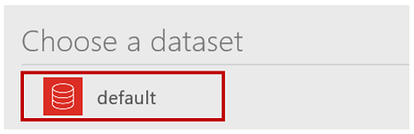
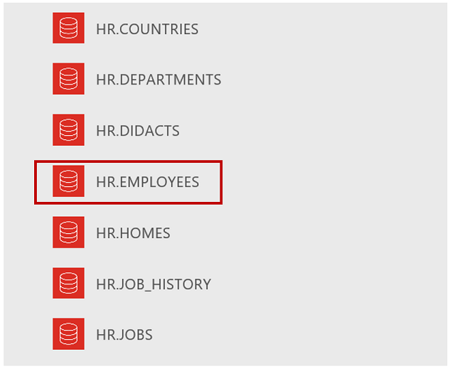

# Herstellen einer Verbindung mit einer Oracle-Datenbank aus Power apps
Auflisten von Tabellen und erstellen, lesen, aktualisieren und Löschen von Tabellenzeilen in einer Oracle-Datenbank nach dem Erstellen einer Verbindung und Erstellen einer APP in powerapps. Die Verbindung mit der Oracle-Datenbank unterstützt die vollständige Delegierung von Filtern, Sortieren und weiteren Funktionen, jedoch keine Trigger und gespeicherten Prozeduren.

## Voraussetzungen
* Oracle 9 und höher
* Oracle-Clientsoftware, Version 8.1.7 und höher
* Installation eines lokalen Datengateways
* Installation des Oracle-Client-SDK

### Installation eines lokalen Datengateways
Führen Sie zum Installieren eines Gateways die Schritte in [diesem Tutorial](../gateway-management.md) aus.

Ein lokales Daten Gateway fungiert als Brücke und bietet eine schnelle und sichere Datenübertragung zwischen lokalen Daten (Daten, die nicht in der Cloud gespeichert sind) und den Diensten Power BI, Energie automatisiert, Logic apps und Power apps. Sie können dasselbe Gateway für mehrere Dienste und mehrere Datenquellen verwenden. Weitere Informationen finden Sie unter [Grundlegendes zu Gateways](../gateway-reference.md).

### Installieren des Oracle-Clients
Installieren Sie auf dem Computer, auf dem sich das lokale Datengateway befindet, Oracle Data Access Components (ODAC) [64-Bit-ODAC 12c-Version 4 (12.1.0.2.4) für Windows x64](https://www.oracle.com/technetwork/database/windows/downloads/index-090165.html). Andernfalls wird ein Fehler angezeigt, wenn Sie versuchen, die Verbindung zu erstellen oder zu verwenden, wie in der Liste bekannter Probleme beschrieben.

## Erstellen einer App aus einer Tabelle in einer Oracle-Datenbank
1. Klicken oder tippen Sie in powerapps Studio im Menü **Datei** auf **neu** (am linken Rand).
   
   
2. Klicken oder tippen Sie auf den Pfeil unter **Mit eigenen Daten beginnen**.
   
      Eine Liste der bereits vorhandenen Verbindungen wird angezeigt.
3. Klicken oder tippen Sie auf **Neue Verbindung**.
   
   
4. Klicken oder tippen Sie in der Liste der Verbindungen auf **Oracle Database**.
   
   
5. Geben Sie den Namen eines Oracle-Servers, einen Benutzernamen und ein Kennwort ein.
   
    Geben Sie einen Server im folgenden Format ein, wenn eine SID erforderlich ist: 
    *Servername*/*SID*
   
   
6. Klicken oder tippen Sie auf das Gateway, das Sie verwenden möchten, oder installieren Sie ein Gateway.
   
    Wenn Ihr Gateway nach der Installation nicht angezeigt wird, klicken Sie auf **Gatewayliste aktualisieren**.
   
   
7. Klicken oder tippen Sie auf **Erstellen**, um die Verbindung zu erstellen.
   
   
8. Klicken oder tippen Sie auf das Dataset **Standard**.
   
   
9. Klicken oder tippen Sie in der Liste der Tabellen auf die Tabelle, die Sie verwenden möchten.
   
   
10. Klicken Sie auf **Verbinden**, um die App zu erstellen.
    
    

Powerapps erstellt eine APP mit drei Bildschirmen und zeigt die Daten aus der Tabelle an, die Sie ausgewählt haben:

* **BrowseScreen1** – Dort werden alle Einträge in der Tabelle aufgelistet.
* **DetailScreen1** – Bietet weitere Informationen über einen einzelnen Eintrag.
* **EditScreen1** – Dort können Benutzer einen Eintrag aktualisieren oder erstellen.

## Nächste Schritte
* Zum Speichern der App, die Sie gerade erstellt haben, drücken Sie STRG+S.
* Informationen zum Anpassen von **BrowseScreen1** (standardmäßig angezeigt) finden Sie unter [Anpassen eines Layouts](../customize-layout-sharepoint.md).
* Informationen zum Anpassen von **DetailsScreen1** oder **EditScreen1** finden Sie unter [Anpassen von Formularen](../customize-forms-sharepoint.md).

## Bekannte Probleme, Tipps und Problembehandlung
1. Das Gateway ist nicht erreichbar.
   
    Dieser Fehler wird angezeigt, wenn das lokale Datengateway keine Verbindung mit der Cloud herstellen kann. Um den Status des Gateways zu überprüfen, melden Sie sich bei „powerapps.microsoft.com“ an, klicken oder tippen Sie auf **Gateways**, und klicken oder tippen Sie auf das Gateway, das Sie verwenden möchten.
   
    Stellen Sie sicher, dass das Gateway ausgeführt wird und eine Verbindung mit dem Internet herstellen kann. Installieren Sie das Gateway nicht auf einem Computer, der möglicherweise ausgeschaltet oder in den Energiesparmodus versetzt wird. Möglicherweise können Sie das Problem auch durch einen Neustart des lokalen Datengatewaydiensts (PBIEgwService) beheben.
2. System.Data.OracleClient erfordert Version 8.1.7 oder höher der Oracle-Clientsoftware.
   
    Dieser Fehler wird angezeigt, wenn das Oracle-Client-SDK nicht auf demselben Computer wie das lokale Datengateway installiert ist. Um das Problem zu beheben, [installieren Sie die Software vom offiziellen Anbieter](https://go.microsoft.com/fwlink/p/?LinkID=272376).
3. Für die Tabelle „[Tabellenname]“ sind keine Schlüsselspalten definiert.
   
    Dieser Fehler wird angezeigt, wenn Sie eine Verbindung mit einer Tabelle herstellen, die keinen Primärschlüssel enthält. Dieser ist für die Verbindung mit der Oracle-Datenbank erforderlich.
4. Zum Zeitpunkt der Erstellung dieses Dokuments werden gespeicherte Prozeduren, Tabellen mit zusammengesetzten Schlüsseln und geschachtelte Objekttypen in Tabellen nicht unterstützt.

