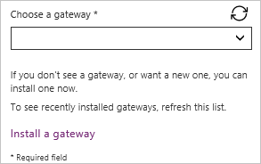
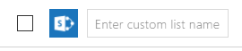

# Herstellen einer Verbindung mit SharePoint über eine Canvas-App

Stellen Sie eine Verbindung mit einer SharePoint-Website her, um eine APP automatisch aus einer benutzerdefinierten Liste zu generieren, oder erstellen Sie eine Verbindung, bevor Sie einer vorhandenen APP Daten hinzufügen oder eine APP von Grund auf neu erstellen

Abhängig davon, wo sich Ihre Daten befinden, können Sie einen oder beide der folgenden Ansätze verwenden:

- Anzeigen von Daten aus einer benutzerdefinierten Liste auf einer SharePoint Online-Website oder an einem lokalen Standort.
- Anzeigen von Bildern und Abspielen von Video-oder Audiodateien in einer Bibliothek (nur SharePoint Online).

## Eine App generieren

Wenn Sie Daten in einer benutzerdefinierten Liste verwalten möchten, können Sie powerapps [automatisch eine APP mit drei Bildschirmen generieren](../app-from-sharepoint.md). Benutzer können die Liste auf dem ersten Bildschirm durchsuchen, Details zu einem Element im zweiten Bildschirm anzeigen und Elemente auf dem dritten Bildschirm erstellen oder aktualisieren.

> [!NOTE]
> Wenn die SharePoint-Liste eine Spalte " **Choice**", " **Lookup**" oder " **Person" oder "Group** " enthält, finden Sie weitere Informationen unter Anzeigen von [Daten in einem](connection-sharepoint-online.md#show-list-columns-in-a-gallery) Katalog weiter unten

## Erstellen einer Verbindung

1. [Melden Sie sich bei powerapps](https://make.powerapps.com?utm_source=padocs&utm_medium=linkinadoc&utm_campaign=referralsfromdoc)an, wählen Sie **Daten** > **Verbindungen** in der linken Navigationsleiste aus, und wählen Sie dann in der oberen linken Ecke **neue Verbindung** aus.

    > [!div class="mx-imgBorder"]
    > Wählen Sie 

1. Geben oder fügen Sie im Suchfeld in der Nähe der oberen rechten Ecke **SharePoint**ein, und wählen Sie dann **SharePoint**aus.

    > [!div class="mx-imgBorder"]
    > Geben Sie im Suchfeld in der Nähe der oberen rechten Ecke SharePoint ein, oder fügen Sie es ein, und wählen Sie dann SharePoint aus. 

1. Führen Sie einen der folgenden Schritte aus:

    - Wählen Sie zum Herstellen einer Verbindung mit SharePoint Online **direkt verbinden (Clouddienste)** und dann **Erstellen**aus, und geben Sie dann Anmelde Informationen ein (falls Sie dazu aufgefordert werden).

        > [!div class="mx-imgBorder"]
        > 

        Die Verbindung wird hergestellt, und Sie können einer vorhandenen APP Daten hinzufügen oder eine APP von Grund auf neu erstellen.

    - Wählen Sie zum Herstellen einer Verbindung mit einem lokalen Standort **mithilfe des lokalen Daten Gateways verbinden aus**.

        > [!div class="mx-imgBorder"]
        > Wählen Sie zum Herstellen einer Verbindung mit dem lokalen Standort "* * Verbindung mit lokalem Daten Gateway herstellen" aus](./media/connection-sharepoint-online/select-onprem.png) ![

        Geben Sie **Windows** als Authentifizierungstyp an, und geben Sie dann Ihre Anmeldeinformationen ein. (Wenn Ihre Anmeldeinformationen einen Domänennamen enthalten, geben Sie sie folgendermaßen an: *Domäne\Alias*.)

        > [!div class="mx-imgBorder"]
        > 

        Wählen Sie unter **Gateway auswählen**das Gateway aus, das Sie verwenden möchten, und wählen Sie dann **Erstellen**aus.

        > [!NOTE]
        > Wenn Sie kein lokales Daten Gateway installiert haben, [Installieren Sie eines](../gateway-reference.md), und klicken Sie dann auf das Symbol, um die Liste der Gateways zu aktualisieren.

        > [!div class="mx-imgBorder"]
        > 

        Die Verbindung wird hergestellt, und Sie können einer vorhandenen APP Daten hinzufügen oder eine APP von Grund auf neu erstellen.

## Hinzufügen von Daten zu einer vorhandenen APP

1. Öffnen Sie in powerapps Studio die APP, die Sie aktualisieren möchten, wählen Sie die Registerkarte **Ansicht** aus, und wählen Sie dann **Datenquellen**aus.

    > [!div class="mx-imgBorder"]
    > 

1. Wählen Sie im Bereich **Daten** die Option Datenquelle > **SharePoint** **Hinzufügen** aus.

1. Wählen Sie unter **Verbindung mit einer SharePoint-Website herstellen**einen Eintrag in der Liste **Letzte Sites** aus (oder geben Sie die URL für die Website ein, die Sie verwenden möchten), und klicken Sie dann auf **verbinden**.

    > [!div class="mx-imgBorder"]
    > Wählen Sie 

1. Aktivieren Sie unter **Liste auswählen**das Kontrollkästchen für **Dokumente** oder eine oder mehrere Listen, die Sie verwenden möchten, und klicken Sie dann auf **verbinden**:

    > [!div class="mx-imgBorder"]
    > Wählen Sie 

    Nicht alle Typen von Listen werden standardmäßig angezeigt. Powerapps unterstützt benutzerdefinierte Listen und keine Vorlagen basierten Listen. Wenn der Name der Liste, die Sie verwenden möchten, nicht angezeigt wird, Scrollen Sie nach unten, und geben Sie dann den Namen der Liste in das Feld ein, das den Namen der **benutzerdefinierten Tabelle**enthält.

    > [!div class="mx-imgBorder"]
    > 

    Die Datenquellen oder Quellen werden ihrer app hinzugefügt.

## Erstellen Sie Ihre eigene APP von Grund auf neu

Wenden Sie die Konzepte in [Erstellen einer APP von Grund](../get-started-create-from-blank.md) auf auf SharePoint anstelle von Excel an.

## Anzeigen von Listen Spalten in einem Katalog

Wenn die benutzerdefinierte **Liste einen dieser** Spaltentypen enthält, zeigen Sie diese Daten in einem Katalog-Steuerelement an, indem Sie die Bearbeitungs Leiste verwenden, um die **Text** -Eigenschaft eines oder mehrerer Label-Steuerelemente in diesem **Katalog** festzulegen:

- Geben **Sie** für eine Spalte vom Typ " **Choice** " oder "Suche" **thisitem an.** _ColumnName_**. Der Wert** , mit dem Daten in dieser Spalte angezeigt werden.

    Geben Sie z.B. **ThisItem.Standort.Value** an, wenn Sie eine **Auswahl**-Spalte mit dem Namen **Standort** haben. Geben Sie **ThisItem.PostalCode.Value** für eine **Nachschlage**-Spalte namens **PostalCode** ein.

- Geben Sie für eine **Person oder eine Gruppen** Spalte **thisitem an.** _ColumnName_**. Display Name** , um den anzeigen amen des Benutzers oder der Gruppe anzuzeigen.

    Geben Sie z.B. **ThisItem.Manager.DisplayName** an, um die Anzeigenamen aus einer **Person oder Gruppe**-Spalte mit dem Namen **Manager** anzuzeigen.

    Sie können auch andere Informationen zu Benutzern anzeigen, z.B. E-Mail-Adressen oder Positionsbeschreibungen. Um eine komplette Liste der Optionen anzuzeigen, geben Sie **thisitem an.** _ColumnName_**.** (einschließlich des nachfolgenden Zeitraums).

    > [!NOTE]
    > Geben Sie für eine Spalte vom Typ " **kreatedby** " **thisitem. Author. Display Name** an, um die anzeigen Amen von Benutzern anzuzeigen, die Elemente in der Liste erstellt haben. Für eine **ModifiedBy**-Spalte geben Sie **ThisItem.Editor.DisplayName** ein, um die Anzeigenamen von Benutzern anzuzeigen, die die Elemente in der Liste geändert haben.

- Für eine **verwaltete Metadatenspalte** geben Sie **thisitem an.** _ColumnName_**. Bezeichnung** zum Anzeigen von Daten in dieser Spalte.

    Geben Sie z.B. **ThisItem.Sprachen.Label** ein, wenn Sie mit einer **Verwaltete Metadaten**-Spalte mit dem Namen **Sprachen** arbeiten.

## Anzeigen von Daten aus einer Bibliothek

Wenn Sie mehrere Images in einer SharePoint-Bibliothek haben, können Sie der APP ein **Dropdown** -Steuerelement hinzufügen, damit Benutzer angeben können, welches Bild angezeigt werden soll. Sie können dieselben Prinzipien auch auf andere Steuerelemente anwenden, z. b. auf Katalog **Steuerelemente und** andere Datentypen, z. b. Videos.

1. Wenn Sie dies noch nicht getan haben, [Erstellen Sie eine Verbindung](#create-a-connection), und fügen Sie dann [Daten zu einer vorhandenen APP hinzu](#add-data-to-an-existing-app).

1. Fügen Sie ein **Dropdown** -Steuerelement hinzu, und benennen Sie es **ImageList**.

1. Legen Sie die **Items** -Eigenschaft von **ImageList** auf **Documents**fest.

1. Öffnen Sie auf der Registerkarte **Eigenschaften** im rechten Bereich die Liste **Wert** , und wählen Sie dann **Name**aus.

    Die Dateinamen der Bilder in Ihrer Bibliothek werden in der **ImageList**angezeigt.

    > [!div class="mx-imgBorder"]
    > 

1. Fügen Sie ein **Bild** Steuerelement hinzu, und legen Sie dessen **Image** -Eigenschaft auf diesen Ausdruck fest:

    `ImageList.Selected.'Link to item'`

1. Drücken Sie F5, und wählen Sie dann in **ImageList**einen anderen Wert aus.

    Das von Ihnen angegebene Bild wird angezeigt.

    > [!div class="mx-imgBorder"]
    > 

Sie können [eine Beispiel-app herunterladen](https://pwrappssamples.blob.core.windows.net/samples/spdoclib_blogapp.msapp) , die einen komplexeren Ansatz zum Darstellen von Daten aus einer SharePoint-Bibliothek veranschaulicht.

1. Nachdem Sie die App heruntergeladen haben, öffnen Sie [powerapps Studio](https://us.create.powerapps.com/studio/#), wählen Sie in der linken Navigationsleiste **Öffnen** aus, und klicken Sie dann auf **Durchsuchen**.
1. Suchen und öffnen Sie im Dialogfeld **Öffnen** die heruntergeladene Datei, und fügen Sie dann eine SharePoint-Bibliothek als Datenquelle hinzu, indem Sie die ersten beiden Verfahren in diesem Thema befolgen.

> [!NOTE]
> Standardmäßig zeigt diese APP [Delegierungs Warnungen](../delegation-overview.md)an, Sie können Sie jedoch ignorieren, wenn Ihre Bibliothek weniger als 500 Elemente enthält.

In dieser One-screen-App werden in der Liste in der unteren linken Ecke alle Dateien in der Bibliothek angezeigt.

- Sie können nach einer Datei suchen, indem Sie ein oder mehrere Zeichen in das Suchfeld oben eingeben oder einfügen.
- Wenn die Bibliothek Ordner enthält, können Sie die Liste der Dateien filtern, indem Sie in der Liste der Ordner direkt unter der Titelleiste ein Filter Symbol auswählen.

Wenn Sie die gewünschte Datei finden, wählen Sie diese aus, um Sie im **Video**-, **Bild**-oder **Audiosteuerelement** auf der rechten Seite anzuzeigen.

> [!div class="mx-imgBorder"]
> 

## Bekannte Probleme

### Listen

Powerapps kann Spaltennamen lesen, die Leerzeichen enthalten, aber die Leerzeichen werden durch den hexadezimalen Escapecode **"\_x0020\_"** ersetzt. Beispielsweise wird **"Spalten Name"** in SharePoint in powerapps als **"Column_x0020_Name"** angezeigt, wenn Sie im Datenlayout angezeigt oder in einer Formel verwendet werden.

Nicht alle Spaltentypen werden unterstützt, und nicht alle Typen von Spalten unterstützen alle Kartentypen.

| Spaltentyp | Unterstützungswert | Standardkarten |
| --- | --- | --- |
| Eine Textzeile |Ja |Text anzeigen |
| Mehrere Textzeilen |Ja |Text anzeigen |
| Auswahl |Ja |Suche anzeigen Suche bearbeiten Mehrfachauswahl anzeigen Mehrfachauswahl bearbeiten |
| Number |Ja |Prozentsatz anzeigen Bewertung anzeigen Text anzeigen |
| Währung |Ja |Prozentsatz anzeigen Bewertung anzeigen Text anzeigen |
| Datum und Uhrzeit |Ja |Text anzeigen |
| Suche |Ja |Suche anzeigen Suche bearbeiten Mehrfachauswahl anzeigen Mehrfachauswahl bearbeiten |
| Boolesch (Ja/Nein) |Ja |Text anzeigen Ansicht umschalten |
| Person oder Gruppe |Ja |Suche anzeigen Suche bearbeiten Mehrfachauswahl anzeigen Mehrfachauswahl bearbeiten |
| Hyperlink |Ja |URL anzeigen Text anzeigen |
| Bild |Ja (schreibgeschützt) |Bild anzeigen Text anzeigen |
| Anlage |Ja (schreibgeschützt) |Anlagen anzeigen|
| Berechnet |Ja (schreibgeschützt) | |
| Ergebnis der Aufgabe |Nein | |
| Externe Daten |Nein | |
| Verwaltete Metadaten |Ja (schreibgeschützt) | |
| Rating |Nein | |

### Bibliotheken

- Dateien aus Power Apps können nicht in eine Bibliothek hochgeladen werden.
- PDF-Dateien können nicht aus einer Bibliothek in einem PDF-Viewer-Steuerelement angezeigt werden.
- Power Apps Mobile unterstützt die **Download** -Funktion nicht.
- Wenn Ihre Benutzer die app in powerapps Mobile oder der Windows 10-app ausführen, verwenden Sie die **Launch** -Funktion, um Bibliotheksinhalte in einem Katalog anzuzeigen.

## Nächste Schritte

- Erfahren Sie, wie Sie [Daten aus einer Datenquelle anzeigen](../add-gallery.md).
- Erfahren Sie, wie Sie [Details anzeigen und Datensätze erstellen oder aktualisieren](../add-form.md).
- Hier erhalten Sie Informationen zu anderen Arten von [Datenquellen](../connections-list.md), mit denen Sie eine Verbindung herstellen können.
