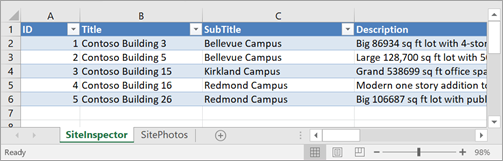
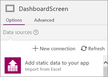
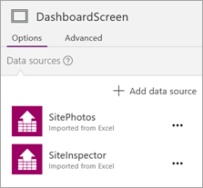

# <a name="let-customers-test-drive-your-canvas-app-on-appsource"></a>Testen Ihrer Canvas-App durch Kunden auf AppSource

Sind Sie begeistert, Canvas-apps in powerapps zu entwickeln? Möchten Sie eine Canvas-App für Kunden freigeben? [AppSource.com](https://appsource.microsoft.com) unterstützt powerapps-Test Laufwerk Lösungen als Möglichkeit zum Freigeben von Apps für Kunden und Generieren von Leads für Ihr Unternehmen.

## <a name="what-is-a-test-drive-solution"></a>Was ist eine Test Drive-Projektmappe?

Eine Test Drive-Lösung ermöglicht es Ihren Kunden, eine echte App auszuprobieren, ohne sich für einen powerapps-Plan zu registrieren oder Anwendungen zu installieren. Kunden melden sich einfach mithilfe ihres AAD-Kontos (Azure Active Directory) bei AppSource.com an und führen die App in einem Webbrowser aus. Ohne Test Drive können Ihre Kunden nur von Ihrer App lesen oder ein Video anschauen, das sie beschreibt. Mit Test Drive erhalten Kunden eine bessere Vorstellung davon, was Ihre Lösung ist und über welche Funktionalität Ihre App verfügt. Und sie machen die Erfahrung, die App tatsächlich zu verwenden. Kunden können dabei nicht „unter die Haube sehen“, um herauszufinden, wir Ihre App erstellt wurde, daher ist Ihr geistiges Eigentum geschützt. Wir sammeln und teilen Leadinformationen für Benutzer, die Ihre Test Drive-App starten, um Sie beim Ausbau Ihres Geschäfts zu unterstützen.

Hier ist ein Beispiel für eine [App-Auflistung](https://go.microsoft.com/fwlink/?linkid=848867) auf AppSource.com:


Wenn Sie den Link " **Kostenlose Testversion** " aus der obigen App-Auflistung auswählen, wird die zugehörige powerapps-Test Laufwerk-App direkt im Browser des Benutzers


## <a name="how-do-i-build-a-test-drive-solution"></a>Wie wird eine Test Drive-Projektmappe erstellt?
Das Entwickeln einer APP für eine Test Drive-Lösung ist genauso wie das Entwickeln einer beliebigen app in Power apps, aber Sie verwenden eingebettete Daten anstelle externer Datenverbindungen. Durch die Verwendung eingebetteter Daten wird die Barriere der Bereitstellung der APP für Ihren Kunden reduziert, sodass es keine Reibung gibt, um sie auszuprobieren. Die vollständige Lösung, die Sie letztendlich an Kunden verteilen, umfasst normalerweise Datenverbindungen, aber eingebettete Daten funktionieren gut für eine Test Drive-Lösung.

Powerapps unterstützt das Entwickeln von apps mit eingebetteten Daten, sodass Sie nur Beispiel Daten benötigen, damit Ihre APP verwendet werden kann. Diese Daten sollten in einer Excel-Datei in Form einer oder mehrerer Tabellen vorliegen. In powerapps rufen Sie dann die Daten aus den Excel-Tabellen in die APP auf und arbeiten dort, anstatt über eine externe Verbindung. Der aus drei Schritten bestehende Prozess unten zeigt Ihnen, wie Daten in die App importiert und darin verwendet werden.

### <a name="step-1-import-data-into-the-app"></a>Schritt 1: Importieren von Daten in die App
Angenommen, Sie besitzen eine Excel-Datei mit zwei Tabellen: **SiteInspector** und **SitePhotos**.



Importieren Sie diese beiden Tabellen in powerapps, indem Sie die Option **statische Daten zu Ihrer APP hinzufügen**verwenden.



Die Tabellen sind jetzt als Datenquellen in Ihrer App verfügbar.



### <a name="step-2-handling-read-only-and-read-write-scenarios"></a>Schritt 2: Behandlung von Szenarien mit Schreibschutz und mit Lese-/Schreibzugriff
Die importierten Daten sind *statisch* und daher schreibgeschützt. Wenn Ihre App schreibgeschützt ist (sie dem Benutzer also Daten nur anzeigt), verweisen Sie direkt in der App auf die Tabellen. Wenn Sie beispielsweise auf das Feld **Title** in der Tabelle **SiteInspector** zugreifen möchten, verwenden Sie **SiteInspector.Title** in Ihrer Formel.

Wenn Ihre APP Lese-/Schreibzugriff hat, rufen Sie zuerst die Daten aus jeder Tabelle in eine Auflistung auf, bei der *es sich um*eine tabellarische Datenstruktur in Power apps handelt. Arbeiten Sie dann mit der Sammlung anstelle der Tabelle. So ziehen Sie Daten aus den Tabellen **SiteInspector** und **SitePhotos** in die Sammlungen **SiteInspectorCollect** und **SitePhotosCollect**:

```powerapps-comma
ClearCollect( SiteInspectorCollect; SiteInspector );; 
ClearCollect( SitePhotosCollect; SitePhotos )
```

Die Formel leert beide Sammlungen und sammelt anschließend die Daten aus den einzelnen Tabellen in der entsprechenden Sammlung:

* Rufen Sie diese Formel an beliebiger Stelle in Ihrer App auf, um die Daten zu laden.
* Sie können alle Sammlungen in Ihrer App anzeigen, indem Sie zu **Datei** > **Sammlungen** navigieren.
* Weitere Informationen finden Sie unter [Erstellen und Aktualisieren einer Sammlung in Ihrer App](../canvas-apps/create-update-collection.md).

Wenn Sie jetzt auf das Feld **Title** zugreifen möchten, verwenden Sie in Ihrer Formel **SiteInspectorCollect.Title**.

### <a name="step-3-add-update-and-delete-data-in-your-app"></a>Schritt 3: Hinzufügen, Aktualisieren und Löschen von Daten in Ihrer App
Sie haben gesehen, wie Daten direkt und aus einer Sammlung gelesen werden; jetzt möchten wir Ihnen zeigen, wie Sie Daten in einer Sammlung hinzufügen, aktualisieren und löschen:

**Um einer Sammlung eine Zeile hinzuzufügen**, verwenden Sie [Collect( DataSource, Item, ... )](../canvas-apps/functions/function-clear-collect-clearcollect.md):

```powerapps-comma
Collect( SiteInspectorCollect;
    {
        ID: Value( Max( SiteInspectorCollect; ID ) + 1 );
        Title: TitleText.Text;
        SubTitle: SubTitleText.Text;
        Description: DescriptionText.Text
    }
)
```

**Um eine Zeile in einer Sammlung zu aktualisieren** , verwenden Sie [UpdateIf( DataSource, Condition1, ChangeRecord1 [, Condition2, ChangeRecord2, ...] )](../canvas-apps/functions/function-update-updateif.md):

```powerapps-comma
UpdateIf( SiteInspectorCollect;
    ID = record.ID;
    {
        Title: TitleEditText.Text;
        SubTitle: SubTitleEditText.Text;
        Description: DescriptionEditText.Text
    }
)
```

**Um eine Zeile aus einer Sammlung zu löschen**, verwenden Sie [RemoveIf( DataSource, Condition [, ...] )](../canvas-apps/functions/function-remove-removeif.md):

```powerapps-comma
RemoveIf( SiteInspectorCollect; ID = record.ID )
```

> [!NOTE]
> Sammlungen enthalten nur Daten, während die App ausgeführt wird; beim Schließen der App werden sämtliche Änderungen verworfen.

Zusammengefasst lässt sich sagen, dass Sie eine Version Ihrer App mit eingebetteten Daten erstellen können, die die Erfahrung der App bei bestehender Verbindung mit externen Daten simuliert. Nach dem Einbetten der Daten sind Sie bereit, diese App auf AppSource.com als Test Drive-Projektmappe zu veröffentlichen.

## <a name="how-do-i-list-my-test-drive-solution-on-appsourcecom"></a>Wie liste ich meine Test Drive-Projektmappe auf AppSource.com auf?
Jetzt, da Ihre App fertig ist, ist es an der Zeit, sie auf AppSource.com zu veröffentlichen. Um diesen Vorgang zu starten, vervollständigen Sie das [Anwendungs Formular](https://powerapps.microsoft.com/partners/get-listed/) in Power apps.com.

Nachdem Sie sich beworben haben, erhalten Sie eine E-Mail mit Anweisungen zum Einreichen Ihrer App für die Veröffentlichung auf AppSource.com. Die Dokumentation zum Onboarding, die den vollständigen Prozess lückenlos beschreibt, kann [hier](https://go.microsoft.com/fwlink/?linkid=851031) heruntergeladen werden.

